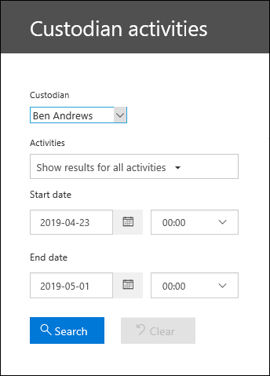

# View custodian audit activity

Need to find if a user viewed a specific document or purged an item from their mailbox? Microsoft Purview eDiscovery (Premium) is now integrated with the existing audit log search tool in the Microsoft Purview compliance portal. Using this embedded experience, you can use the eDiscovery (Premium) Custodian Management tool to facilitate your investigation by easily accessing and searching the activity for custodians within your case.

## Get permissions

You have to be assigned the View-Only Audit Logs or Audit Logs role in Exchange Online to search the audit log. By default, these roles are assigned to the Compliance Management and Organization Management role groups on the Permissions page in the <a href="https://go.microsoft.com/fwlink/p/?linkid=2059104" target="_blank">Exchange admin center</a>. To give a user the ability to search the eDiscovery (Premium) audit log with the minimum level of privileges, you can create a custom role group in Exchange Online, add the View-Only Audit Logs or Audit Logs role, and then add the user as a member of the new role group. For more information, see Manage role groups in Exchange Online.

> [!IMPORTANT]
> If you assign a user the View-Only Audit Logs or Audit Logs role on the Permissions page in the compliance portal, they won't be able to search the audit log. You have to assign the permissions in Exchange Online. This is because the underlying cmdlet used to search the audit log is an Exchange Online cmdlet.

## Step 1: Search the audit log for activities performed by a custodian

1. Go to  **eDiscovery > eDiscovery (Premium)** and open the case.
  
2. Click the **Sources** tab.
  
3. On the **Custodians** page, select a custodian from the list, and then click **View custodian activity** on the flyout page.

    The Custodian activities search page is displayed. Note the custodian you selected in the previous step is displayed in the **Custodian** drop-down box. You can select different custodians in the drop-down box, but you can only search for activities for one custodian at a time.

    
   
4. Configure the following search criteria:
      
   1. **Activities** - Click the drop-down list to display the activities that you can search for. After you run the search, only the audit records for the selected activities are displayed. Selecting **Show results for all activities** will display results for all activities performed by the custodian that match the other search criteria.

      
      
   1. **Start date and End date** - Select a date and time range to display the events that occurred within that period. The last seven days are selected by default. The date and time are presented in Coordinated Universal Time (UTC) format. The maximum date range that you can specify is one year.
      
   1. **Custodians** - Click in this box and then select a specific custodian to display search results for. Audit records for the selected activity performed by the users you select in this box are displayed in the list of results.
      
5. Click   to run the search using your search criteria. The search results are loaded, and after a few moments they are displayed under Results on the Custodian Activities search page. 

## Step 2: View the audit log search results

The results of an audit log search are displayed under Results on the Custodian Audit log page. A maximum of 5,000 (newest) events are displayed in increments of 150 events. To display more events you can use the scroll bar in the Results pane or you can press Shift + End to display the next 150 events.

The results contain the following information about each event returned by the search.
- **Date**: The date and time (in UTC format) when the event occurred.

- **IP address**: The IP address of the device that was used when the activity was logged. The IP address is displayed in either an IPv4 or IPv6 address format.

- **User**: The user (or service account) who performed the action that triggered the event.

- **Activity**: The activity performed by the user. This value corresponds to the activities that you selected in the Activities drop down list. For an event from the Exchange admin audit log, the value in this column is an Exchange cmdlet.

- **Item**: The object that was created or modified as a result of the corresponding activity. For example, the file that was viewed or modified or the user account that was updated. Not all activities have a value in this column.

- **Detail**: Additional detail about an activity. Again, not all activities will have a value.

## Step 3: Filter the search results

In addition to sorting, you can also filter the results of an audit log search. This can help you quickly filter the results for a specific user or activity. 

To filter the results:

 1. Create and run an audit log search.
  
2. When the results are displayed, click **Filter results**.
 
3. Keyword boxes are displayed under each column header.
  
4. Click one of the boxes under a column header and type a word or phrase, depending on the column you're filtering on. The results will dynamically readjust to display the events that match your filter.
  
5. To clear a filter, click the **X** in the filter box or just click **Hide filtering**.

## Export the search results to a file

You can export the results of an audit log search to a comma separated value (CSV) file on your local computer. You can open this file in Microsoft Excel and use features such as search, sorting, filtering, and splitting a single column (that contains multi-value cells) into multiple columns.

1. Run an audit log search, and then revise the search criteria until you have the desired results.
  
2. Click Export results and select one of the following options:

    - **Save loaded results:** Choose this option to export only the entries that are displayed under **Results** on the **Custodian Audit log search** page. The CSV file that is downloaded contains the same columns (and data) displayed on the page (Date, User, Activity, Item, and Details). An additional column (titled **More**) is included in the CSV file that contains more information from the audit log entry. Because you're exporting the same results that are loaded (and viewable) on the Audit log search page, a maximum of 5,000 entries are exported.
        
    - **Download all results:** Choose this option to export all entries from the audit log that meet the search criteria. For a large set of search results, choose this option to download all entries from the audit log in addition to the 5,000 results that can be displayed on the **Custodian Audit log** search page. This option will download the raw data from the audit log to a CSV file, and contains additional information from the audit log entry in a column named AuditData. It may take longer to download the file if you choose this export option because the file may be much larger than the one that's downloaded if you choose the other option.
    
      > [!IMPORTANT]
      > You can download a maximum of 50,000 entries to a CSV file from a single audit log search. If 50,000 entries are downloaded to the CSV file, you can probably assume there are more than 50,000 events that met the search criteria. To export more than this limit, try using a date range to reduce the number of audit log entries. You might have to run multiple searches with smaller date ranges to export more than 50,000 entries.
        

3. After you select an export option, a message is displayed at the bottom of the window that prompts you to open the CSV file, save it to the Downloads folder, or save it to a specific folder

For more information about viewing, filtering, or exporting audit log search results, see [Search the audit log](search-the-audit-log-in-security-and-compliance.md).
