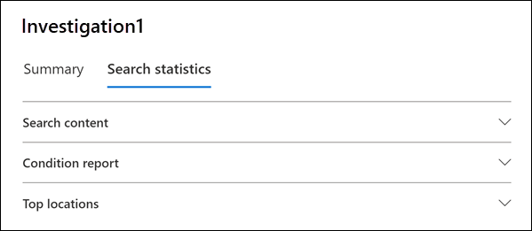
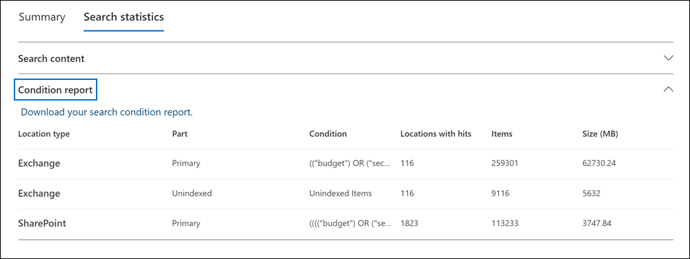
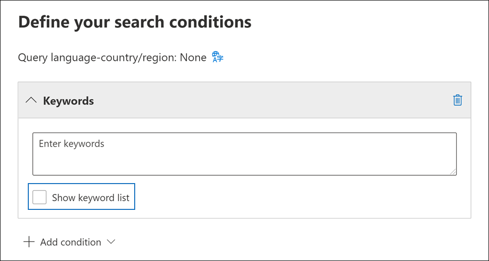
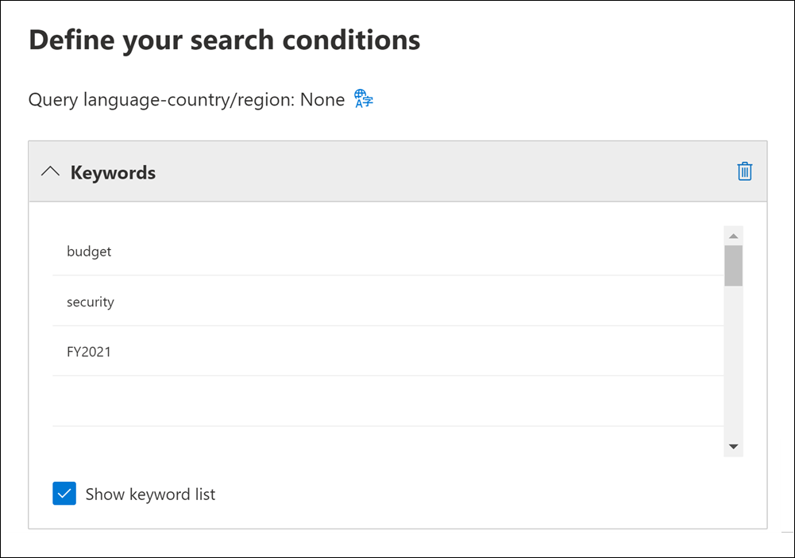
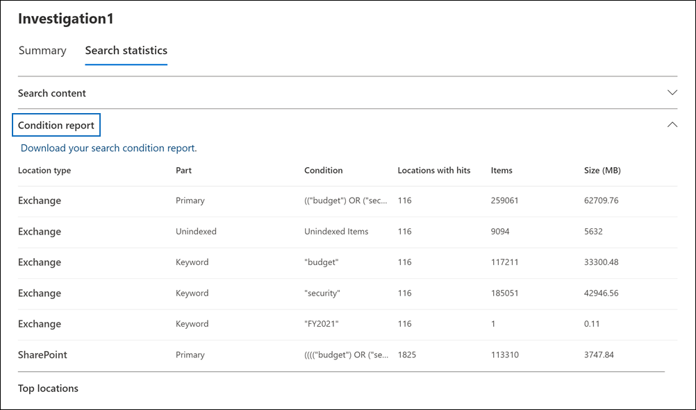

# View statistics for eDiscovery search results

After you create and run a Content search or a search associated with a Core eDiscovery case, you can view statistics about the estimated search results. This includes a summary of the search results (similar to the summary of the estimated search results displayed on the search flyout page), the query statistics such as the number of content locations with items that match the search query, and the identity of content locations that have the most matching items.
  
Additionally, you can use the keywords list to configure a search to return statistics for each keyword in a search query. This lets you compare the number of results returned by each keyword in a query.
  
You can also download search statistics to a CSV file. This lets you use the filtering and sorting features in Excel to compare results, and prepare reports for your search results.
  
## Get statistics for searches

To display statistics for a Content search or a search associated with a Core eDiscovery case.:
  
1. In the Microsoft 365 compliance center, click **Show all**, and then do one of the following:

   - Click **Content search** and then select a search to display the flyout page.

     OR

   - Click **eDiscovery** > **Core**, select a case, and then select a search on the **Searches** tab to display the flyout page.

2. On the flyout page of the selected search, click the **Search statistics** tab.
  
   

The **Search statistics** tab contains for following sections that contain different types of statistics about the search.

### Search content

This section displays a graphical summary of the estimated items returned by the search. This indicates the number of items that match the search criteria. This information gives you an idea about the estimated number of items returned by the search.

- **Estimated items by locations**: The total number of estimated items returned by the search. The specific number of items located in mailboxes and located in sites is also displayed.

- **Estimated locations with hits**: The total number of content locations that contain items returned by the search. The specific number of mailbox and site locations is also displayed.

- **Data volume by location (in MB)**: The total size of all estimated items returned by the search. The specific size of mailbox items and site items is also displayed.

### Condition report

This section displays statistics about the search query and the number of estimated items that matched different parts of the search query. You can use these statistics to analyze the number of items that match each component of search query. This can help you refine the search criteria and if necessary narrow the scope of the scope. You can also download a copy of this report in CSV format.

- **Location type**: The type of content location that the query statistics are applicable to. The value of **Exchange** indicates a mailbox location; a value of **SharePoint** indicates a site location.

- **Part**: The part of the search query the statistics are applicable to. **Primary** indicates the entire search query. **Keyword** indicates the statistics in the row are for a specific keyword. If you use a keyword list for search query, statistics for each component of the query are included in this table. For more information, see [Get keyword statistics for searches](#get-keyword-statistics-for-searches).

- **Condition**: The actual component (keyword or condition) of the search query that returned the statistics displayed in the corresponding row.

- **Locations with hits**: The number of the content locations (specified by the **Location type** column) that contain items that match the primary or keyword query listed in the **Condition** column.

- **Items**: The number of items (from the specified content location) that match the query listed in the **Condition** column. As previously explained, if an item contains multiple instances of a keyword that is being searched for, it's only counted once in this column.

- **Size (MB)**: The total size of all items that were found (in the specified content location) that match the search query in the **Condition** column.

### Top locations

This section displays statistics about the specific content locations with the most items returned by the search. The top 1,000 locations are displayed. You can also download a copy of this report in CSV format.

- The name of the location name (the email address of mailboxes and the URL for sites).

- Location type (a mailbox or site).

- Estimated number of items in the content location returned by the search.

- The total size of estimated items in each content location.

## Get keyword statistics for searches

As previous explained, the **Condition report** section shows the search query and the number (and size) of items that match the query. If you use a keyword list when you create or edit a search query, you can get enhanced statistics that show how many items match each keyword or keyword phrase. This can help you quickly identify which parts of the query are the most (and least) effective. For example, if a keyword returns a large number of items, you might choose to refine the keyword query to narrow the search results.

To create a keyword list and view keyword statistics for a search:
  
1. In the Microsoft 365 compliance center, create a new Content search or a search associated with a Core eDiscovery case.

2. On the **Conditions** page of the search wizard. select the **Show keyword list** checkbox.

   

3. Type a keyword or keyword phase in a row in the keywords table. For example, type **budget** in the first row, type **security** in the second row, and type **FY2021** in the third row.

   

   > [!NOTE]
   > To help reduce issues caused by large keyword lists, you're limited to a maximum of 20 rows in the keyword list of a search query.

4. After adding the keywords to the list that you want to search and get statistics for, run the search.

5. When the search is completed, select it to display the flyout page.

6. On the **Search statistics** tab, click the **Condition report** to display the keyword statistics for the search.

    
  
    As shown in the previous screenshot, the statistics for each keyword are displayed; this includes:

    - The keyword statistics for each type of content location included in the search.

    - The number of unindexed mailbox items.

    - The actual search query and results for each keyword (identified as **Keyword** in the **Part** column), which includes any conditions from the search query.

    - The complete search query (identified as **Primary** in the **Part** column) and the statistics for the complete query for each location type. Note these are the same statistics displayed on the **Summary** tab.
