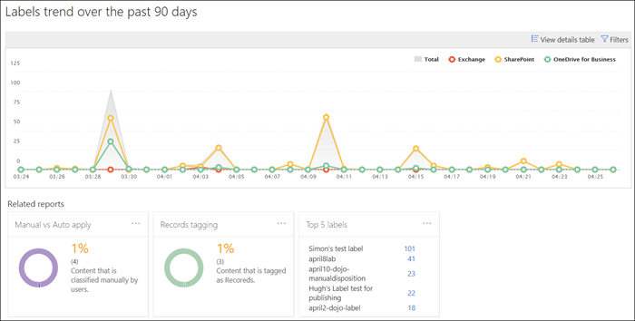
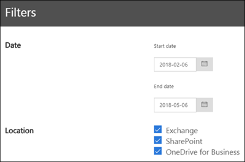

# View the data governance reports

After you create your labels, you'll want to verify that they're being applied to content as you intended. With the data governance reports in the Security &amp; Compliance Center, you can quickly view:
  
- **Top 5 labels** This report shows the count of the top 5 labels that have been applied to content. Click this report to view a list of all labels that have been recently applied to content. You can see each label's count, location, how it was applied, its retention actions, whether it's a record, and its disposition type. 
    
- **Manual vs Auto apply** This report shows the count of all content that's been labeled manually or automatically, and the percentage of content that's been labeled manually vs automatically. 
    
- **Records tagging** This report shows the count of all content that's been tagged as a record or non-record, and the percentage of content that's been tagged as a record vs. non-record. 
    
- **Labels trend over the past 90 days** This report shows the count and location of all labels that have been applied in the last 90 days. 
    
All these reports show labeled content from Exchange, SharePoint, and OneDrive for Business.
  
You can find these reports in the Security &amp; Compliance Center \> **Information governance** \> [**Dashboard**](https://protection.office.com/datamanagement/dashboard).
  

  
You can filter the data governance reports by date (up to 90 days) and location (Exchange, SharePoint, and OneDrive for Business). The most recent data can take up to 24 hours to appear in the reports.
  

  

