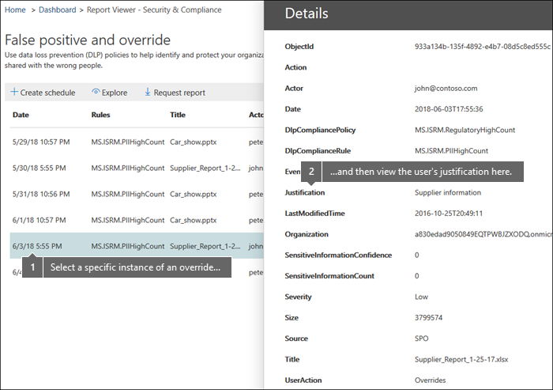
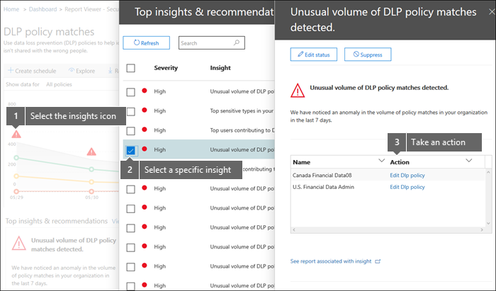

# View the reports for data loss prevention

After you create your data loss prevention (DLP) policies, you'll want to verify that they're working as you intended and helping you to stay compliant. With the DLP reports in the Security &amp; Compliance Center, you can quickly view:
  
- **DLP policy matches** This report shows the count of DLP policy matches over time. You can filter the report by date, location, policy, or action. You can use this report to: 
    
  - Tune or refine your DLP policies as you run them in test mode. You can view the specific rule that matched the content.
    
  - Focus on specific time periods and understand the reasons for spikes and trends.
    
  - Discover business processes that violate your organization's DLP policies.
    
  - Understand any business impact of the DLP policies by seeing what actions are being applied to content.
    
  - Verify compliance with a specific DLP policy by showing any matches for that policy.
    
  - View a list of top users and repeat users who are contributing to incidents in your organization.
    
  - View a list of the top types of sensitive information in your organization.
    
- **DLP incidents** This report also shows policy matches over time, like the policy matches report. However, the policy matches report shows matches at a rule level; for example, if an email matched three different rules, the policy matches report shows three different line items. By contrast, the incidents report shows matches at an item level; for example, if an email matched three different rules, the incidents report shows a single line item for that piece of content. 
    
  Because the report counts are aggregated differently, the policy matches report is better for identifying matches with specific rules and fine tuning DLP policies. The incidents report is better for identifying specific pieces of content that are problematic for your DLP policies.
    
- **DLP false positives and overrides** If your DLP policy allows users to override it or report a false positive, this report shows a count of such instances over time. You can filter the report by date, location, or policy. You can use this report to: 
    
  - Tune or refine your DLP policies by seeing which policies incur a high number of false positives.
    
  - View the justifications submitted by users when they resolve a policy tip by overriding the policy.
    
  - Discover where DLP policies conflict with valid business processes by incurring a high number of user overrides.
    
All DLP reports can show data from the most recent four-month time period. The most recent data can take up to 24 hours to appear in the reports.
  
You can find these reports in the Security &amp; Compliance Center \> **Reports** \> **Dashboard**.
  

  
## View the justification submitted by a user for an override

If your DLP policy allows users to override it, you can use the false positive and override report to view the text submitted by users in the policy tip.
  

  
## Take action on insights and recommendations

Reports can show insights and recommendations where you can click the red warning icon to see details about potential issues and take possible remedial action.
  

  
## Permissions for DLP reports

To view DLP reports in the Security & Compliance Center, you have to be assigned the:

- **Security Reader** role in the Exchange admin center. By default, this role is assigned to the Organization Management and Security Reader role groups in the Exchange admin center.

- **View-Only DLP Compliance Management** role in the Security & Compliance Center. By default, this role is assigned to the Compliance Administrator, Organization Management, Security Administrator, and Security Reader role groups in the Security & Compliance Center.

- **View-Only Recipients** role in the Exchange admin center. By default, this role is assigned to the Compliance Management, Organization Management, and View-Only Organization Management role groups in the Exchange admin center.

## Find the cmdlets for the DLP reports

To use most of the cmdlets for the Security &amp; Compliance Center, you need to:
  
1. [Connect to the Security &amp; Compliance Center using remote PowerShell](/powershell/exchange/connect-to-scc-powershell&amp;clcid=0x409)
    
2. Use any of these [Security &amp; Compliance Center cmdlets](/powershell/exchange/exchange-online-powershell)
    
However, DLP reports need pull data from across Office 365, including Exchange Online. For this reason, the cmdlets for the DLP reports are available in Exchange Online Powershell—not in Security &amp; Compliance Center Powershell. Therefore, to use the cmdlets for the DLP reports, you need to:
  
1. [Connect to Exchange Online using remote PowerShell](/powershell/exchange/connect-to-exchange-online-powershell)
    
2. Use any of these cmdlets for the DLP reports:
    
      - [Get-DlpDetectionsReport](/powershell/module/exchange/get-dlpdetectionsreport)
    
      - [Get-DlpDetailReport](/powershell/module/exchange/get-dlpdetailreport)
