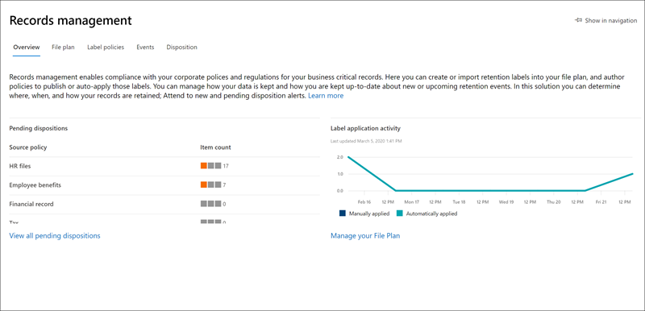
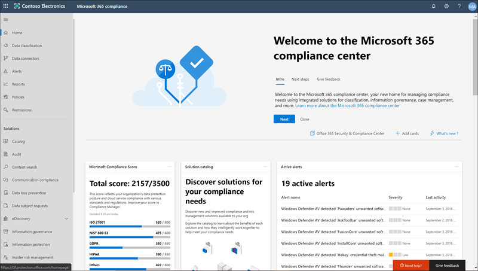

# What's new in Microsoft 365 compliance

Whether it be adding new solutions to the [Microsoft 365 compliance center](microsoft-365-compliance-center.md), updating existing features based on your feedback, or rolling out fresh and updated documentation, Microsoft 365 helps you stay on top of the ever-changing compliance landscape. Take a look below to see what’s new in Microsoft 365 compliance today. 

> [!NOTE]
> Some compliance features get rolled out at different speeds to our customers. If you aren't seeing a feature yet, try adding yourself to [targeted release](https://docs.microsoft.com/office365/admin/manage/release-options-in-office-365).

> [!TIP]
> Interested in what's going on in other admin centers? Check out these articles: [What's new in the Microsoft 365 admin center](https://docs.microsoft.com/office365/admin/whats-new-in-preview?view=o365-worldwide) [What's new in the SharePoint admin center](https://docs.microsoft.com/sharepoint/what-s-new-in-admin-center) [What's new in Microsoft 365 Defender](https://docs.microsoft.com/microsoft-365/security/mtp/whats-new)  
And visit the [Microsoft 365 Roadmap](https://www.microsoft.com/en-us/microsoft-365/roadmap) to learn about Microsoft 365 features that were launched, are rolling out, are in development, have been cancelled, or previously released.

## August 2020

### Spotlight: Insider risk and communication compliance updates

Several new and improved features hit public preview this month:

**Insider risk management**

- Check out our six new [policy templates](insider-risk-management-policies.md#policy-templates):
    - Data leaks by priority users
    - Data leaks by disgruntled users
    - General security policy violations
    - Security policy violations by departing users
    - Security policy violations by priority users
    - Security policy violations by disgruntled users

- Integration with [Microsoft Defender for Endpoint](https://docs.microsoft.com/windows/security/threat-protection/microsoft-defender-atp/microsoft-defender-advanced-threat-protection) allows you to import and filter Microsoft Defender for Endpoint alerts for activities detected by policies created from the new security violation policy templates. There’s also a related [insider risk setting](insider-risk-management-settings.md#microsoft-defender-for-endpoint-preview) where you can choose to import security alerts to insider risk management based on the Microsoft Defender for Endpoint alert triage status.

    > [!NOTE]
    > To take advantage of Microsoft Defender for Endpoint integration (including the new security policy violation templates), you'll need to have Microsoft Defender for Endpoint configured in your organization. You’ll also need to enable Microsoft Defender for Endpoint for insider risk management integration by [configuring advanced features in Microsoft Defender for Endpoint](https://docs.microsoft.com/windows/security/threat-protection/microsoft-defender-atp/advanced-features#share-endpoint-alerts-with-microsoft-compliance-center).
 
- Customize indicator thresholds when [creating a policy](insider-risk-management-policies.md#create-a-new-policy).
- Set up [priority user groups](insider-risk-management-settings.md#priority-user-groups-preview) to define users in your organization whose activity requires closer inspection based on factors such as their position, level of access to sensitive information, or risk history.
- Use Office 365 Management Activity APIs to [export insider risk alert details](insider-risk-management-settings.md#export-alerts-preview) to other applications your organization might use to manage or aggregate insider risk data.
- New [domain settings](insider-risk-management-settings.md#domains-preview) help you define and control risk levels for activity in specific domains.

**Communication compliance**

- When [reviewing messages in an alert](communication-compliance-investigate-remediate.md#step-3-decide-on-a-remediation-action), you can now remove inappropriate messages in Microsoft Teams channels, 1:1, and group chats. Removed messages and content are replaced with a policy tip that explains that it was removed due to sensitive content.
- New [communication roles](communication-compliance-configure.md#step-1-required-enable-permissions-for-communication-compliance) (these will also be included in new communication compliance role groups releasing in September).
- New communication compliance settings experience that includes settings for [privacy](communication-compliance-feature-reference.md#privacy-preview) and [notice templates](communication-compliance-feature-reference.md#notice-templates).
- New [classifiers](communication-compliance-feature-reference.md#classifiers) to help detect adult, racy, and gory images.
- New ‘Pattern detected’ notification that appears when [reviewing messages in an alert](communication-compliance-investigate-remediate.md#step-2-examine-the-message-details) lets you know about reoccurring instances of the same behavior by a user.

### Sensitivity labels

- For US Government tenants (GCC, GCC-H, and DoD), sensitivity labels are currently supported only for the Azure Information Protection unified labeling client and scanner. For more information, see [Azure Information Protection Premium Government Service Description](https://docs.microsoft.com/enterprise-mobility-security/solutions/ems-aip-premium-govt-service-description).
- You can now [use Security & Compliance Center PowerShell](create-sensitivity-labels.md#use-powershell-for-sensitivity-labels-and-their-policies) to create and configure all settings you see in your labeling admin center. This means that, in addition to using PowerShell for settings that aren't available in the labeling admin centers, you can now fully script the creation and maintenance of sensitivity labels and sensitivity label policies.

### Records management: Content overhaul

New docs covering deployment steps, marking content as records, and record versioning:

- [Get started with records management](get-started-with-records-management.md)
- [Declare records by using retention labels](declare-records.md)
- [Use record versioning to update records stored in SharePoint or OneDrive](record-versioning.md)

### Retention labels & policies

Retention-related admin activity is now recorded and available to review in the audit log. For the full list, see [Retention policy and retention label activities](search-the-audit-log-in-security-and-compliance.md#retention-policy-and-retention-label-activities).

### Advanced eDiscovery

- When [adding a collection to a review set](add-data-to-review-set.md#define-options-to-scope-your-collection-for-review), you can now include modern attachments (also called “cloud attachments”) and SharePoint document versions.
- New [direct download export experience](export-documents-from-review-set.md), eliminating the need to use Azure Storage Explorer to download case content.

## July 2020

### Spotlight on help docs

To help you understand which compliance solutions are used to protect and govern your organization’s sensitive data, we created two new landing pages with overviews of how the solutions work together to achieve those goals, including links to related docs so you can dive in further.

[Microsoft Information Protection in Microsoft 365](protect-information.md) 
[Microsoft Information Governance in Microsoft 365](manage-Information-governance.md)

### Advanced eDiscovery: Add non-custodial data sources to your cases

Add data to a case without having to associate it with a custodian (known as [non-custodial data sources](non-custodial-data-sources.md)). And if you need to place this non-custodial data on hold, you’ll be able to do so using our new Advanced Indexing feature.

### Data connectors: HR connector enhancements

(In preview) A new version of the [HR connector](import-hr-data.md) lets you import data related to job level changes, performance reviews, and performance improvement plans. This data can then be used in several [insider risk policies](insider-risk-management-policies.md) to detect related activity.

### Retention labels: New support for email

You can now create a [retention label](retention.md#retention-labels) to start retaining email based on when messages were labeled. This doesn’t apply to calendar items, which will be retained based on when the item is sent.

### Sensitivity labels: New feature and an improvement

- (In preview) When configuring encryption settings for a label, look for the new option to use [Double Key Encryption](encryption-sensitivity-labels.md#double-key-encryption) to further protect labeled files and emails.
- When creating or deleting sensitivity labels or creating, editing, or deleting their label policies, changes now synchronize within 1 hour to all users, apps, and services.

## June 2020

### Spotlight: New data connectors hit preview

Building on our promise to help you import data from more third-party sources into Microsoft 365, we’re pleased to announce the preview release of two more data connectors:

- [Bloomberg message](archive-bloomberg-message-data.md). Import and archive financial services email data from the Bloomberg Message collaboration tool. After the data’s stored in mailboxes, you can access and use the data in compliance features such as litigation hold, content search, In-place archiving, auditing, communication compliance, and retention policies.
- [ICE Chat](archive-icechat-data.md). Import and archive financial services chat data from the ICE Chat collaboration tool. After the data’s stored in mailboxes, you can access and use the data in compliance features such as litigation hold, eDiscovery, archiving, auditing, communication compliance, and retention policies.

### Compliance Score & Compliance Manager: The hits keep coming

June updates include a new assessment drill-down view in [Compliance Score](compliance-score.md). Monitor control progress, add, delete assessments directly from Compliance Score, and more.

Want to stay on top of updates to Compliance Score and Compliance Manager? Bookmark the [Compliance Score release notes](compliance-score-release-notes.md) and check back often.

## May 2020

### Spotlight: Data classification is officially released

Data classification, aka ‘[Know your data](data-classification-overview.md)’, features (analytics, content explorer, and activity explorer) have graduated from the preview phase and are available to all organizations. Powerful insights and tools can help you discover and evaluate how sensitive info and labels (retention and sensitivity) are being used in content across your organization. Review content that contains sensitive info or has labels applied, explore label activity across Microsoft 365 locations, create custom sensitive info types, and more.

Take a video tour...

> [!VIDEO https://www.microsoft.com/videoplayer/embed/RE4vx8x]

### Trainable classifiers: A fix and a feature

May brings more enhancements to trainable classifiers:

- A fix based on your feedback: When you seed and train a custom classifier, you no longer need to manually enter SharePoint site URLs and folder paths. You can now choose from a pre-populate list of sites and folders.
- New feature: When creating a sensitivity label and configuring auto-labeling settings for Office apps, you can now automatically apply (or recommend that users apply) the label to content that matches trainable classifiers. [Learn more](apply-sensitivity-label-automatically.md#configuring-trainable-classifiers-for-a-label)

### Communication compliance: Yammer support is here

Private messages and public community conversations in Yammer are supported in communication compliance policies. Yammer is an optional channel and must be in [native mode](https://docs.microsoft.com/yammer/configure-your-yammer-network/overview-native-mode) to support scanning of messages and attachments.

### Data loss prevention: New sharing restriction

When setting up a DLP policy to protect content in SharePoint or OneDrive, you can now configure the “Restrict access to content” action to block people who were given access to the content through the ‘[Anyone with the link](https://support.microsoft.com/office/share-files-outside-your-organization-with-anyone-links-53e91027-fb8e-4a6e-a3e4-5df4be32e38a)’ option.

### Insider risk management: Tailor your alert volume

User activities detected by insider risk policies are assigned a specific risk score, which in turn determines the alert severity (low, medium, high). By default, Microsoft 365 generates a certain amount of low, medium, and high severity alerts, but with the new [alert volume setting](insider-risk-management-settings.md#alert-volume), you can increase or decrease the volume to suit your needs.

### PST import: New region supported

Network upload is now available in United Arab Emirates.

### Sensitivity labels: New privacy option

When configuring [site and group settings](sensitivity-labels-teams-groups-sites.md#how-to-configure-groups-and-site-settings) for a label, you can now set the privacy option to **None - let user choose who can access the site**. This is useful when you want to protect content in the container by using a sensitivity label, but still let users configure the privacy setting themselves.

## April 2020

### Records management: Overhaul…and a new addition

April includes a couple key updates to our records management solution:

- The ‘Records management’ section is now fully available in the compliance center. Take advantage of updated user interfaces and functionality for file plan, retention labels and label policies, events, and disposition.
- Speaking of disposition, we also rolled out [proof of disposition](disposition.md#disposition-of-records) for records in SharePoint and OneDrive. You can now see a list of items in those locations that have been disposed of automatically or after a disposition review.

### Sensitivity labels: Preview auto-labeling policies

With auto-labeling policies, you can now automatically apply sensitivity labels to SharePoint and OneDrive docs that are already saved (aka ‘data at rest) and emails that are already sent or received (aka ‘email in transit’). Because this labeling is applied by services rather than by apps, you don't need to worry about what apps users have and what version.

This capability extends the existing client-side labeling that’s already included in the ‘Auto-labeling for Office apps’ settings when you create a sensitivity label. To get up to speed on the differences and benefits of both auto-labeling options, check out the [updated article](apply-sensitivity-label-automatically.md).

## March 2020

### Introducing Advanced Audit

[Advanced Audit in Microsoft 365](advanced-audit.md) introduces new auditing capabilities that can help your organization with forensic and compliance investigations. Highlights include long term retention of audit logs, custom audit log retention policies, new *MailItemsAccessed* mailbox auditing action, and the introduction of a new tenant-level throttling limit, which provides your organization with its own fully allocated bandwidth quota to access your auditing data.

### Compliance Score & Compliance Manager: Preview the latest enhancements

Key updates for this preview release include:

- Simplified process for creating and modifying templates
- Versioning notice and control for templates and actions
- Synchronizing common actions across groups
- Language support now extended to Chinese (Simplified), Chinese (Traditional), French, German, Italian, Japanese, Korean, Portuguese (Brazil), Russian, and Spanish

Learn more about [Compliance Score](compliance-score.md) and [Compliance Manager](compliance-manager-overview.md)

### Sensitivity labels: Support for labeling Office files in SharePoint and OneDrive (preview)

Enabling the preview allows users to apply sensitivity labels in Office on the web. They’ll be able to see the **Sensitivity** button on the ribbon and the applied label name on the status bar. In addition, if they use desktop apps to label and then save their files on SharePoint or OneDrive, Microsoft 365 will now be able to process the content of these files if the label has encryption settings applied. Coauthoring, eDiscovery, data loss prevention, search, and other collaborative features will also be supported in these circumstances.

[Learn how to enable the preview](sensitivity-labels-sharepoint-onedrive-files.md)

## February 2020

### Insider risk management is officially released

Drum roll, please... Insider risk management is now available to organizations with the following subscriptions:

- [Microsoft 365 E5](https://go.microsoft.com/fwlink/?linkid=2120431) (paid or trial)
- Microsoft 365 Enterprise E3 subscription with the [Microsoft E5 Compliance add-on](https://go.microsoft.com/fwlink/?linkid=2120432)

Heads up that we made some improvements since the preview release, including [new role groups](insider-risk-management-configure.md#step-1-enable-permissions-for-insider-risk-management) and [solution-wide settings](insider-risk-management-configure.md#step-4-configure-insider-risk-settings).

As always, please leave feedback as you use the solution so we can continue to make improvements.

### Records management

This new solution brings all the records management capabilities under a single umbrella. Highlights include the introduction of records versioning for SharePoint and OneDrive and proof of disposal for records.

[Learn more about records management](records-management.md)

### Solution spotlight: Data connectors for Facebook and Twitter

Data connectors [released last month](#just-launched) and we're looking for your help in testing out the following connectors.

- [Facebook business pages](archive-facebook-data-with-sample-connector.md). Imports and archives data from Facebook business pages to Microsoft 365. Beneficial for compliance solutions such as records management and eDiscovery.
- [Twitter](archive-twitter-data-with-sample-connector.md). Imports and archives data from Twitter to Microsoft 365. Beneficial for compliance solutions such as records management and eDiscovery.

As you set up and validate these connectors, please leave us feedback about what went well, what didn't, and what we can do to improve the experience.

## January 2020

The wait is over. We're pleased to announce that the Microsoft 365 compliance center is available to all customers with Microsoft 365, Office 365, Enterprise Mobility + Security (EMS), and Windows 10 Enterprise plans. Any data or policies you were managing in the Security & Compliance Center are available in the compliance center, so no need to jump back and forth.

> [!TIP]
> Read through last month's update again for a refresher on some of the [new solutions](#new-compliance-solutions) we previewed recently, as well as a [roadmap](#updated-compliance-solutions) showing where compliance features from the Security & Compliance Center now live in Microsoft 365.

Bookmark and head over now to [https://compliance.microsoft.com](https://compliance.microsoft.com) to tour your one-stop-shop for managing compliance across your org...or [read this article](microsoft-365-compliance-center.md) to dig in a bit more.

We also released new and updated solutions this month. Here's a quick glance at the highlights.

### Now in preview

**Insider risk management (preview)**

We're happy to announce that our insider risk management solution is now in public preview. In a nutshell, insider risk management helps your organization intelligently identify and take action on insider risks by providing:

- Anonymity controls to help ensure user privacy.
- Intelligent policy templates with native and third-party indicators that identify insider threats, such as data leaks.
- Integrated end-to-end investigation workflows that span across IT, HR and legal teams.

We'd love to hear what you think. As you use the solution, leave us feedback so we can make sure we're meeting your needs as we head toward general availability.

[Learn more about insider risk management](insider-risk-management.md)

### Just launched

**Communication compliance**

Graduating from the preview phase to full availability, communication compliance is a key component of our new insider risk solution set. This robust solution helps minimize communication risks using workflows for detecting, investigating, and taking remediation actions for messages that don't meet your organization's standards.

Customer feedback during the preview was fantastic. It resulted in several enhancements, including a first-run experience to get you started, improvements to investigation and remediation actions, and more.

[Learn more about communication compliance](communication-compliance.md)

**Data connectors**

Formerly sharing space with other 'Import' features in the Office 365 Security & Compliance Center, data connectors now have their very own home in the Microsoft 365 compliance center. Use the new 'Data connectors' page to import and archive data from your organization's human resources (HR) files and various third-party platforms (like Facebook, LinkedIn, Twitter, and Instant Bloomberg) to mailboxes in your Microsoft 365 organization. Once imported, this data can be managed in several compliance solutions, including eDiscovery, insider risk management, communication compliance, audit, retention policies, and more.

[Learn more about data connectors](archiving-third-party-data.md)

### Noteworthy updates

**New assessment templates for Compliance Score (preview)**

Always working hard to help you get ahead of the ever-evolving compliance landscape, our Compliance Score team shipped a new set of templates to help you assess your organization's compliance posture against recent regulations and get guidance on how to implement more effective controls. You'll see new templates for:

- ISO/IEC 27701:2019
- California Consumer Privacy Act (CCPA)
- Brazil General Data Protection Law (Lei Geral de Proteção de Dados - LGPD)
- SOC 1 Type 2 and SOC 2 Type 2

[Learn more about Compliance Score templates](compliance-score.md#templates)

## November & December 2019

Over the holidays, we started rolling out all the great compliance solutions that were demo'd at Ignite. Most are in a preview state, so test them out and be sure to let us know what you think by opening the Feedback card at the bottom right of the compliance center.

### Get to know the new neighborhood

The new Microsoft 365 compliance center includes brand new solutions as well as the compliance features you know and love from the Office 365 Security & Compliance Center. Let's dig in a bit more…

#### New compliance solutions

You might be wondering what a *solution* is. As much as the cloud has revolutionized the way business is done, it's also opened the door for new methods of data theft and fraud and necessitated new regulations. Our compliance solutions are collections of integrated capabilities that can help you help you manage these evolving compliance requirements. A solution's capabilities might include a combination of policies, alerts, reports, and more.

Here's a summary of the new solutions you'll find. Keep an eye out for others coming soon.

> [!NOTE]
> These solutions are located only in the Microsoft 365 compliance center. They can't be managed in the Office 365 Security & Compliance Center.
 

|**New solution**|**Description**|**Learn more**|
|:-----|:-----|:-----|
|Microsoft Compliance Score (preview)  |Built from [Compliance Manager](compliance-manager-overview.md), Compliance Score is a standalone feature with a simpler, more user-friendly design that helps you understand and improve your organization's compliance posture. It calculates a risk-based score measuring your progress in completing actions that help reduce risks around data protection and regulatory standards.  |[Overview of Microsoft Compliance Score (preview)](compliance-score.md)|
|Solution catalog (preview)  |The solution catalog is your one-stop-shop for discovering, learning about, and quickly getting started with our compliance and risk management solutions. The catalog is organized into three compliance categories, each containing details about the solutions that make up that category. Categories include Information protection & governance, Insider risk management, and Discovery & response  |[Overview of the solution catalog (preview)](microsoft-365-solution-catalog.md)|
|Communication compliance (preview)  |Communication compliance is part of the new insider risk management category that helps minimize communication risks by helping you detect, capture, and take remediation actions for inappropriate messages in your organization. The solution extends the capabilities of supervision policies in Office 365 by introducing several new enhancements such as intelligent templates, flexible remediation workflows, and actionable insights.  |[Communication compliance in Microsoft 365 (preview)](communication-compliance.md)|
|Data classification (preview)  |Our new Data classification page contains powerful insights and tools to help you discover and evaluate how sensitive info and labels (retention and sensitivity) are being used in content across your organization. Review content that contains sensitive info or has labels applied, explore label activity across Microsoft 365 locations, create custom sensitive info types, and much more. |[Data classification overview (preview)](data-classification-overview.md)|
|Trainable classifiers (preview)  |This powerful new tool uses our machine learning engine to help identify categories of content in your org, like regulatory docs or employee agreements. Once created, classifiers can be used in several compliance solutions to detect related content and classify it, protect it, retain it, and more. |[Learn about trainable classifiers (preview)](classifier-learn-about.md)|

#### Updated compliance solutions

If you've been using the Office 365 Security & Compliance Center for your compliance needs, you might wonder where some features now live in the new Microsoft 365 compliance center. Here's a quick roadmap to help find their new homes.

> [!NOTE]
> Some features are still available only in the Office 365 Security & Compliance Center – these are noted below. But we're working hard to preview these in the Microsoft 365 compliance center, so stay tuned for updates. 
 

|**Feature**|**Office 365 Security & Compliance Center**|**Microsoft 365 compliance center**|**Learn more**|
|:-----|:-----|:-----|:-----|
|Advanced eDiscovery|eDiscovery > Advanced eDiscovery   https://protection.office.com/advancedediscoverycases |eDiscovery > Advanced   https://compliance.microsoft.com/advancedediscovery | [Overview of the Advanced eDiscovery solution in Microsoft 365](overview-ediscovery-20.md) |
|Alert policies|Alerts > Alert policies   https://protection.office.com/alertpolicies |At this time, alert policies are managed only in the Office 365 Security & Compliance Center. |[Alert policies in the security and compliance center](alert-policies.md) |
|Alerts|Alerts > View alerts   https://protection.office.com/viewalerts |Alerts   https://compliance.microsoft.com/compliancealerts |[Viewing alerts](alert-policies.md#viewing-alerts)|
|Archive|Information governance > Archive   https://protection.office.com/archiving |Information governance > Archive tab   https://compliance.microsoft.com/informationgovernance?viewid=archive |[Enable archive mailboxes](enable-archive-mailboxes.md)|
|Audit log search|Search > Audit log search   https://protection.office.com/unifiedauditlog |Audit   https://compliance.microsoft.com/auditlogsearch | [Search the audit log in the Security & Compliance Center](search-the-audit-log-in-security-and-compliance.md)|
|Content search|Search > Content search   https://protection.office.com/contentsearchbeta?ContentOnly=1 | Content search   https://compliance.microsoft.com/contentsearch |[Search for content in Office 365](search-for-content.md) |
|Data connectors|Information governance > Archive third-party data   https://protection.office.com/nativeconnector | Data connectors   https://compliance.microsoft.com/connectorlanding |[Archive third-party data](archiving-third-party-data.md)|
|Data loss prevention|Data loss prevention   https://protection.office.com/datalossprevention |Data loss prevention   https://compliance.microsoft.com/datalossprevention |[Overview of data loss prevention](data-loss-prevention-policies.md)|
|Data subject requests |Data privacy > Data subject requests   https://protection.office.com/dsrcases |Data subject requests   https://compliance.microsoft.com/datasubjectrequest |[Manage GDPR data subject requests with the DSR case tool](manage-gdpr-data-subject-requests-with-the-dsr-case-tool.md)|
|eDiscovery|eDiscovery > eDiscovery   https://protection.office.com/ediscoveryv1 |eDiscovery > Core   https://compliance.microsoft.com/classicediscovery |[Manage eDiscovery cases](ediscovery-cases.md) |
|Events|Records management > Events   https://protection.office.com/events |Records management > Events tab   https://compliance.microsoft.com/recordsmanagement?viewid=events |[Start retention when an event occurs](event-driven-retention.md)|
|File plan|Records management > File plan   https://protection.office.com/fileplan |Records management > File plan tab   https://compliance.microsoft.com/recordsmanagement?viewid=fileplan |[Use file plan to manage retention labels](file-plan-manager.md)|
|Import PST files|Information governance > Import PST files   https://protection.office.com/importV2 |Information governance > Import tab   https://compliance.microsoft.com/informationgovernance?viewid=import |[Overview of importing your organization's PST files](importing-pst-files-to-office-365.md)|
|Label activity explorer|Information governance > Label activity explorer   https://protection.office.com/labelexplorer |Data classification > Activity explorer tab   https://compliance.microsoft.com/dataclassification?viewid=activitiesexplorer |[View activity on your labeled content (preview)](data-classification-activity-explorer.md)|
|Retention labels and label policies |Classification > Retention labels > Labels and Label policies tabs   https://protection.office.com/retentionlabels |Information governance > Labels and Label policies tabs   https://compliance.microsoft.com/informationgovernance?viewid=labels   https://compliance.microsoft.com/informationgovernance?viewid=labelpolicies | [Overview of retention labels](retention.md)|
|Retention policies|Information governance > Retention   https://protection.office.com/retention |Information governance > Retention tab   https://compliance.microsoft.com/informationgovernance?viewid=retention |[Learn about retention policies and retention labels](retention.md)|
|Sensitive info types|Classification > Sensitive info types   https://protection.office.com/sensitivetypes |Data classification > Sensitive info types tab   https://compliance.microsoft.com/dataclassification?viewid=sensitiveinfotypes |[Sensitive information type entity definitions](sensitive-information-type-entity-definitions.md)|
|Sensitivity labels and label policies|Classification > Sensitivity labels > Labels and Label policies tabs   https://protection.office.com/sensitivity |Information protection > Labels and Label policies tabs   https://compliance.microsoft.com/informationprotection?viewid=sensitivitylabels   https://compliance.microsoft.com/informationprotection?viewid=sensitivitylabelpolicies |[Learn about sensitivity labels](sensitivity-labels.md) |
|Service assurance|Service assurance   https://protection.office.com/serviceassurance/dashboard |At this time, service assurance resources can only be accessed in the Office 365 Security & Compliance Center. |[Service assurance in the Security & Compliance Center](service-assurance.md)|
|Supervision|Supervision   https://protection.office.com/supervisoryreviewv2 |Communication compliance   https://compliance.microsoft.com/supervisoryreview |[Communication compliance in Microsoft 365 (preview)](communication-compliance.md) |

## September 2019

Wondering why it's quiet on the release front this month? We're heads down building new, innovative compliance solutions that'll be unveiled at [Microsoft Ignite](https://www.microsoft.com/ignite) in November. Stay tuned!

### New encryption options for sensitivity labels 

When configuring encryption for a sensitivity label, you now have two options that lets users assign permissions when they manually apply the label to email and docs: 
- When applying the label to **Outlook email**, users can enforce restrictions equivalent to the Do Not Forward option. Recipients will be able to read the message but not forward, print, or copy the content.
- When applying the label to **Word, PowerPoint, and Excel files**, users will be prompted to assign access permissions to specific users and groups.

Go to [Restrict access to content by using sensitivity labels to apply encryption](encryption-sensitivity-labels.md#let-users-assign-permissions) to learn more.
