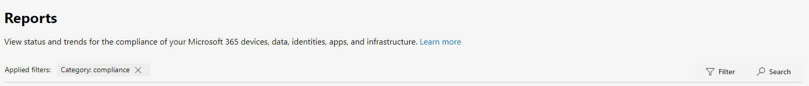

# What's new in the Microsoft 365 compliance center

We're continuously adding new features to the [Microsoft 365 compliance center](microsoft-365-compliance-center.md), fixing issues we learn about, and making changes based on your feedback. Take a look below to see what's available for you today. Some features get rolled out at different speeds to our customers. If you aren't seeing a feature yet, try adding yourself to [targeted release](https://docs.microsoft.com/office365/admin/manage/release-options-in-office-365).

> [!TIP]
> Interested in what's going on in other admin centers? Check out these articles: [What's new in the Microsoft 365 admin center](https://docs.microsoft.com/office365/admin/whats-new-in-preview?view=o365-worldwide) [What's new in the SharePoint admin center](https://docs.microsoft.com/sharepoint/what-s-new-in-admin-center)  
And visit the [Microsoft 365 Roadmap](https://www.microsoft.com/en-us/microsoft-365/roadmap) to learn about Microsoft 365 features that were launched, are rolling out, are in development, have been cancelled, or previously released.

## February 2020

### Insider risk management is officially released

Drum roll, please... Insider risk management is now available to organizations with the following subscriptions:

- [Microsoft 365 E5](https://go.microsoft.com/fwlink/?linkid=2120431) (paid or trial)
- Microsoft 365 Enterprise E3 subscription with the [Microsoft E5 Compliance add-on](https://go.microsoft.com/fwlink/?linkid=2120432)

Heads up that we made some improvements since the preview release, including [new role groups](insider-risk-management-configure.md#step-1-required-enable-permissions-for-insider-risk-management) and [solution-wide settings](insider-risk-management-configure.md#step-4-required-configure-insider-risk-settings).

As always, please leave feedback as you use the solution so we can continue to make improvements.

### Records management

This new solution brings all the records management capabilities under a single umbrella. Highlights include the introduction of records versioning for SharePoint and OneDrive and proof of disposal for records.

[Learn more about records management](records-management.md)

### Solution spotlight: Data connectors for Facebook and Twitter

Data connectors [released last month](#just-launched) and we're looking for your help in testing out the following connectors.

- [Facebook business pages](archive-facebook-data-with-sample-connector.md). Imports and archives data from Facebook business pages to Microsoft 365. Beneficial for compliance solutions such as records management and eDiscovery.
- [Twitter](archive-twitter-data-with-sample-connector.md). Imports and archives data from Twitter to Microsoft 365. Beneficial for compliance solutions such as records management and eDiscovery.

As you set up and validate these connectors, please leave us feedback about what went well, what didn't, and what we can do to improve the experience.

## January 2020

The wait is over. We're pleased to announce that the Microsoft 365 compliance center is available to all customers with Microsoft 365, Office 365, Enterprise Mobility + Security (EMS), and Windows 10 Enterprise plans. Any data or policies you were managing in the Office 365 Security & Compliance Center are available in the compliance center, so no need to jump back and forth.

> [!TIP]
> Read through last month's update again for a refresher on some of the [new solutions](#new-compliance-solutions) we previewed recently, as well as a [roadmap](#updated-compliance-solutions) showing where compliance features from the Office 365 Security & Compliance Center now live in Microsoft 365.

Bookmark and head over now to [https://compliance.microsoft.com](https://compliance.microsoft.com) to tour your one-stop-shop for managing compliance across your org...or [read this article](microsoft-365-compliance-center.md) to dig in a bit more.

We also released new and updated solutions this month. Here's a quick glance at the highlights.

### Now in preview

**Insider risk management (preview)**

We're happy to announce that our insider risk management solution is now in public preview. In a nutshell, insider risk management helps your organization intelligently identify and take action on insider risks by providing:

- Anonymity controls to help ensure user privacy.
- Intelligent policy templates with native and third-party indicators that identify insider threats, such as data leaks.
- Integrated end-to-end investigation workflows that span across IT, HR and legal teams.

We'd love to hear what you think. As you use the solution, leave us feedback so we can make sure we're meeting your needs as we head toward general availability.

[Learn more about insider risk management](insider-risk-management.md)

### Just launched

**Communication compliance**

Graduating from the preview phase to full availability, communication compliance is a key component of our new insider risk solution set. This robust solution helps minimize communication risks using workflows for detecting, investigating, and taking remediation actions for messages that don't meet your organization's standards.

Customer feedback during the preview was fantastic. It resulted in several enhancements, including a first-run experience to get you started, improvements to investigation and remediation actions, and more.

[Learn more about communication compliance](communication-compliance.md)

**Data connectors**

Formerly sharing space with other 'Import' features in the Office 365 Security & Compliance Center, data connectors now have their very own home in the Microsoft 365 compliance center. Use the new 'Data connectors' page to import and archive data from your organization's human resources (HR) files and various third-party platforms (like Facebook, LinkedIn, Twitter, and Instant Bloomberg) to mailboxes in your Microsoft 365 organization. Once imported, this data can be managed in several compliance solutions, including eDiscovery, insider risk management, communication compliance, audit, retention policies, and more.

[Learn more about data connectors](archiving-third-party-data.md)

### Noteworthy updates

**New assessment templates for Compliance Score (preview)**

Always working hard to help you get ahead of the ever-evolving compliance landscape, our Compliance Score team shipped a new set of templates to help you assess your organization's compliance posture against recent regulations and get guidance on how to implement more effective controls. You'll see new templates for:

- ISO/IEC 27701:2019
- California Consumer Privacy Act (CCPA)
- Brazil General Data Protection Law (Lei Geral de Proteção de Dados - LGPD)
- SOC 1 Type 2 and SOC 2 Type 2

[Learn more about Compliance Score templates](compliance-score.md#templates)

## November & December 2019

Over the holidays, we started rolling out all the great compliance solutions that were demo'd at Ignite. Most are in a preview state, so test them out and be sure to let us know what you think by opening the Feedback card at the bottom right of the compliance center.

### Get to know the new neighborhood

The new Microsoft 365 compliance center includes brand new solutions as well as the compliance features you know and love from the Office 365 Security & Compliance Center. Let's dig in a bit more…

#### New compliance solutions

You might be wondering what a *solution* is. As much as the cloud has revolutionized the way business is done, it's also opened the door for new methods of data theft and fraud and necessitated new regulations. Our compliance solutions are collections of integrated capabilities that can help you help you manage these evolving compliance requirements. A solution's capabilities might include a combination of policies, alerts, reports, and more.

Here's a summary of the new solutions you'll find. Keep an eye out for others coming soon.

> [!NOTE]
> These solutions are located only in the Microsoft 365 compliance center. They can't be managed in the Office 365 Security & Compliance Center.
 

|**New solution**|**Description**|**Learn more**|
|:-----|:-----|:-----|
|Microsoft Compliance Score (preview)  |Built from [Compliance Manager](compliance-manager-overview.md), Compliance Score is a standalone feature with a simpler, more user-friendly design that helps you understand and improve your organization's compliance posture. It calculates a risk-based score measuring your progress in completing actions that help reduce risks around data protection and regulatory standards.  |[Overview of Microsoft Compliance Score (preview)](compliance-score.md)|
|Solution catalog (preview)  |The solution catalog is your one-stop-shop for discovering, learning about, and quickly getting started with our compliance and risk management solutions. The catalog is organized into three compliance categories, each containing details about the solutions that make up that category. Categories include Information protection & governance, Insider risk management, and Discovery & response  |[Overview of the solution catalog (preview)](microsoft-365-solution-catalog.md)|
|Communication compliance (preview)  |Communication compliance is part of the new insider risk management category that helps minimize communication risks by helping you detect, capture, and take remediation actions for inappropriate messages in your organization. The solution extends the capabilities of supervision policies in Office 365 by introducing several new enhancements such as intelligent templates, flexible remediation workflows, and actionable insights.  |[Communication compliance in Microsoft 365 (preview)](communication-compliance.md)|
|Data classification (preview)  |Our new Data classification page contains powerful insights and tools to help you discover and evaluate how sensitive info and labels (retention and sensitivity) are being used in content across your organization. Review content that contains sensitive info or has labels applied, explore label activity across Microsoft 365 locations, create custom sensitive info types, and much more. |[Data classification overview (preview)](data-classification-overview.md)|
|Trainable classifiers (preview)  |This powerful new tool uses our machine learning engine to help identify categories of content in your org, like regulatory docs or employee agreements. Once created, classifiers can be used in several compliance solutions to detect related content and classify it, protect it, retain it, and more. |[Getting started with trainable classifiers (preview)](classifier-getting-started-with.md)|

#### Updated compliance solutions

If you've been using the Office 365 Security & Compliance Center for your compliance needs, you might wonder where some features now live in the new Microsoft 365 compliance center. Here's a quick roadmap to help find their new homes.

> [!NOTE]
> Some features are still available only in the Office 365 Security & Compliance Center – these are noted below. But we're working hard to preview these in the Microsoft 365 compliance center, so stay tuned for updates. 
 

|**Feature**|**Office 365 Security & Compliance Center**|**Microsoft 365 compliance center**|**Learn more**|
|:-----|:-----|:-----|:-----|
|Advanced eDiscovery|eDiscovery > Advanced eDiscovery   https://protection.office.com/advancedediscoverycases |eDiscovery > Advanced   https://compliance.microsoft.com/advancedediscovery | [Overview of the Advanced eDiscovery solution in Microsoft 365](overview-ediscovery-20.md) |
|Alert policies|Alerts > Alert policies   https://protection.office.com/alertpolicies |At this time, alert policies are managed only in the Office 365 Security & Compliance Center. |[Alert policies in the security and compliance center](alert-policies.md) |
|Alerts|Alerts > View alerts   https://protection.office.com/viewalerts |Alerts   https://compliance.microsoft.com/compliancealerts |[Viewing alerts](alert-policies.md#viewing-alerts)|
|Archive|Information governance > Archive   https://protection.office.com/archiving |Information governance > Archive tab   https://compliance.microsoft.com/informationgovernance?viewid=archive |[Enable archive mailboxes](enable-archive-mailboxes.md)|
|Audit log search|Search > Audit log search   https://protection.office.com/unifiedauditlog |Audit   https://compliance.microsoft.com/auditlogsearch | [Search the audit log in the Security & Compliance Center](search-the-audit-log-in-security-and-compliance.md)|
|Content search|Search > Content search   https://protection.office.com/contentsearchbeta?ContentOnly=1 | Content search   https://compliance.microsoft.com/contentsearch |[Search for content in Office 365](search-for-content.md) |
|Data connectors|Information governance > Archive third-party data   https://protection.office.com/nativeconnector | Data connectors   https://compliance.microsoft.com/connectorlanding |[Archive third-party data](archiving-third-party-data.md)|
|Data loss prevention|Data loss prevention   https://protection.office.com/datalossprevention |Data loss prevention   https://compliance.microsoft.com/datalossprevention |[Overview of data loss prevention](data-loss-prevention-policies.md)|
|Data subject requests |Data privacy > Data subject requests   https://protection.office.com/dsrcases |Data subject requests   https://compliance.microsoft.com/datasubjectrequest |[Manage GDPR data subject requests with the DSR case tool](manage-gdpr-data-subject-requests-with-the-dsr-case-tool.md)|
|eDiscovery|eDiscovery > eDiscovery   https://protection.office.com/ediscoveryv1 |eDiscovery > Core   https://compliance.microsoft.com/classicediscovery |[Manage eDiscovery cases](ediscovery-cases.md) |
|Events|Records management > Events   https://protection.office.com/events |Records management > Events tab   https://compliance.microsoft.com/recordsmanagement?viewid=events |[Overview of event-driven retention](event-driven-retention.md)|
|File plan|Records management > File plan   https://protection.office.com/fileplan |Records management > File plan tab   https://compliance.microsoft.com/recordsmanagement?viewid=fileplan |[Overview of file plan manager](file-plan-manager.md)|
|Import PST files|Information governance > Import PST files   https://protection.office.com/importV2 |Information governance > Import tab   https://compliance.microsoft.com/informationgovernance?viewid=import |[Overview of importing your organization's PST files](importing-pst-files-to-office-365.md)|
|Label activity explorer|Information governance > Label activity explorer   https://protection.office.com/labelexplorer |Data classification > Activity explorer tab   https://compliance.microsoft.com/dataclassification?viewid=activitiesexplorer |[View activity on your labeled content (preview)](data-classification-activity-explorer.md)|
|Retention labels and label policies |Classification > Retention labels > Labels and Label policies tabs   https://protection.office.com/retentionlabels |Information governance > Labels and Label policies tabs   https://compliance.microsoft.com/informationgovernance?viewid=labels   https://compliance.microsoft.com/informationgovernance?viewid=labelpolicies | [Overview of retention labels](labels.md)|
|Retention policies|Information governance > Retention   https://protection.office.com/retention |Information governance > Retention tab   https://compliance.microsoft.com/informationgovernance?viewid=retention |[Overview of retention policies](retention-policies.md)|
|Sensitive info types|Classification > Sensitive info types   https://protection.office.com/sensitivetypes |Data classification > Sensitive info types tab   https://compliance.microsoft.com/dataclassification?viewid=sensitiveinfotypes |[What the sensitive information types look for](what-the-sensitive-information-types-look-for.md)|
|Sensitivity labels and label policies|Classification > Sensitivity labels > Labels and Label policies tabs   https://protection.office.com/sensitivity |Information protection > Labels and Label policies tabs   https://compliance.microsoft.com/informationprotection?viewid=sensitivitylabels   https://compliance.microsoft.com/informationprotection?viewid=sensitivitylabelpolicies |[Learn about sensitivity labels](sensitivity-labels.md) |
|Service assurance|Service assurance   https://protection.office.com/serviceassurance/dashboard |At this time, service assurance resources can only be accessed in the Office 365 Security & Compliance Center. |[Service assurance in the Security & Compliance Center](service-assurance.md)|
|Supervision|Supervision   https://protection.office.com/supervisoryreviewv2 |Communication compliance   https://compliance.microsoft.com/supervisoryreview |[Communication compliance in Microsoft 365 (preview)](communication-compliance.md) |

## September 2019

Wondering why it's quiet on the release front this month? We're heads down building new, innovative compliance solutions that'll be unveiled at [Microsoft Ignite](https://www.microsoft.com/ignite) in November. Stay tuned!

### New encryption options for sensitivity labels 

When configuring encryption for a sensitivity label, you now have two options that lets users assign permissions when they manually apply the label to email and docs: 
- When applying the label to **Outlook email**, users can enforce restrictions equivalent to the Do Not Forward option. Recipients will be able to read the message but not forward, print, or copy the content.
- When applying the label to **Word, PowerPoint, and Excel files**, users will be prompted to assign access permissions to specific users and groups.

[Learn more](encryption-sensitivity-labels.md#let-users-assign-permissions)

## August 2019

### Update to data investigations

When performing a data investigation, you can now delete items from their original locations. This means you can delete items from Exchange mailboxes, SharePoint sites, and OneDrive accounts across your organization. Because you collected the items as evidence, you'll have copies of them retained in the evidence set to you can investigate further or just keep as a reference. [Learn more](manage-data-spillage-incidents.md#step-4-delete-the-spilled-data) 

## July 2019

### New admin roles

We released two new admin roles to help manage security and compliance in your org. Tell all your friends.

- **Compliance data admin**. Users with this role have permissions to protect and track data in the Microsoft 365 compliance center, Microsoft 365 admin center, and Azure. They can also manage everything the Exchange admin center, Compliance Manager, Teams & Skype for Business admin center and create support tickets for Azure and Microsoft 365.
- **Security operator**. Users with this role can manage alerts and have global read-only access to security-related features, including everything in the Microsoft 365 security center, Azure Active Directory, Identity Protection, Privileged Identity Management and Office 365 Security & Compliance Center.

[Learn more about these roles](https://docs.microsoft.com/microsoft-365/security//office-365-security/permissions-microsoft-365-compliance-security)

### Search and filtering for reports

No more scrolling through a sea of reports to find the ones you want. You can now search for reports (based on their titles) and filter on categories like 'Labels' and 'Compliance' and sources like 'Office 365' and 'Microsoft Cloud App Security'.

