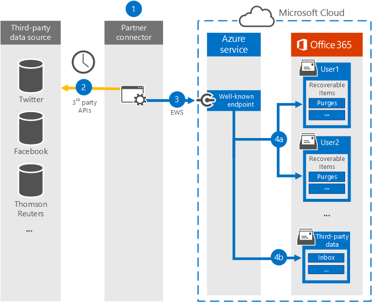
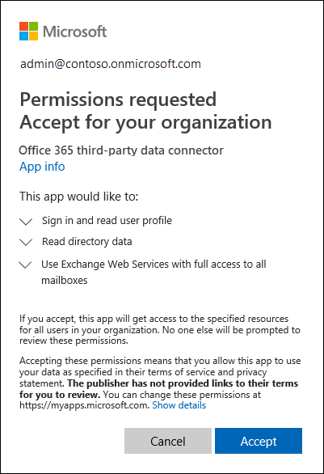

# Work with a partner to archive third-party data

You can work with a Microsoft Partner to import and archive data from a third-party data source to Microsoft 365. A partner can provide you with a custom connector that is configured to extract items from the third-party data source (on a regular basis) and then import those items. The partner connector converts the content of an item from the data source to an email message format and then stores the items in mailboxes. After third-party data is imported, you can apply Microsoft 365 compliance features such as Litigation Hold, eDiscovery, In-Place Archiving, Auditing, and Microsoft 365 retention policies to this data.

>[!IMPORTANT]
>The [Communication compliance](communication-compliance.md) solution in Microsoft 365 can't be applied to the third-party data imported by partner connectors mentioned in this article. 

Here's an overview of the process and the steps necessary to work with a Microsoft Partner to import third-party data.

[Step 1: Find a third-party data partner](#step-1-find-a-third-party-data-partner)

[Step 2: Create and configure a third-party data mailbox](#step-2-create-and-configure-a-third-party-data-mailbox-in-microsoft-365)

[Step 3: Configure user mailboxes for third-party data](#step-3-configure-user-mailboxes-for-third-party-data)

[Step 4: Provide your partner with information](#step-4-provide-your-partner-with-information)

[Step 5: Register the third-party data connector in Azure Active Directory](#step-5-register-the-third-party-data-connector-in-azure-active-directory)

## How the third-party data import process works

The following illustration and description explain how the third-party data import process works when working with a partner.
  

  
1. Customer works with their partner of choice to configure a connector that will extract items from the third-party data source and then import those items to Microsoft 365.
    
2. The partner connector connects to third-party data sources via a third-party API (on a scheduled or as-configured basis) and extracts items from the data source. The partner connector converts the content of an item to an email message format. See the [More information](#more-information) section for a description of the message-format schema. 
    
3. Partner connector connects to the Azure service in Microsoft 365 by using Exchange Web Service (EWS) via a well-known end point.
    
4. Items are imported into the mailbox of a specific user or into a "catch-all" third-party data mailbox. Whether an item is imported into a specific user mailbox or to the third-party data mailbox is based on the following criteria:
    
   1. **Items that have a user ID that corresponds to a user account:** If the partner connector can map the user ID of the item in the third-party data source to a specific user ID in Microsoft 365, the item is copied to the **Purges** folder in the user's Recoverable Items folder. Users can't access items in the Purges folder. However, you can use eDiscovery tools to search for items in the Purges folder.
    
   1. **Items that don't have a user ID that corresponds to a user account:** If the partner connector can't map the user ID of an item to a specific user ID, the item is copied to the **Inbox** folder of the third-party data mailbox. Importing items to the inbox allows you or someone in your organization to sign in to the third-party mailbox to view and manage these items, and see if any adjustments need to be made in the partner connector configuration.
 
## Step 1: Find a third-party data partner

A key component for archiving third-party data in Microsoft 365 is finding and working with a Microsoft partner that specializes in capturing data from a third-party data source and importing it to Microsoft 365. After the data is imported, it can be archived and preserved along with your organization's other Microsoft data, such as email from Exchange and documents from SharePoint and OneDrive for Business. A partner creates a connector that extracts data from your organization's third-party data sources (such as BlackBerry, Facebook, Google+, Thomson Reuters, Twitter, and YouTube) and passes that data to a Microsoft 365 API that imports items to Exchange mailboxes as email messages.
  
The following sections list the Microsoft partners (and the third-party data sources they support) that are participating in the program for archiving third-party data in Microsoft 365.

[17a-4 LLC](#17a-4-llc)
  
[ArchiveSocial](#archivesocial)
  
[Veritas](#veritas)
  
[OpenText](#opentext)
  
[Smarsh](#smarsh)

[Verba](#verba)
  
### 17a-4 LLC

[17a-4 LLC](https://www.17a-4.com) supports the following third-party data sources:
  
- BlackBerry
    
- Bloomberg Data Streams
    
- Cisco Jabber
    
- FactSet
    
- HipChat
    
- InvestEdge
    
- LivePerson
    
- MessageLabs Data Streams
    
- OpenText
    
- Oracle/ATG 'click-to-call' Live Help
    
- Pivot IMTRADER
    
- Microsoft SharePoint
    
- MindAlign
    
- Sitrion One (Newsgator)
    
- Skype for Business (Lync/OCS)
    
- Skype for Business Online (Lync Online)
    
- SQL Databases
    
- Squawker
    
- Thomson Reuters Eikon Messenger
  

  
### ArchiveSocial

[ArchiveSocial ](https://www.archivesocial.com) supports the following third-party data sources: 
  
- Facebook
    
- Flickr
    
- Instagram
    
- LinkedIn
    
- Pinterest
    
- Twitter
    
- YouTube
    
- Vimeo
  
### Veritas

[Veritas](https://www.globanet.com) supports the following third-party data sources: 
  
- AOL with Pivot Client 
    
- BlackBerry Call Logs (v5, v10, v12)
    
- BlackBerry Messenger (v5, v10, v12)
    
- BlackBerry PIN (v5, v10, v12)
    
- BlackBerry SMS (v5, v10, v12)
    
- Bloomberg Chat
    
- Bloomberg Mail
    
- Box
    
- CipherCloud for Salesforce Chatter
    
- Cisco IM &amp; Presence Server (v10, v10.5.1 SU1, v11.0, v11.5 SU2)

- Cisco Webex Teams

- Citrix Workspace &amp; ShareFile

- CrowdCompass

- Custom-delimited text files
    
- Custom XML files
    
- Facebook (Pages)
    
- Factset
    
- FXConnect
    
- ICE Chat/YellowJacket
    
- Jive
    
- Macgregor XIP

- Microsoft Exchange Server
    
- Microsoft OneDrive for Business

- Microsoft Teams
       
- Microsoft Yammer
    
- Mobile Guard
    
- Pivot
    
- Salesforce Chatter

- Skype for Business Online
    
- Skype for Business, versions 2007 R2 - 2016 (on-premises)
    
- Slack Enterprise Grid
    
- Symphony
    
- Thomson Reuters Eikon
    
- Thomson Reuters Messenger
    
- Thomson Reuters Dealings 3000 / FX Trading
    
- Twitter
    
- UBS Chat
    
- YouTube
  
### OpenText

[OpenText](https://www.opentext.com/what-we-do/products/opentext-product-offerings-catalog/rebranded-products/daegis) supports the following third-party data sources: 
  
- Axs Encrypted
    
- Axs Exchange
    
- Axs Local Archive
    
- Axs PlaceHolder
    
- Axs Signed
    
- Bloomberg
    
- Thomson Reuters
  
### Smarsh

[Smarsh](https://www.smarsh.com) supports the following third-party data sources: 
  
- AIM
    
- American Idol
    
- Apple Juice
    
- AOL with Pivot client
    
- Ares
    
- Bazaar Voice
    
- Bear Share
    
- Bit Torrent
    
- BlackBerry Call Logs (v5, v10, v12)
    
- BlackBerry Messenger (v5, v10, v12)
    
- BlackBerry PIN (v5, v10, v12)
    
- BlackBerry SMS (v5, v10, v12)
    
- Bloomberg Mail
    
- CellTrust
    
- Chat Import
    
- Chat Real Time Logging and Policy
    
- Chatter
    
- Cisco IM &amp; Presence Server (v9.0.1, v9.1, v9.1.1 SU1, v10, v10.5.1 SU1)
    
- Cisco Unified Presence Server (v8.6.3, v8.6.4, v8.6.5)
    
- Collaboration Import
    
- Collaboration Real Time Logging
    
- Direct Connect
    
- Facebook
    
- FactSet
    
- FastTrack
    
- Gnutella
    
- Google+
    
- GoToMyPC
    
- Hopster
    
- HubConnex
    
- IBM Connections (v3.0.1, v4.0, v4.5, v4.5 CR3, v5)
    
- IBM Connections Chat Cloud
    
- IBM Connections Social Cloud
    
- IBM SameTime Advanced 8.5.2 IFR1
    
- IBM SameTime Communicate 9.0
    
- IBM SameTime Community (v8.0.2, v8.5.1 IFR2, v8.5.2 IFR1, v9.1)
    
- IBM SameTime Complete 9.0
    
- IBM SameTime Conference 9.0
    
- IBM SameTime Meeting 8.5.2 IFR1
    
- ICE/YellowJacket
    
- IM Import
    
- IM Real Time Logging and Policy
    
- Indii Messenger
    
- Instant Bloomberg
    
- IRC
    
- Jive
    
- Jive 6 Real Time Logging (v6, v7)
    
- Jive Import
    
- JXTA
    
- LinkedIn
    
- Microsoft Lync (2010, 2013)
    
- MFTP
    
- Microsoft Lync 2013 Voice
    
- Microsoft SharePoint (2010, 2013)
    
- Microsoft SharePoint Online
    
- Microsoft UC (Unified Communications)
    
- MindAlign
    
- Mobile Guard
    
- MSN
    
- My Space
    
- NEONetwork
    
- Microsoft 365 Lync Dedicated
    
- Microsoft 365 Shared IM
    
- Pinterest
    
- Pivot
    
- QQ
    
- Skype for Business 2015
    
- SoftEther
    
- Symphony
    
- Thomson Reuters Eikon
    
- Thomson Reuters Messenger
    
- Tor
    
- TTT
    
- Twitter
    
- WinMX
    
- Winny
    
- Yahoo
    
- Yammer
    
- YouTube
    

### Verba

[Verba](https://www.verba.com) supports the following third-party data sources: 
  
- Avaya Aura Video
    
- Avaya Aura Voice
    
- Avtec Radio
    
- Bosch/Telex Radio
    
- BroadSoft Video
    
- BroadSoft Voice
    
- Centile Voice
    
- Cisco Jabber IM
    
- Cisco UC Video
    
- Cisco UC Voice
    
- Cisco UCCX/UCCE Video
    
- Cisco UCCX/UCCE Voice
    
- ESChat Radio
    
- Geoman Contact Expert
    
- IP Trade Voice
    
- Luware LUCS Contact Center
    
- Microsoft UC (Unified Communications)
    
- Mitel MiContact Center for Lync (prairieFyre)
    
- Oracle / Acme Packet Session Border Controller Video
    
- Oracle / Acme Packet Session Border Controller Voice
    
- Singtel Mobile Voice
    
- SIPREC Video
    
-  SIPREC Voice 
    
- Skype for Business / Lync IM
    
- Skype for Business / Lync Video
    
- Skype for Business / Lync Voice
    
- Speakerbus Voice
    
- Standard SIP/H.323 Video
    
- Standard SIP/H.323 Voice
    
- Truphone Voice
    
- TwistedPair Radio
    
- Windows Desktop Computer Screen
  
## Step 2: Create and configure a third-party data mailbox in Microsoft 365

Here are the steps for creating and configuring a third-party data mailbox for importing data to Microsoft 365. As previous explained, items are imported to this mailbox if the partner connector can't map the user ID of the item to a user account.
  
 **Complete these tasks in the Microsoft 365 admin center**
  
1. Create a user account and assign it an Exchange Online Plan 2 license; see [Add users to Microsoft 365](../admin/add-users/add-users.md). A Plan 2 license is required to place the mailbox on Litigation Hold or enable an archive mailbox that has an unlimited storage quota.
    
2. Add the user account for the third-party data mailbox to the **Exchange administrator** admin role in Microsoft 365; see [Assign admin roles in Microsoft 365](../admin/add-users/assign-admin-roles.md).
    
    > [!TIP]
    > Write down the credentials for this user account. You need to provide them to your partner, as described in Step 4. 
  
 **Complete these tasks in the Exchange admin center**
  
1. Hide the third-party data mailbox from the address book and other address lists in your organization; see [Manage user mailboxes](/exchange/recipients-in-exchange-online/manage-user-mailboxes/manage-user-mailboxes). Alternatively, you can run the following PowerShell command:
    
    ```powershell
    Set-Mailbox -Identity <identity of third-party data mailbox> -HiddenFromAddressListsEnabled $true
    ```

2. Assign the **FullAccess** permission to the third-party data mailbox so that administrators or compliance officers can open the third-party data mailbox in the Outlook desktop client; see [Manage permissions for recipients](https://go.microsoft.com/fwlink/p/?LinkId=692104).
    
3. Enable the following compliance-related features for the third-party data mailbox:
    
    - Enable the archive mailbox; see [Enable archive mailboxes](enable-archive-mailboxes.md) and [Enable unlimited archiving](enable-unlimited-archiving.md). This lets you free-up storage space in the primary mailbox by setting up an archive policy that moves third-party data items to the archive mailbox. This provides you with unlimited storage for third-party data.
    
    - Place the third-party data mailbox on Litigation Hold. You can also apply a Microsoft 365 retention policy in the security and compliance center. Placing this mailbox on hold retains third-party data items (indefinitely or for a specified duration) and prevent them from being purged from the mailbox. See one of the following topics:
    
      - [Place a mailbox on Litigation Hold](./create-a-litigation-hold.md)
    
      - [Learn about retention policies and retention labels](retention.md)
    
    - Enable mailbox audit logging for owner, delegate, and admin access to the third-party data mailbox; see [Enable mailbox auditing](enable-mailbox-auditing.md). This allows you to audit all activity performed by any user who has access to the third-party data mailbox.

## Step 3: Configure user mailboxes for third-party data

The next step is to configure user mailboxes to support third-party data. Complete these tasks by using the Exchange admin center or by using the corresponding Windows PowerShell cmdlets.
  
1. Enable the archive mailbox for each user; see [Enable archive mailboxes](enable-archive-mailboxes.md) and [Enable unlimited archiving](enable-unlimited-archiving.md).
    
2. Place user mailboxes on Litigation Hold or apply a Microsoft 365 retention policy; see one of the following topics: 
    
    - [Place a mailbox on Litigation Hold](./create-a-litigation-hold.md)
    
    - [Learn about retention policies and retention labels](retention.md)
    
    As previously stated, when you place mailboxes on hold, you can set a duration for how long to hold items from the third-party data source or you can choose to hold items indefinitely.

## Step 4: Provide your partner with information

The final step is to provide your partner with the following information so they can configure the connector to connect to your organization to import data to user mailboxes and to the third-party data mailbox. 
  
- The endpoint used to connect to the Azure service in Microsoft 365:

    ```http
    https://office365ingestionsvc.gble1.protection.outlook.com/service/ThirdPartyIngestionService.svc
    ```

- The sign-in credentials (Microsoft 365 user ID and password) of the third-party data mailbox that you created in Step 2. These credentials are required so that the partner connector can access and import items to user mailboxes and to the third-party data mailbox.
 
## Step 5: Register the third-party data connector in Azure Active Directory

Starting September 30, 2018, the Azure service in Microsoft 365 will begin using modern authentication in Exchange Online to authenticate third-party data connectors that attempt to connect to your organization to import data. The reason for this change is that modern authentication provides more security than the current method, which was based on an allow list for third-party connectors that use the previously described endpoint to connect to the Azure service.

To enable a third-party data connector to connect to Microsoft 365 using the new modern authentication method, an administrator in your organization must consent to register the connector as a trusted service application in Azure Active Directory. This is done by accepting a permission request to allow the connector to access your organization's data in Azure Active Directory. After you accept this request, the third-party data connector is added as an enterprise application to Azure Active Directory and represented as a service principal. For more information the consent process, see  [Tenant Admin Consent](/skype-sdk/trusted-application-api/docs/tenantadminconsent).

Here are the steps to access and accept the request to register the connector:

1. Go to [this page](https://login.microsoftonline.com/common/oauth2/authorize?client_id=8dfbc50b-2111-4d03-9b4d-dd0d00aae7a2&response_type=code&redirect_uri=https://portal.azure.com/&nonce=1234&prompt=admin_consent) and sign in using the credentials of a global administrator.

   The following dialog box is displayed. You can expand the carets to review the permissions that will be assigned to the connector.

   

2. Click **Accept**.

After you accept the request, the [Azure portal](https://portal.azure.com) is displayed. To view the list of applications for your organization, click **Azure Active Directory** > **Enterprise applications**. The Microsoft 365 third-party data connector is listed on the **Enterprise applications** blade.

> [!IMPORTANT]
> After September 30, 2018, third-party data will no longer be imported into mailboxes in your organization if you don't register a third-party data connector in Azure Active Directory. Note existing third-party data connectors (those created before September 30, 2018) must also be registered in Azure Active Directory by following the procedure in Step 5.

### Revoking consent for a third-party data connector

After your organization consents to the permissions request to register a third-party data connector in Azure Active Directory, your organization can revoke that consent at any time. However, revoking the consent for a connector means that data from the third-party data source will no longer be imported into Microsoft 365.

To revoke consent for a third-party data connector, you can delete the application (by deleting the corresponding service principal) from Azure Active Directory using the **Enterprise applications** blade in the Azure portal, or by using the [Remove-MsolServicePrincipal](/powershell/module/msonline/remove-msolserviceprincipal) in Microsoft 365 PowerShell. You can also use the [Remove-AzureADServicePrincipal](/powershell/module/azuread/remove-azureadserviceprincipal) cmdlet in Azure Active Directory PowerShell.
  
## More information

- As previous explained, items from third-party data sources are imported to Exchange mailboxes as email messages. The partner connector imports the item using a schema required by the Microsoft 365 API. The following table describes the message properties of an item from a third-party data source after it's imported to an Exchange mailbox as an email message. The table also indicates if the message property is mandatory. Mandatory properties must be populated. If an item is missing a mandatory property, it won't be imported to Microsoft 365. The import process returns an error message explaining why an item wasn't imported and which property is missing.<br/><br/>
    
    |**Message property**|**Mandatory?**|**Description**|**Example value**|
    |:-----|:-----|:-----|:-----|
    |**FROM** <br/> |Yes  <br/> |The user who originally created or sent the item in the third-party data source. The partner connector attempts to map the user ID from the source item (for example a Twitter handle) to a user account for all participants (users in the FROM and TO fields). A copy of the message will be imported to the mailbox of every participant. If none of the participants from the item can be mapped to a user account, the item will be imported to the third-party archiving mailbox in Microsoft 365.  <br/> <br/> The participant who's identified as the sender of the item must have an active mailbox in the organization that the item is being imported to. If the sender doesn't have an active mailbox, the following error is returned:<br/><br/>  `One or more messages in the Request failed to be delivered to either From or Sender email address. You will need to resend your entire Request. Error: The request failed. The remote server returned an error: (401) Unauthorized.`  | `bob@contoso.com` <br/> |
    |**TO** <br/> |Yes  <br/> |The user who received an item, if applicable for an item in the data source.  <br/> | `bob@contoso.com` <br/> |
    |**SUBJECT** <br/> |No  <br/> |The subject from the source item.  <br/> | `"Mega deals with Contoso coming your way! #ContosoHolidayDeals"` <br/> |
    |**DATE** <br/> |Yes  <br/> |The date the item was originally created or posted in the customer data source. For example, that date when a Twitter message was tweeted.  <br/> | `01 NOV 2015` <br/> |
    |**BODY** <br/> |No  <br/> |The contents of the message or post. For some data sources, the contents of this property could be the same as the content for the **SUBJECT** property. During the import process, the partner connector attempts to maintain full fidelity from the content source as possible. If possible files, graphics, or other content from the body of the source item is included in this property. Otherwise, content from the source item is included in the **ATTACHMENT** property. The contents of this property depends on the partner connector and on the capability of the source platform.  <br/> | `Author: bob@contoso.com` <br/>  `Date: 10 DEC 2014` <br/>  `Tweet: "Mega deals with Contoso coming your way! #ContosoHolidayDeals"` <br/>  `Date: 01 NOV 2015` <br/> |
    |**ATTACHMENT** <br/> |No  <br/> |If an item in the data source (such as a tweet in Twitter or an instant messaging conversation) has an attached file or include images, the partner connect will first attempt to include attachments in the **BODY** property. If that isn't possible, then it's added to the ** ATTACHMENT ** property. Other examples of attachments include Likes in Facebook, metadata from the content source, and responses to a message or post.  <br/> | `image.gif` <br/> |
    |**MESSAGECLASS** <br/> |Yes  <br/> | This is a multi-value property, which is created and populated by partner connector. The format of this property is  `IPM.NOTE.Source.Event`. (This property must begin with  `IPM.NOTE`. This format is similar to the one for the  `IPM.NOTE.X` message class.) This property includes the following information:  <br/><br/>`Source`: Indicates the third-party data source; for example, Twitter, Facebook, or BlackBerry.  <br/> <br/>  `Event`: Indicates the type of activity that was performed in the third-party data source that produced the items; for example, a tweet in Twitter or a post in Facebook. Events are specific to the data source.  <br/> <br/>  One purpose of this property is to filter specific items based on the data source where an item originated or based on the type of event. For example, in an eDiscovery search you could create a search query to find all the tweets that were posted by a specific user.  <br/> | `IPM.NOTE.Twitter.Tweet` <br/> |
   
- When items are successfully imported to mailboxes in Microsoft 365, a unique identifier is returned back to the caller as part of the HTTP response. This identifier, called  `x-IngestionCorrelationID`, can be used for subsequent troubleshooting purposes by partners for end-to-end tracking of items. It's recommended that partners capture this information and log it accordingly at their end. Here's an example of an HTTP response showing this identifier:

    ```http
    HTTP/1.1 200 OK
    Content-Type: text/xml; charset=utf-8
    Server: Microsoft-IIS/8.5
    x-IngestionCorrelationID: 1ec7667d-f097-47fe-a9a2-bc7ab0a7552b
    X-AspNet-Version: 4.0.30319
    X-Powered-By: ASP.NET
    Date: Tue, 02 Feb 2016 22:55:33 GMT 
    ```

- You can use the Content Search tool in the security and compliance center to search for items that were imported to mailboxes from a third-party data source. To search specifically for these imported items, you can use the following message property-value pairs in the keyword box for a Content Search.
    
  - **`kind:externaldata`**: Use this property-value pair to search all third-party data types. For example, to search for items that were imported from a third-party data source and contained the word "contoso" in the Subject property of the imported item, you would use the keyword query  `kind:externaldata AND subject:contoso`.
    
  - **`itemclass:ipm.externaldata.<third-party data type>`**: Use this property-value pair to only search a specify type of third-party data. For example, to only search Facebook data that contains the word "contoso" in the Subject property, you would use the keyword query  `itemclass:ipm.externaldata.Facebook* AND subject:contoso`. 

  For a complete list of values to use for third-party data types for the  `itemclass` property, see [Use Content Search to search third-party data that was imported to Microsoft 365](use-content-search-to-search-third-party-data-that-was-imported.md).
    
   For more information about using Content Search and creating keyword search queries, see:
    
  - [Content Search](content-search.md)
    
  - [Keyword queries and search conditions for Content Search](keyword-queries-and-search-conditions.md)