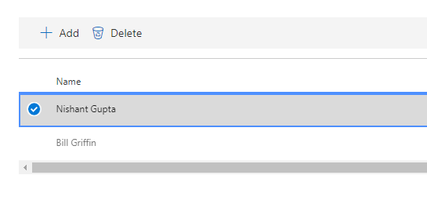
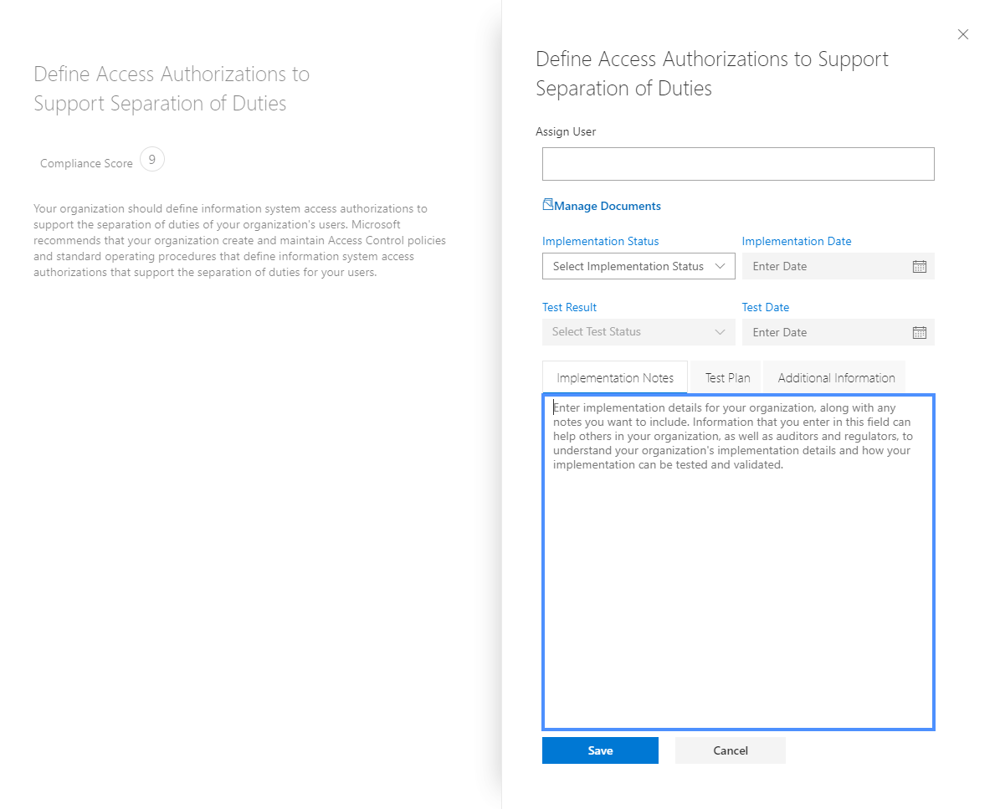
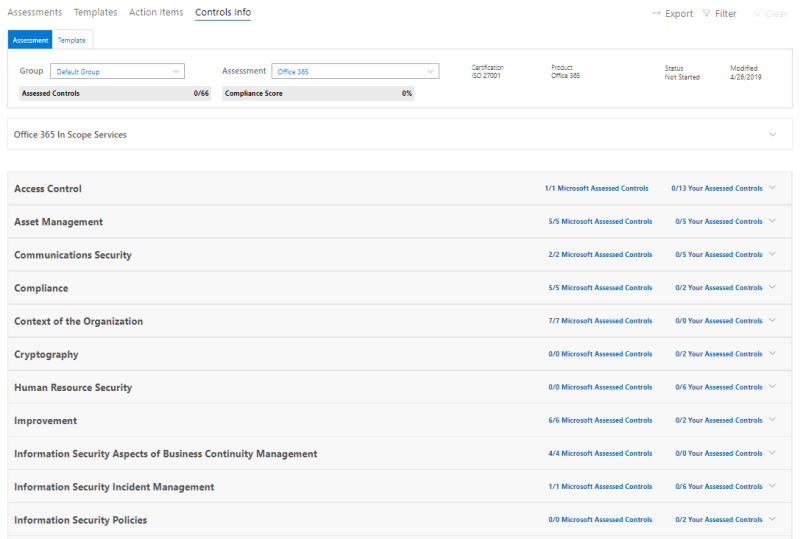
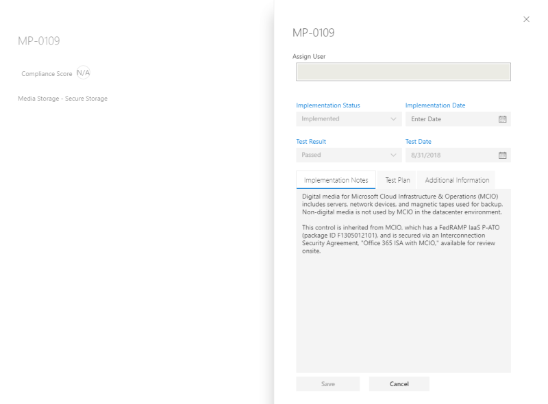
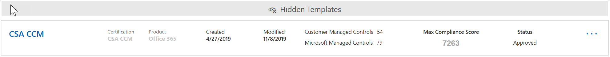
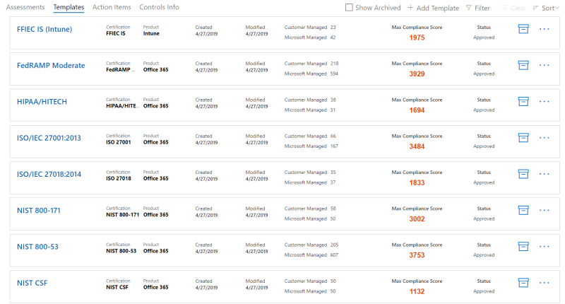
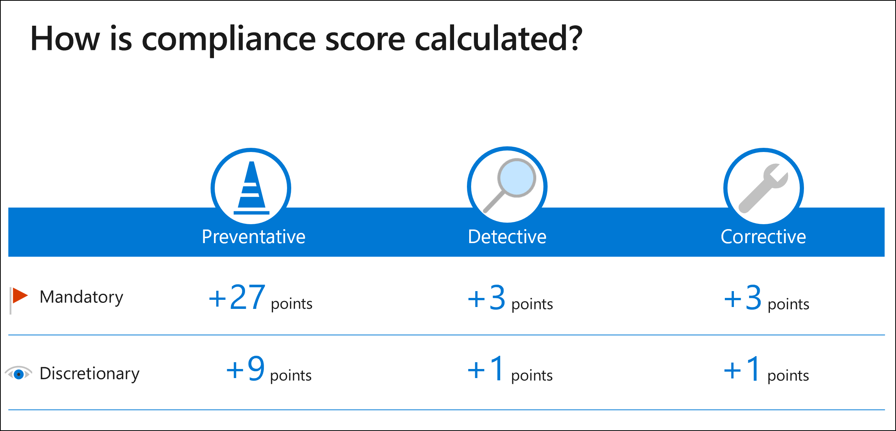

# Work with Microsoft Compliance Manager (Preview)

> [!IMPORTANT]
> Microsoft Compliance Manager is a dashboard and management tool that provides a summary of your data protection and compliance stature and recommendations to improve data protection and compliance. The customer actions provided in Compliance Manager are recommendations. It is up to your organization to evaluate the effectiveness of these recommendations in their respective regulatory environment prior to implementation. Recommendations found in Compliance Manager should not be interpreted as a guarantee of compliance.

## Access Compliance Manager

Compliance Manager is accessible from the Microsoft Service Trust Portal. Anyone with a Microsoft account or Azure Active Directory organizational account can access Compliance Manager.

1. Go to [https://servicetrust.microsoft.com/ComplianceManager/V3](https://servicetrust.microsoft.com/ComplianceManager/V3).

2. Sign in with your Microsoft service account, which is your Office 365, Microsoft 365, or Azure Active Directory (Azure AD) user account.

> [!NOTE]
> In the Service Trust Portal, select **Compliance Manager**, which is the preview version with the most current features. Do not select **Compliance Manager (Classic)**, which contains legacy features not covered by this documentation.

## Administration

There are specific administrative functions that are only available to the global administrator and only visible when logged in with a global administrator account. The global administrator can assign user permissions and turn on automatic Secure Score updates.
  
### Assigning Compliance Manager roles to users

Once the administrator assigns Compliance Manager roles to other users, those users can view data in Compliance Manager and perform actions determined by their role. The administrator can also give read-only access to Compliance Manager by assigning the user the [Global Reader role in Azure Active Directory (Azure AD)](https://docs.microsoft.com/azure/active-directory/users-groups-roles/directory-assign-admin-roles#global-reader).

Each Compliance Manager role has slightly different permissions. You can view the permissions assigned to each role, see which users are in which roles, and add or remove users from that role through the Service Trust Portal. Select the **Admin** menu item, and choose **Settings** to view.
  

  
To add or remove users from Compliance Manager roles.
  
1. Go to [https://servicetrust.microsoft.com](https://servicetrust.microsoft.com).

2. Sign in with your Azure Active Directory global administrator account.

3. On the Service Trust Portal top menu bar, select **Admin** and then choose **Settings**.

4. In the **Select Role** drop-down list, select the role that you want to manage.

5. Users added to each role are listed on the **Select Role** page.

6. To add users to this role, select **Add**. In the **Add Users** dialog, select the user field. You can scroll through the list of available users or begin typing the user name to filter the list based on your search term. Select the user to add that account to the **Add Users** list provisioned with that role. If you would like to add multiple users concurrently, begin typing a user name to filter the list, and then select the user to add to the list. Select **Save** to provision the selected role to these users. 

    
  
7. To remove users from this role, select the users and select **Delete**.

    

### Controlling automatic Secure Score updates

Secure Score updates can be turned on automatically for all actions, turned off for all actions, or set by individual action by following these steps.

1. Sign in to the [Service Trust Portal](https://servicetrust.microsoft.com) with your global administrator account.

2. On the Service Trust Portal top menu bar, under **More**, select **Admin** and then choose **Settings**.

3. In the **Secure Score** tab, select the corresponding button to either **turn on for all actions**, **turn off for all actions**, or **set per action.**

If you choose **set per action,** take these additional steps to turn on Secure Score updates for individual actions:

4. Select **Compliance Manager** from the top menu (note: do not select "Compliance Manager (classic)").

5. Select **Tenant Management** in the upper-right corner of your screen.

6. On the **Customer Actions** pane, find your intended action with an ellipsis (**...**) under the **Affected Actions** column. Click on the ellipses and select **Edit.**

7. Switch the **Secure Score continuous update** toggle switch to **On.**

8. Select **Save.** Secure Score continuous monitoring is now turned on for that action.

**Note:** Only the global administrator can turn on or off automatic updates for all actions. The Compliance Manager administrator can turn on automatic updates for individual actions, but not for all actions globally.

## Groups

Groups are containers that allow you to organize Assessments and share common information and workflow tasks between Assessments that have the same or related customer-managed controls.

You can group Assessments in a way that is logical to you, such as by year, standard, service, or based on your organization's teams, divisions, or geographies. Below are examples of two groups and their underlying Assessments:
  
- **FFIEC IS Assessments 2020**
  - Office 365 + FFIEC IS
  - Intune + FFIEC IS
- **Data Security and Privacy Assessments**
  - Office 365 + ISO 27001:2013
  - Office 365 + ISO 27018:2014

> [!NOTE]
> We recommend determining a grouping strategy for your organization *before* adding new Assessments.

To get you started, a **Default** group is set up for you that contains the Data Protection Baseline. This baseline is a set of controls that includes common industry regulations and standards ([learn more](compliance-score-methodology.md#initial-score-based-on-microsoft-365-data-protection-baseline)).

### How to create a group

Groups cannot be created as standalone entities. A group must always contain at least one Assessment, so in order to create a group, you must first create an Assessment to put in the group.

Follow the steps below to create a group:

1. Create a new Assessment by selecting **+ Add Assessment** near the top of your dashboard.
2. From the **Assessment** flyout pane, enter a title for your Assessment and select a template from the drop-down menu.
3. At **Please select a group or add a new group**, select **Add a new group** and enter your group name in the field below.
4. To copy information from an existing group, toggle the **Would you like to copy the data from an existing group?** switch to **On.** Select the group you want to copy from the drop-down menu underneath, and select the checkboxes of any fields you want to carry over to the new Assessment in your new group.
5. Select **Save**. When completed, the flyout pane closes and your new group automatically displays on your dashboard.

What to know when working with groups:
  
- Group names (also called *Group IDs*) must be unique within your organization.
- Groups do not have any security properties. All permissions are associated with Assessments.
- Once you add an Assessment to a group, the grouping cannot be changed. You can rename the assessment group, which changes the name of the assessment grouping for all the assessments associated with that group.
- Related Assessment controls in different Assessments within the same group automatically update when completed.
- If you add a new Assessment to an existing group, common information from Assessments in that group are copied to the new Assessment.
- Groups can contain Assessments for the same certification or regulation, but each group can only contain one Assessment for a specific product-certification pair. For example, a group can't contain two Assessments for Office 365 and NIST CSF. A group can contain multiple Assessments for the same product only if the corresponding certification or regulation for each one is different.
- Hiding an Assessment breaks the relationship between that Assessment and the group. Any further updates to other related Assessments are no longer reflected in the hidden assessment. ([Learn how to hide Assessments.](#hide-a-template-or-an-assessment))
- Groups cannot be deleted.
- When a change is made to an Action Item that appears in multiple Groups, that change is reflected in all instances of that Action Item.

## Tenant management of dimensions, owners, & customer actions

The **Tenant Management** interface enables you to manage these organization-wide settings:

- **Dimensions:** View metadata for Templates, Assessments, and Action Items that allow you to create custom pivots for filters.
- **Owners:** Specify an owner for each Action Item.
- **Customer Actions:** Manage the complete list of Actions Items included in Compliance Manager (Preview) and enable/disable Secure Score monitoring for Actions that are integrated with Secure Score.

Select **Tenant Management** from the upper-right corner of your screen to open the management interface, and use the steps below to manage  **Dimensions**, **Owners**, and **Customer Actions**.

### Dimensions

Dimensions are sets of metadata that provide information about a Template, an Assessment, or an Action Item. Dimensions use the concept of Keys and Values, where the Dimension Key represents a property, and Dimension Value represents valid values for the property. For example, in Compliance Manager there are three types of Actions. They are defined by a Dimension Key of **Action Purpose** and Dimension Values of **Preventative**, **Detective**, and **Corrective**.

### Owners

Owners are used to identify the responsible party for each control. All built-in controls are owned by Microsoft, by customers, or by both. You can create custom values for Owners that can be used to specify more granular responsibilities within your organization. For example, you could create Owners that represent specific groups, teams, or business units within your organization.

#### Add an Owner

1. Open **Tenant Management** and select **Owners**.
2. Select **+ Add owner**.
3. Provide a Name and Description for the Owner and select **Save**. The description is displayed in the Owner column.

#### Edit an Owner

You can't edit an Owner name, but you can modify the description that is displayed in the Owner column.

1. Open **Tenant Management** and select **Owners**.
2. Locate the Owner you want to edit, select the ellipses (…) next to it, and select **Edit**.
3. Modify the Description as needed and select **Save**.

#### Delete an Owner

1. Open **Tenant Management** and select **Owners**.
2. Locate the Owner you want to delete, select the ellipses (…) next to it, and select **Delete**.
3. When the confirmation message appears, select **Delete**.

### Customer Actions

The Customer Actions area shows all the customer actions for all Templates and Assessments in Compliance Manager (Preview).

At a glance, you can see an Action's title, owner, category, enforcement, and score, and determine if it is integrated with Secure Score. You can expand an Action and select **Read More** to read the Action's description and access any links in the description. You can also use this interface to enable and disable Secure Score integration on a per-action basis, and to add custom actions. Actions that have Secure Score integration capabilities have an ellipsis (…) next to them (note that custom actions also have an ellipsis next to them).

#### Enable or disable Secure Score integration

1. Select the ellipses (…) for the Action you want to modify and select **Edit**.
2. Toggle the switch for Secure Score continuous update to On or Off to enable or disable continuous monitoring through Secure Score.
3. Select **Save**.

When organizations first deploy Microsoft 365 or Office 365, it takes approximately seven days for Secure Score to fully collect data and factor it into your score. During that time, setting the Secure Score continuous update switch to **Off** and manually setting an action to **implemented** will count that action toward your score. After the initial seven days, turning Secure Score continuous update back on will enable continuous monitoring from that point forward.

Any actions that are not supported by Secure Score integration can be manually implemented. A manual implementation will factor into the score for that action's group.

## Assessments

This section explains how to view and work with your Assessments, including how to add new ones, export them, copy information from existing Assessments, and keep them updated through versioning.

### View an Assessment and Action details
  
In the **Assessments** dashboard, select the assessment name to open it and view the Action Items and Controls Info.

Here's an example of the Assessment for Office 365 and ISO 27001. The first view illustrates the new Action Items view in Compliance Manager (Preview).

The Actions are listed in alphabetical order, and each Action is assigned a score and an owner. Select  the **Read More** link to read the details of each Action.

Select the **Review** link to manage, assign, implement, and test the action. Below is an example Action.

Use the following fields to manage the Action workflow:

- **Assign User:** Select this field to choose or enter the user to whom this Action should be assigned. You can scroll through the list, or type a name to find it, and then select it.
- **Manage Documents:** You can upload evidence of implementation in the form of Office documents, image files and screenshots, PowerShell output in CSV or TXT, and PDFs.
- **Implementation Status:** Used to indicate the Action's current implementation status. Possible values are Not Implemented, Implemented, Alternative Implementation, Planned, and Not in Scope.
- **Implementation Date:** The date on which the Action was taken.
- **Test Result:** Used to indicate the results of implementation validation. Possible values are Not Assessed, Passed, Failed-Low Risk, Failed-Medium Risk, Failed-High Risk, and Not in Scope.
- **Test Date:** The date on which validation occurred.
- **Implementation Notes:** Enter implementation details for your organization, along with any notes that you want to include.
- **Test Plan:** Enter the test plan details for this action, along with any notes that you want to include.
- **Additional Information:** Enter any additional information about this Action or how it was implemented in your organization, along with any notes you want to include.

On the **Controls Info** dashboard, you can view information for controls at the Assessment and Template level. Below is an example of the Controls Info dashboard for Assessments.

For Assessments, the Controls Info dashboard displays the following information:

- A **Group** dropdown to select which Group to view (when using multiple groups).
- An **Assessment** dropdown to select which Assessment to view.
- Metadata about the selected Assessment, including:
    - A progress indicator for **Assessed Controls** showing the number of assessed controls over the total number of controls.
    - The current **Compliance Score** for the Assessment, shown as a percentage.
    - Details about the **Certification** and **Product** used in the Assessment.
    - The current **Status** of and last **Modified** date for the Assessment.
- A list of **In Scope Services** for the Assessment.
- Details of the controls, grouped by Control Family, with links to customer actions and Microsoft implementation details:
    - **Your Actions** displays the customer actions that you can perform to satisfy some or all the control's requirements. Many controls have multiple Actions associated with them, and all Actions associated with a control are displayed here. The Actions here have the same UI as those listed in the Actions dashboard.
    - **Microsoft Actions** displays the list of controls from Microsoft's internal framework that apply to the selected certification control. For each internal control, select **Implemented** to see Microsoft's implementation and test details, along with the test result and test date, as shown below.

### Add an Assessment
  
1. In the Assessments dashboard, select **+ Add Assessment**.

2. When the blade opens, enter the following information:

    - **Title (required):** Enter a title for your Assessment
    - **Please select a template (required):** Select a standard or custom template
    - **Please select a group or add a new group (required):** Select an existing group or choose to add a new group, and provide a unique group name
    - **Would you like to copy the data from an existing group? (optional):** Toggle the control to enable group copy and then:
        - **Select a group (optional):** If group copy is enabled, select the group to copy from
            - **Implementation Details (optional):** Select to copy implementation details to the new group
            - **Test plan & additional information (optional):** Select to copy test plan and additional information details to the new group
            - **Documents (optional):** Select to copy documents to the new group

3. Select **Save** to create the Assessment.

 The new Assessment appears on the Assessment dashboard and displays the following information:

- The title of the Assessment.
- The dimensions of the Assessment, including certification, environment, and product applied to the Assessment.
- The date it was created and date when it was last modified.
- The Assessment Score shown as a percentage. This score automatically includes your scores from Microsoft-managed controls and from Secure Score.
- Progress indicators that show the number of assessed Microsoft-managed and customer-managed controls.

### Copying information from existing Assessments

When you create an Assessment, you have the option to copy information from an existing group. This allows you to apply the information entered into the copied assessment to the same controls in the new Assessment. For example, if you have a group for all FFIEC-related Assessments in your organization, you can copy the following information from existing assessments:

- Implementation Details
- Test Plan & Additional Information
- Documents

#### Copy information from an existing Assessment to a new Assessment
  
1. In the Assessment dashboard, select **+ Add Assessment**.
    
2. In the **Add an Assessment** window, complete the following information

    - **Title (required):** Enter a title for your Assessment.
    - **Please select a template (required):** Select a standard or custom template.
    - **Please select a group or add a new group (required):** Choose **Add a new group** and provide a unique group name.
    - **Would you like to copy the data from an existing group? (optional):** Toggle the control to On to enable group copy and then:
            - **Select a group (optional):** If group copy is enabled, select the group to copy from.
            - **Implementation Details (optional):** Select to copy implementation details to the new group.
            - **Test plan & additional information (optional):** Select to copy test plan and additional information details to the new group.
            - **Documents (optional):** Select to copy documents to the new group.

3. Select **Save** to create the Assessment.

### Versioning alerts for Assessment updates

When an update is available for an Assessment, an alert icon notifies you that an update is ready. When you click on that icon, a pop-up window explains the update and prompts you to accept. Below is an example of the versioning alert for an Assessment:

Selecting the alert icon reveals a flyout pane explaining the update and prompting you to accept:

We strongly recommend accepting all updates when you receive update notifications.

### Export an Assessment

You can export an Assessment to an Excel file for compliance stakeholders in your organization or for external auditors and regulators. The report is a snapshot of the Assessment as of the date and time that the report is created. The report contains the details for all Microsoft and customer-managed controls for the Assessment, control implementation status, control test date, test results, and provides links to uploaded evidence documents. You should export the Assessment report prior to archiving an assessment because archived assessments do not retain links to uploaded documents.
  
### Export an Assessment report
  
1. On the Compliance Manager dashboard, select **Controls Info** tab.
2. Select the **Group** and **Assessment** in the drop-down menus for the Assessment you want to export.
3. Select the **Export** button.

The assessment report is downloaded as an Excel file in your browser session. The files name for the Excel file defaults to the title of the Assessment.

### Hide a Template or an Assessment

When you are finished with a Template or Assessment and no longer need it for compliance purposes, you can hide it from your view. When a Template or Assessment is hidden, it is removed from the default view, and you must select **Include Hidden** checkbox to display it.

> [!IMPORTANT]
> Hidden Assessments do not retain their links to uploaded evidence documents. It is highly recommended that you export the Assessment before hiding it to retain links to the evidence documents in the report.
  
#### Hiding a Template

1. Open the **Templates** dashboard.
2. Locate the Template you want to hide and at the ellipses in its row, select **Hide**.
3. When you see the confirmation message, select **Hide**.

#### Hide an Assessment

1. Open the **Assessments** dashboard.
2. Select the **Group** from the dropdown that contains the Assessment you want to hide.
3. Locate the Assessment you want to hide and at the ellipses, select **Hide**.
4. When you see the confirmation message, select **Hide**.

#### View hidden Assessments
  
1. Open the **Assessments** dashboard tab and select the **Include Hidden** checkbox.
2. The hidden assessments appear in the **Hidden Assessments** section.

#### Unhide an Assessment

1. On the **Assessments** tab, select the **Include Hidden** checkbox.
2. The hidden assessments appear in the **Hidden Assessments** section.
3. Locate the Assessment you want to unhide and at the ellipses, select **Unhide**.
4. When you see the confirmation message, select **Unhide**.

## Controls and Actions

Controls and Actions are the primary data pivots used in Compliance Manager (Preview). The Control pivot, which existed in previous versions of Compliance Manager, has been enhanced to show the Microsoft and customer controls in the same control families. This consolidated view makes it easier to see the complete shared responsibility model on a per-control basis. The Action pivot is new in Compliance Manager (Preview) and it is designed to provide a streamlined view of all of actions recommended by Microsoft.

### Controls

Controls can be viewed from the Controls Info dashboard. Controls represent the requirements from a standard, certification, regulation, or framework. To map these requirements across multiple standards, regulations, etc., and to associate them with Actions, everything is treated as if it were a control framework. For example, like a control framework, regulations, such as HIPAA, have been broken down by section, and the HIPAA controls in Compliance Manager use the same numbering scheme as those sections, as shown below:

There are three types of controls:

1. **Microsoft-managed controls:** these are controls for which only Microsoft has responsibility. They appear in the in-box Templates and are added to Compliance Manager by Microsoft.
2. **Customer-managed controls:** these are controls for which only customers have responsibility. They appear in the in-box Templates and are added to Compliance Manager by customers.
3. **Shared management controls:** these are controls where responsibility is shared between Microsoft and the customer. These appear in the in-box Templates and are added to Compliance Manager by Microsoft. The customer can also edit or disable Microsoft-managed controls.

### Actions Items

Actions Items are the recommended tasks for implementing the requirements of a standard or regulation, or to test, verify, and document your organization's implementation requirements. Actions are associated with one or more Controls. Each Control has one or more Action associated with it, and each Action can be associated with one or more Controls. Actions are part of the core workflow in Compliance Manager (Preview), as they are the objects that are assigned, tracked, and validated by your organization.

#### Assign Action Items
  
1. On the **Action Items** dashboard, select the **Group** containing the Assessment(s) whose Action you want to assign.
2. In the **Assessment** dropdown, select the Assessment whose Action you want to assign, or select **All** from the dropdown to see all available Actions.
3. Locate the Action you want to assign, and in the **Owner** column, select the link for **Review**, **Implemented** or **Test**.
4. Select the **Assign User** field, and a list of users in your organization appear. Scroll the list and select user or filter the list to select a user by typing in the user's name.
5. In the Implementation Notes field, enter any notes you wish to convey to the assigned user.
6. Select **Save** to assign the Action.

#### Reassign Action Items

This function enables an organization to remove any active or outstanding dependencies on the user account by reassigning an Action to a new user.

1. On the **Action Items** dashboard, select the **Group** containing the Assessment(s) whose Action you want to reassign.
2. In the **Assessment** dropdown, select the Assessment whose Action you want to reassign, or select **All** from the dropdown to see all available Actions.
3. Locate the Action you want to reassign, and in the **Owner** column, select the link for **Review**, **Implemented**, or **Test**.
4. Delete the existing user from the **Assign User** field, and either choose a different user from the list of users or filter the list to select a user by typing in the user's name.
5. In the Implementation Notes field, enter any notes you wish to convey to the user.
6. Select **Save** to reassign the Action.

#### Common Action Items synch status across Groups

If your organization has multiple groups of assessments, there is a behavior of Technical actions (that is, actions affecting your entire organization). Any duplicate action across groups are now combined into one single action. That single action contains all uploaded notes and evidence from previously duplicate versions. Any change made to the action in one group or assessment will be reflected in all instances of that action. The **Implementation Status**, **Implementation Date**, **Test Status**, and **Test Date** reflects the most recent updates.

## Templates

A Template is the base object in Compliance Manager (Preview) that is associated with a product and a certification (for example, standard, regulation, control framework, etc.). Templates can be viewed and added from the **Templates** dashboard.

 
The dashboard displays each Template, along with the Certification and Product associated with the Template, the dates on which the Template was created and last modified, the number of customer and Microsoft-managed controls, the maximum Compliance Score for the Template, and the status of the Template (for example, Approved, Pending Approval, Imported).

The built-in Templates each have a built-in Assessment associated with them, but you can create additional Assessments based on built-in Templates, and you can import your own Templates, and create custom Assessments based off those.

### Create a Template

There are three ways to create and use a Template:

1. Use one of the pre-configured Templates provided by Microsoft.
2. Customize a pre-configured Template with your own actions and controls through the extension process.
3. Create your own Template and import it into Compliance Manager.

#### Use a Microsoft pre-configured Template

The pre-configured templates are available on your **Templates** dashboard. View the current [list of templates](compliance-manager-overview.md#templates), which is updated each time a new template is available.

#### Customize a Template through the extension process

1. Open the **Templates** dashboard and select **+ Add Template**.
2. On the Template flyout pane, select the **Create extension from global template** checkbox.
3. Select the template you want to extend from the drop-down menu.
4. If you have not already formatted your template data in Excel, select the link in the flyout pane to download an Excel file. Fill out the spreadsheet according to the [Import Template data with Excel](#import-template-data-with-excel) instructions below and save it to your local drive.
5. Import your customized template data by selecting **Browse** to upload your Excel file.
6. Select **Add to Dashboard**. You will then see your new template added to your **Templates** dashboard.

#### Create your own Template and import it into Compliance Manager

1. Open the **Templates** dashboard and select **+ Add Template**.
2. On the Template flyout pane, select **Create a new template**.
3. Import your template data by selecting **Browse** to upload your Excel file containing the data (see [Import Template data with Excel](#import-template-data-with-excel) below).
4. Select **Add to Dashboard**. You will then see your new template added to your **Templates** dashboard.

#### Import Template data with Excel

To modify a template or create your own template, you'll use an [Excel spreadsheet](https://go.microsoft.com/fwlink/?linkid=2124865) to capture the necessary data and upload it to Compliance Manager. This spreadsheet template has a specific format and schema that must be used or it will not import into Compliance Manager.

> [!IMPORTANT]
> If you've created or customized templates in Compliance Manager before, **this process has been updated** as part of the April 2020 release of Compliance Manager (Preview). **Please review this section carefully.**

The spreadsheet contains four tabs, three of which are required:

1. Template (required)
2. ControlFamily (required)
3. Actions (required)
4. Dimensions (optional)

Your spreadsheet **must include the tabs in this order**, otherwise your data won't successfully import to a template.

##### Template tab

The **Template** tab is required. The information in this tab provides metadata about the template. There are four required columns. The columns must retain the order on the Excel sheet as listed below. You can add your own columns **after** the four columns to provide additional data for your Template.

- **title**: This is the title for your template, which must be unique. It can't share a name with another template you have in Compliance Manager, whether it's a template you already created, or a pre-configured template provided by Microsoft.

- **product**: This is a required dimension. List the product associated with the template. You can list multiple products separated by two semi-colons with no space in between (for example: Office 365;;Intune).

- **certification**: This is the regulation you're using for the template.

- **inScopeServices**: These are the services within the product that this assessment addresses (for example, if you listed Office 365 as the product, Microsoft Teams could be an in-scope service). You can list multiple services separated by two semi-colons.

> [!NOTE]
> Regarding product and certification: The data you insert in the **product** and **certification** cells cannot be edited after you import the spreadsheet to create or customize a template. Also, a group cannot contain two assessments that have the same **product/certification** combination. You can have multiple templates that have the same product/certification combination.

##### ControlFamily tab

The **ControlFamily** tab is required.  The required columns in this tab, which must follow the order provided in the sample spreadsheet, are:

- **controlName**: This is the control name from the certification, standard, or regulation, which is typically some type of ID. Control names must be unique within a template. You can't have multiple controls with the same name in the spreadsheet.

- **controlFamily**: Provide a word or phrase for the controlFamily, which identifies a broad grouping of controls. A controlFamily doesn't have to be unique; it can be listed more than once in a spreadsheet. The same controlFamily can also be listed in multiple templates, though they have no relation to each other. Every controlFamily must be mapped to at least one control.

- **controlTitle**: Provide a title for the control. Whereas the controlName is a reference code, the title is more rich text and is what it typically seen in the regulations.

- **controlDescription**: Provide a description of the control.

- **controlActionTitle**: This is the title of an action that you want to relate to this control. You can add multiple actions by separating by two semi-colons with no space in between. Every control you list must include at least one action, and the action must exist (this means, you can list an action that you list on the **Actions** tab of the same spreadsheet, an action that exists in a different template, or an action created by Microsoft). Different controls can reference the same action.

##### Actions tab

The **Actions** tab is required.  It designates actions of your organization and not the actions of Microsoft, which already exist in Compliance Manager. The required columns for this tab, which must follow the order provided in the sample spreadsheet, are:

- **actionTitle**: This is the title for your action and is a required field. The title you provide must be unique. **Important**: if you reference an action you own that already exists (such as in another template) and you modify any of its elements in the subsequent columns, those changes will propagate to the same action in other templates.

- **implementationType**: In this required field, list one of the three implementation types below:
    - **Operational** - actions implemented by people and processes to protect the confidentiality, integrity, and availability of organizational systems, assets, data, and personnel (example: security awareness and training)
    - **Technical** - actions completed through the use of technology and mechanisms contained in the hardware, software, or firmware components of the information system to protect the confidentiality, integrity, and availability of organizational systems and data (example: multi-factor authentication)
    - **Documentation** - actions implemented through documented policies and procedures establishing and defining the controls required to protect the confidentiality, integrity, and availability of organizational systems, assets, data, and personnel (example: an information security policy)

- **actionScore**: In this required field, provide a numeric score value for your action. It must be a whole number ranging from 1 to 99; it cannot be 0, null, or blank. The higher the number, the greater its value toward improving your compliance posture. For guidance, see below how Microsoft scores its controls:

- **actionOwnership**: This is the person who is responsible for the action overall. It is not necessarily the person who is assigned to complete the action. You may want to simply list "customer" here. This is a required field.

- **actionDescriptionTitle**: This is the title of the description and is required. This description title allows you to have the same action in multiple templates and surface a different description in each template.  This field helps you clarify what template the description is referencing. In most cases, you can simply put the name of the template you're creating in this field.

- **actionDescription**: Provide a description of the action. You can apply formatting such as bold text and hyperlinks. This is required field.

- **dimension-Action Purpose**: This is an optional field. You don't need to have dimensions for your actions. Any dimensions you include here will be used as [filters in Compliance Score](compliance-score-setup.md#filtering-your-dashboard-view) and appear on the [improvement actions details page in Compliance Score](working-with-compliance-score.md#view-your-improvement-actions). If you include dimensions here, you must list them on the Dimensions tab, as explained in the section immediately below.

##### Dimensions tab

The **Dimensions** tab is optional. However, if you reference a dimension elsewhere, you need to specify it here if it does not exist in a template you've already created or in a Microsoft template. The columns for this tab are listed below:

- **dimensionKey**: list as "product", "certifications," "action purpose"
- **dimensionValue**: examples: Office 365, HIPPA, Preventative, Detective

You can view your existing dimensions by going to **Tenant Management** and selecting the **Dimensions** tab. Also, any time you export an existing template, the exported spreadsheet will have the **Dimensions** tab, which lists all the dimensions used in the template.

#### How to make changes to an existing Template

To make changes to a Template you created or customized using the import process outlined above, you use the same process to import those changes into your Template.

> [!NOTE]
> There are several important factors to be aware of as you edit or modify template components, so please review this section carefully.

##### General process for editing a Template

To make changes to one of your organization's existing templates, the general process is:

1. From your **Templates** dashboard, select the Template you want to modify, which brings up your **Controls Info** dashboard showing your **Template** tab.
2. From here, select **Export**. An Excel sheet with all your template data will download.
3. To edit, add, or remove an action, see the sections below.
4. When you're done making changes to your Excel file, import the file back into the template by selecting the template from your dashboard and selecting **Import**. Your template will now include the changes you made.

##### To edit Template attributes

On the **Templates** tab, you can edit anything in the **title** column, the **inScopeServices** column, and in any other column you may have added. However, you can't edit anything in the **product** or **certification** columns.

##### To add an action to a Template

1. Go to the **Actions** tab and add your information in the required fields in the first empty row underneath your existing actions.
2. Go to your **ControlFamily** tab and add your new action the control it maps to in the **controlActionTitle** column (remember to separate multiple actions in this field with two semi-colons, no space in between).
3. Save your spreadsheet to your local machine.

##### To edit an action's information

You can change any action's information *except for its title*. You can edit any cell from columns B onward, and when you import the file back into the template, the actions in that template will now contain the updated data.

You cannot edit the **actionTitle** (column A) because if you do, Compliance Manager considers this to be a new action. If you want to change an action's name, see the instructions immediately below.

##### To change the name of an action

If you want to change the name of an action, you have to explicitly designate in the spreadsheet that you are replacing an existing name with a new name. To change an action's name, follow these steps:

1. In the **Actions** tab of your spreadsheet, add a new column to the spreadsheet after column A.
2. In this new column, which is now column B, put as its header in row one: **oldActionTitle**.
3. Copy the contents of column A and paste them into column B. This puts your existing action titles, which are what you want to change, into column B.
4. In column A, **actionTitle**, delete the old name and replace it with the new name for your action.

> [!NOTE]
> You can use this same process to rename a control or a control family.

##### To remove an action from a Template

Deleting an action from a row in a spreadsheet **does not** remove the action from the template you're editing. Instead, follow the process below to remove an action:

1. On the **Actions** tab, insert a new column as column A and put **Operation** in the header row, which is row number one.
2. On the row for the action you want to remove, put **Delete** in column A for that row.
3. Ensure that the this action is no longer referenced by a control. Go to the **ControlFamily** tab and look for your action's title in column F, which is **controlActionTitle**.
4. When you find your action listed in the **controlActionTitle** column, delete it.
5. Save your spreadsheet to your local machine.

When you import your spreadsheet back into the template, your action will be removed from the template. Note that removing an action from a template does not completely remove the action. That action can still be referenced by another template.

If you are removing the last action that a control references, then you need to remove the control.

> [!NOTE]
> To remove a control: Follow the same process for removing an action as outlined above. In the **ControlFamily** tab, add an **Operation** column and put **Delete** next to the control you want to remove.

#### Updates to Templates

Each time an Assessment is updated through the versioning process, your customized Assessment will inherit those updates and keep your custom controls. See [Versioning alerts for Assessment updates](#versioning-alerts-for-assessment-updates).

### Export a Template to JSON

Compliance Manager (Preview) also supports exporting Templates to JavaScript Object Notation (JSON) format. This enables you to exchange Compliance Manager data with other systems that support JSON.

## Reports

You can export an Assessment to an Excel file for compliance stakeholders in your organization or for external auditors and regulators. The report is a snapshot of the Assessment as of the date and time of the export. The report contains the details for Microsoft and customer-managed controls for the Assessment, control implementation status, control test date, test results, and links to uploaded evidence documents. You should export Assessments before archiving them because archived Assessments do not retain links to uploaded documents.

### Export an Assessment

1. On the Compliance Manager dashboard, select **Controls Info** tab.
2. Select the Group and Assessment in the dropdown menus for the Assessment you want to export.
3. Select Export. The Assessment export is downloaded as an Excel file.

## Permissions

The following table describes each Compliance Manager permission and what it allows the user do. The table also indicates the role that each permission is assigned.

||**Azure AD Global Reader**|**Compliance Manager Reader**|**Compliance Manager Contributor**|**Compliance Manager Assessor**|**Compliance Manager Administrator**|**Portal Admin**|
|:-----|:-----|:-----|:-----|:-----|:-----|:-----|
|**Read data:** Users can read but not edit data (except for Template data and Tenant Management).    | X | X | X | X | X  | X |
|**Edit data:** Users can edit all fields, except the Test Result and Test Date fields (except for Template data and Tenant Management).    ||| X | X  | X | X |
|**Edit test results:** Users can edit the Test Result and Test Date fields.    |||| X | X | X |
|**Manage assessments:** Users can create, archive, and delete Assessments.    ||||| X | X |
|**Manage master data:** Users can view, edit, and delete template data and tenant management data.    ||||| X | X |
|**Manage users:** Users can add other users in their organization to the Reader, Contributor, Assessor, and Administrator roles. Only those users with the Global Administrator role in your organization can add or remove users from the Portal Admin role.    |||||| X |
