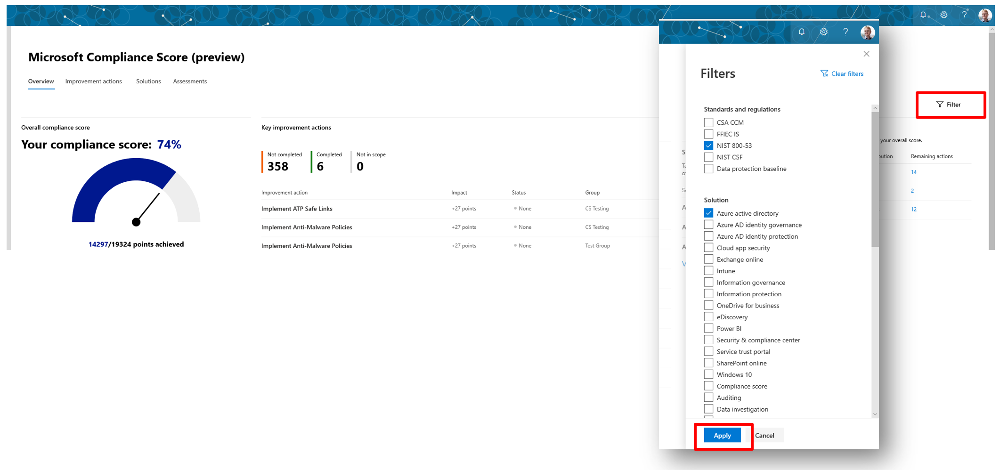
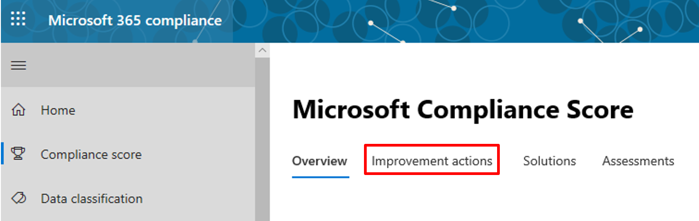
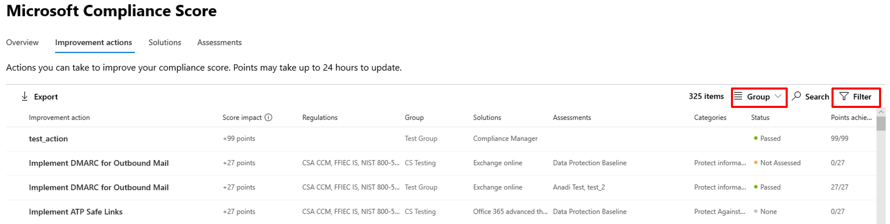
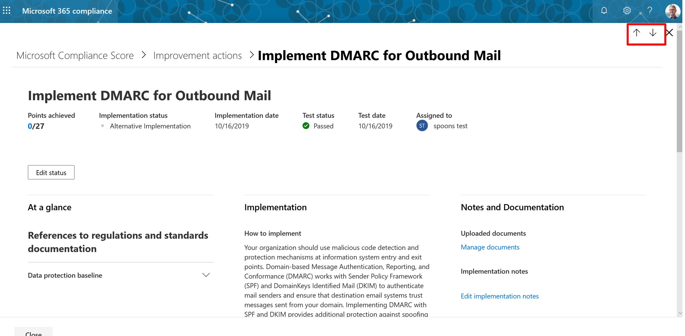
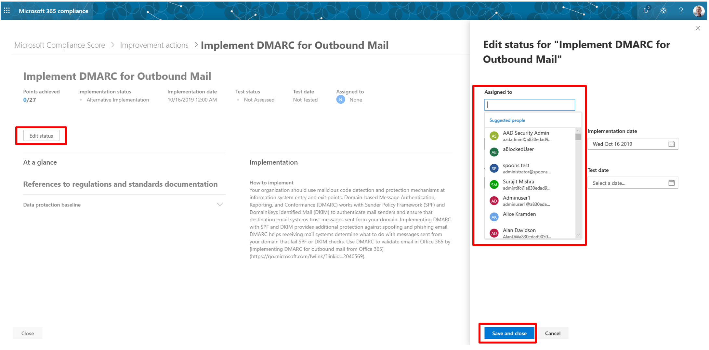
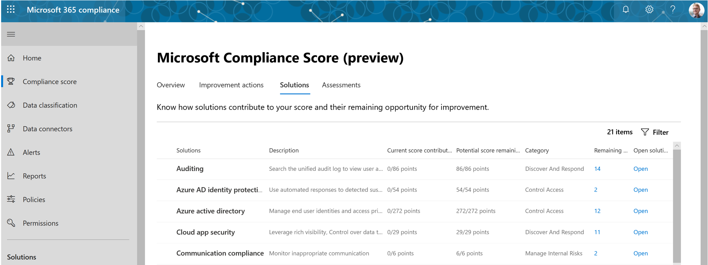
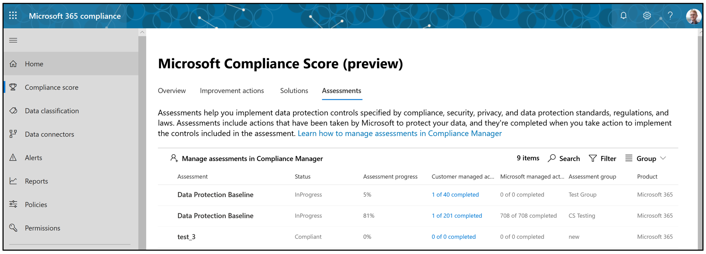

# Working with Microsoft Compliance Score (Preview)

## Getting started: sign in and set permissions

The Microsoft 365 global administrator for your organization will likely be the first user to access Compliance Score. We recommend signing in and setting permissions as outlined below when visiting Compliance Score for the first time.

### Sign in to Compliance Score

1. Go to the [Microsoft Compliance Center](https://compliance.microsoft.com/) and **sign in** with your Microsoft 365 global admin account.
2. Select **Compliance Score** on the left navigation pane. You should then see your [Compliance Score dashboard with your score](#understanding-the-compliance-score-dashboard).

### Set user permissions

Compliance Score uses a role-based access control (RBAC) permission model. Only users who are assigned a user role may access Compliance Score, and the actions allowed by each user are restricted by role type.

**Where to set permissions**

The global admin for your organization can set user permissions in three places: in the Microsoft 365 compliance center or in Compliance Manager for all user roles, or in Azure Active Directory (Azure AD) for read-only access.

- **If you set user permissions in the Microsoft 365 compliance center** - those permissions will automatically apply in Compliance Manager.
- **If you set user permissions only in Compliance Manager** - those permissions will automatically apply to the Microsoft 365 compliance center, including Compliance Score.
- **If you assign the Global Reader role in Azure AD** - this will apply to users of the Microsoft 365 compliance center, Compliance Score, and Compliance Manager

The table below shows how user role titles in the Microsoft 365 compliance center map to user role titles in Compliance Manager.

| User can: | Microsoft 365 compliance center role | Compliance Manager role | 
| :------------- | :-------------: | :------------: |
| **Read but not edit data**| Azure AD global reader  | Azure AD global reader | 
| **Read but not edit data**| Security reader | Compliance Manager reader  | 
| **Edit data**| Compliance administrator | Compliance Manager contributor | 
| **Edit test results**| Compliance administrator | Compliance Manager assessor | 
| **Manage assessments, and template and tenant data**| Compliance administrator Compliance data administrator Security administrator | Compliance Manager administrator | 
| **Assign users***| Global administrator | Portal admin | 

*The global admin and the portal admin can add other users in their organization to the reader, contributor, assessor, and administrator roles. Only the global admin can add users to, or remove them from, the portal admin role.

#### Set permissions in the Microsoft 365 compliance center

To set permissions from the Microsoft 365 compliance center, follow these steps:

1. Go to the [Microsoft Compliance Center](https://compliance.microsoft.com) and sign in with your global admin account.
2. Select **Permissions** on the left navigation pane. From here, you can view roles and assign permissions.

For details, read [roles and permissions in the Microsoft 365 compliance center](../security/office-365-security/microsoft-security-and-compliance.md#required-licenses-and-permissions).

#### Set permissions in Compliance Manager

The Compliance Manager portal admin can set permissions for other users in Compliance Manager. [View a table](working-with-compliance-manager.md#permissions) showing details about the actions allowed for each permission.

Follow these steps to set user permissions:

1. Go to the [Service Trust Portal](https://servicetrust.microsoft.com/). 

2. Select **Compliance Manager** (not **Compliance Manager (classic)**) and sign in with your global admin or portal admin account.

4. When the Non-Disclosure Agreement is displayed, read it, and select **Agree** to continue. You must agree once, and then the Compliance Manager dashboard is displayed.

5. From the top **More** drop-down menu, select **Admin**, then **Settings**.

6. Select the role you want to assign, then select **+ Add** to add the employee you want to assign to that role. Users will then be able to perform the actions assigned to that role.

#### Set read-only permissions in Azure AD

Users who are assigned the **Global Reader** role in Azure AD have read-only permission to access Compliance Score and the Microsoft 365 compliance center. However, they cannot edit data or perform any actions within Compliance Manager. Read instructions on assigning the [Global Reader role in Azure Active Directory (Azure AD)](https://docs.microsoft.com/en-us/azure/active-directory/users-groups-roles/directory-assign-admin-roles#global-reader).

## Understanding the Compliance Score dashboard

The Compliance Score dashboard is designed to provide you an at-a-glance view of your current compliance posture.

### Overall compliance score

Your compliance score, featured prominently at the top, shows a percentage based on points achievable for completing improvement actions addressing key data protection standards and regulations. When you come to Compliance Score for the first time, you're presented with a custom score based on the built-in Microsoft 365 Data Protection Baseline—a set of controls that includes key regulations and standards. Because Compliance Score scans your system to take inventory of your existing Microsoft 365 solutions, it can give an initial assessment of your compliance posture based on privacy and security settings currently enabled by your organization.

As you work to customize Compliance Score, your score number becomes even more relevant and meaningful to your organization. Learn more about [how your score is calculated](compliance-score-methodology.md).

### Key improvement actions

This section lists the top improvement actions you can take right now to make the largest positive impact on your overall compliance score. It lists status of actions that are not completed, completed, and not in scope—which means ???

### Solutions that affect your score

This section shows which solution areas within Microsoft 365 contain actions that have the greatest opportunity to positively impact your score, and how many outstanding improvement actions you have in each solution area.

### Compliance Score breakdown

This section gives you a more detailed view of your score in two different ways:

- **Categories**: this view shows the percentage of your overall score within compliance categories, such as “protect information” or “manage devices.”
- **Assessments**: this view shows the percentage of your progress in managing assessments for particular compliance and data protection standards, regulations, or laws, such as GDPR or NIST 800-53.

### Customizing your view

You can filter your dashboard view to see only the items related to particular regulations and standards, solutions, or action types. Filtering your view in this way will also filter the score on your dashboard, showing how many points you’ve achieved out of total possible points based on your filter criteria.  To filter your view, select **Filter** on the upper-right side of the dashboard. Then select your filter criteria from the flyout **Filters** pane, then select **Apply**.

You will see your score adjusted in real-time, and you will only see improvement actions, solutions, and score breakdown information that correspond to your filter criteria.

## Managing compliance activities with improvement actions

Managing your compliance activities through the improvement actions centralizes your workflow of implementing recommended actions to improve your score.

### What are improvement actions

Improvement actions are the key elements of the workflow process in Compliance Score. Their structure is built in Compliance Manager as a centralized work item you use to implement [controls for particular assessments](compliance-score.md#key-components-controls-assessments-templates--groups). Within an improvement action, you assign users in your organization to carry out the recommended actions, store documentation around implementation and testing details, and track testing status. Below are the key features of improvement actions and how to work with them.

### View your improvement actions

The home screen of Compliance Score shows your **key improvement actions**—the ones with the most available points which address the more important issues. To view all of your improvement actions, select **View all improvement actions** underneath the list of key improvement actions, or select **Improvement actions** on the top navigation.

On the improvement actions screen, you can see all of your organization’s improvement actions, which can be a long list. It may be helpful to filter your view by selecting **Filter** above the list, and then selecting the desired criteria based on regulations and standards, solution, and group.

You can also customize your view by selecting **Group**, and from that drop-down menu, select to view by group, solution, category, action type, or status. 

The following data points are listed for each improvement action:

- **Score impact**: the points by which your overall score will increase by completing the action
- **Regulations**: the applicable regulation or standard that the action seeks to satisfy
- **Group**: the group to which you assigned the action
- **Solutions**: the applicable Microsoft solutions; where you go to perform the action
- **Assessments**: the assessment in which the action resides
- **Categories**: the grouping of actions based on the compliance area (i.e., protect information, manage devices, etc.)
- **Status**:
    - **None**: has not been assigned for work (???)
    - **Not assessed**: testing on the improvement action has not started (???)
    - **Not in scope**: ???
    - **Partially tested**: testing of implementation is in progress
    - **Failed high risk**: testing of implementation has failed, and the risk of falling out of compliance with the applicable standard is high
    - **Passed**: the improvement action implementation successfully tested 
- **Pointed achieved**: lists progress in points achieved out of the maximum potential to be earned

### Begin your workflow at the improvement actions details

To view an improvement action's details page, first go to the improvement actions screen (as seen above). Then double-click anywhere in the row of your intended improvement action. A details page opens, and from here you can read detailed implementation instructions, assign it to a users for work, update its status, and attach notes and documentation.

You can easily view the next or previous improvement action in the list by selecting the up or down arrow in the upper-right corner of the screen. If you filtered your list on the **Improvement actions** screen, moving up or down will take you to the next item within that filtered list.

### Assign improvement actions

To begin implementation work on an improvement action, you must assign it to a user to begin work. To assign an improvement action: 

1. From the improvement actions details page, select **Edit status**. 

2. In the edit status flyout pane, click or tap in the **Assigned to** box, which populates a **Suggested people** list of all available users. You can either select the user from that list, or begin typing the name or email address of your selected user and selecting from results.

3. Select **Save and close** to complete the assignment. The assigned user will receive an email that the improvement action has been assigned to them, and they can then open the improvement action from their dashboard.

> [!NOTE]
> The **Suggested people** list pulls from the users roles assigned when you set up permissions. Therefore, be sure the assigned user has the [role](#getting-started-sign-in-and-set-permissions
) that gives them the proper level of access to perform necessary functions. 

### Store documentation in improvement actions

The **Notes and documentation** fields on the improvement actions details page allows you to upload files and enter notes documenting implementation and testing. This provides a secure, centralized repository to help you demonstrate satisfaction of controls to meet compliance standards and regulations. Any user with read-only access can read content in this section. The ability to upload, download, or delete fields, or to enter or edit notes, is restricted to roles with editing rights.

Fields in this section include:

- **Uploaded documents**: select **Manage documents** to upload any relevant files. When the manage documents flyout pane opens, select **Add document** then select your file from your system. Once your file resolves in the pane, select **Close,** which automatically saves the file attachment. You will then see the file listed underneath **Uploaded documents.** Acceptable formats include (or exclude???) (???). File size limit is (???). To download or delete the document, select **Manage documents** from  underneath the list of documents. On the flyout pane, click or tap on the document row to highlight it, then select **Downlaod** or **Delete.**

- **Implementation notes**: select **Edit implementation notes** to enter notes in this text field. To save notes and close the flyout pane, select **Save and close.** There is no character limit in text fields, so you.

- **Test notes**: select **Edit test notes** to enter notes in this text field. To save notes and close the flyout pane, select **Save and close.**

- **Additional notes**: select **Edit additional notes** to enter notes in this text field. To save notes and close the flyout pane, select **Save and close.**

> [!NOTE]
> There is no character limit in the text fields for notes. We recommend keeping notes brief so that the **Notes and documentation** section of the screen remains easy to view and navigate.

### Change improvement action status

You can designate implementation and testing status for improvement actions. Below are the available fields and selection options:

> [!IMPORTANT]@REVIEWERS - need help listing all available status types and their definitions below.

- **Implementation status**: select from these status options
    - **Not implemented**
    - **Implemented**
    - **Alternative implementation** - ???
    - **Planned**
    - **Not in scope** - ???
- **Implementation date**: available field when implementation status is set to **Implemented** or **Alternative implementation**; toggle through the calendar pop-up to select the date
- **Test status**: select from these options:
    - **Not assessed** - ???
    - **Passed**
    - **Failed low risk** - ???
    - **Failed medium risk** - ??
    - **Failed high risk** - ??
- **Test date**: toggle through the calendar pop-up to select the date

> [!NOTE]
> Implementation and test status fields can be edited by any user with editing permissions, not just the **Assigned to** user.

## Working from the solutions screen

Approaching your work from the **Solutions screen** is another way to start actions that will improve your compliance score. This screen shows the share of earned and potential points as organized by compliance solution areas—some of which will be specific to Microsoft (e.g., Azure AD Identity Protection, OneDrive for Business), while others describe solution areas in the Microsoft 365 and Office 365 security and compliance centers (e.g., data investigation, records management). Viewing your remaining points and improvement actions from this view helps you understand the overall solution areas which may need more immediate attention.

The **Solutions that affect your score** section on your Compliance Score dashboard shows the solutions with the greatest potential to positively impact your score. Selecting **View all solutions** in that section, or selecting **Solutions** on the top navigation of your dashboard, displays the solutions screen showing all your solutions, as seen below:

### How Compliance Score monitors solutions

Compliance Score automatically scans through your Microsoft 365 environment and detect your system settings, continuously and automatically updating your technical control status. For example, if you turned on multi-factor authentication (MFA) in the Azure AD portal, Compliance Score detects the setting and reflect that in the control access solution details. Conversely, if you didn’t turn on MFA, Compliance Score flags that as a recommended action for you to take.

> [!NOTE]
> Compliance Score does not cover every feature in Office 365 or Microsoft Intune. The score is to help you better understand your compliance posture so you can make more informed risk-based decisions.

### Taking actions

The solutions screen displays all of your organization’s Microsoft solutions. The table lists each solution's contribution to your overall score, the score-enhancing points achieved and possible within that solution, and the remaining number of improvement actions grouped in that solution that can increase your score. 

There are two ways you can take action from this screen:

1. On the row of your intented solution, under the **Remaining actions** column, click or tap on the hyperlinked number. This takes you to a filtered view of the improvement actions screen showing untested improvement actions for that solution. You can then ???manage improvement actions???.

2. On the row of your intented solution, under the **Open solution** column, select **Open**. This takes you to the Microsft solution or location in the Microsoft 365 and Office 365 security and compliance centers where you can take the recommended action.

## Working from the assessments screen

The assessments screen lists the assessments set up for your organization by both you and Microsoft. It lists only assessments that have not yet started, are in progress, or are not yet compliant. Any assessments you may have previously tested and implemented are archived in Compliance Manager.

On this screen you can quickly view important information about each assessment:

- **Status**: the status toward completion of all the improvement actions in the assessment will be listed as either:
    - **Non-compliant**: the improvement actions in the assessment have not been implemented and successfully tested; work has not yet begun
    - **In progress**: work is underway in implementing or testing the improvement actions; this could mean, for example, that an improvement action in the assessment has been assigned for work, is in the process of being tested
- **Assessment progress**: the percentage of the work done towards final completion of the assessment, as measured by the number of controls successfully tested.
- **Customer-managed actions**: the number of completed actions to satisfy implementation of  your customer-managed controls
- **Microsoft-managed actions**: the number of completed actions to satisfy implementation of Microsoft-managed controls
- **Assessment group**: name of the group you created, in which the assessment resides
- **Related services**: associated Microsoft 365 service
- **Related regulations**: the regulatory standard, policy, or law which the assessment seeks to satisfy

**Note:** during public preview, functionality for viewing, creating, exporting, and archiving assessments remains in the Compliance Manager tool. To manage your assessments, select **Manage Assessments in Compliance Manager** at the top of the assessments list.

### Customizing your view

To filter you view of assessments: 

1. Select **Filter** at the top left corner of your assessments list.
2. On the flyout **Filters** pane, place a check next to the desired .regulation and standard or group.
3. Select the **Apply** button.

You can also modify your view to see assessments by group, product, or regulation by selecting the type of grouping from the **Group** drop-down menu above your assessments list.

### Managing improvement actions within an assessment

From the assessment list, under the **Customer-managed actions** column, select the linked text on the row of the intended assessment. This takes you a filtered view of the improvement actions screen showing the actions within that assessment.

## Reporting

Link to reporting in compliance center..do those tools pull data from Compliance Score?...https://docs.microsoft.com/en-us/microsoft-365/compliance/reports-in-security-and-compliance