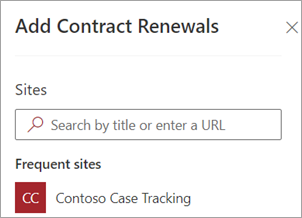
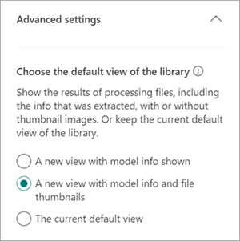

# Apply a document understanding model in Microsoft SharePoint Syntex

 

> [!VIDEO https://www.microsoft.com/videoplayer/embed/RE4CSoL]

 

After publishing your document understanding model, you can apply it to one or more SharePoint document library in your Microsoft 365 tenant.

> [!NOTE]
> You are only able to apply the model to document libraries that you have access to.

## Apply your model to a document library.

To apply your model to to a SharePoint document library:

1. On model home page, on the **Apply model to libraries** tile, select **Publish model**. Or you can select  **+Add Library** in the **Libraries with this model** section.  

     

2. You can then select the SharePoint site that contains the document library that you want to apply the model to. If the site does not show in the list, use the search box to find it. 

     

    > [!NOTE]
    > You must have *Manage List* permissions or *Edit* rights to the document library you are applying the model to. 

3. After selecting the site, select the document library to which you want to apply the model. In the sample, select the *Documents* document library from the *Contoso Case Tracking* site. 

     

4. Since the model is associated to a content type, when you apply it to the library it will add the content type and its view with the labels you extracted showing as columns. This view is the library's default view by default, but you can optionally choose to not have it be the default view by selecting **Advanced settings** and deselecting **Set this new view as default**. 

     

5. Select **Add** to apply the model to the library. 
6. On the model home page, in the **Libraries with this model** section, you should see the URL to the SharePoint site listed. 

     

7. Go to your document library and make sure you are in the model's document library view. Notice that if you select the information button next to the document library name, a message notes that the document library has a model applied to it.

      

    You can the select **View active models** to see details about any models that are applied to the document library.

8. In the **Active models** pane, you can see the models that are applied to the document library. Select a model to see more details about it, such as a description of the model, who published the model, and if the model applies a retention label to the files it classifies.

      

After applying the model to the document library, you can begin uploading documents to the site and see the results.

The model identifies any files with model’s associated content type and lists them in your view. If your model has any extractors, the view displays columns for the data you are extracting from each file.

### Apply the model to files already in the document library

While an applied model processes all files uploaded to the document library after it is applied, you can also do the following to run the model on files that already exists in the document library prior to the model being applied:

1. In your document library, select the files that you want to be processed by your model.
2. After selecting your files, **Classify and extract** will appear in the document library ribbon. Select **Classify and extract**.
3. The files you selected will be added to the queue to be processed.

        

> [!NOTE]
> You can copy individual files to a library and apply them to a model, but not folders.

### The Classification Date field

When a SharePoint Syntex document understanding or form processing model is applied to a document library, a <b> Classification date </b> field is included in the library schema. By default this field is empty, but when documents are processed and classified by a model, this field is updated with a date-time stamp of completion. 

     

The Classification date field is used by the [<b>When a file is classified by a content understanding model</b> trigger](/connectors/sharepointonline/#when-a-file-is-classified-by-a-content-understanding-model) to run a Power Automate flow after a Syntex content understanding model has finished processing a file and updated the "Classification date" field.

    

The <b>When a file is classified by a content understanding model</b> trigger can then be used to start another workflow using any  extracted information from the file.

## See Also
[Create a classifier](create-a-classifier.md)

[Create an extractor](create-an-extractor.md)

[Document Understanding overview](document-understanding-overview.md)
