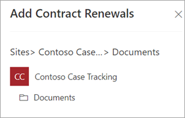
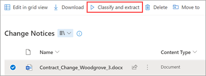
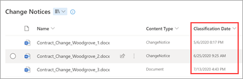

# Apply a document understanding model in Microsoft SharePoint Syntex

 

> [!VIDEO https://www.microsoft.com/videoplayer/embed/RE4CSoL]

 

After publishing your document understanding model, you can apply it to one or more SharePoint document libraries in your Microsoft 365 tenant.

> [!NOTE]
> You are only able to apply the model to document libraries that you have access to.

## Apply your model to a document library

To apply your model to to a SharePoint document library:

1. On model home page, on the **Apply model to libraries** tile, select **Apply model**. Or, in the **Where the model is applied** section, select  **+Add library** .

    

2. You can then select the SharePoint site that contains the document library that you want to apply the model to. If the site does not show in the list, use the search box to find it.

    

    > [!NOTE]
    > You must have *Manage List* permissions or *Edit* rights to the document library you are applying the model to.

3. After selecting the site, select the document library to which you want to apply the model. In the sample, select the *Documents* document library from the *Contoso Case Tracking* site.

    

4. Because the model is associated to a content type, when you apply it to the library it will add the content type and its view with the labels you extracted showing as columns. By default, this view is the library's default view. However, you can optionally choose to not have it be the default view by selecting **Advanced settings** and clearing the **Set this new view as the default** checkbox.

    

5. Select **Add** to apply the model to the library.

6. On the model home page, in the **Where the model is applied** section, you should see the name of the SharePoint site listed.

7. Go to your document library and make sure you are in the model's document library view. Select **Automate** > **View document understanding models**.

8. On the **Review models and apply new ones** page, select the **Applied** tab to see the models that are applied to the document library.

     

9. Select **View model details** to see information about a model, such as a description of the model, who published the model, and if the model applies retention or sensitivity labels to the files it classifies.

     

After applying the model to the document library, you can begin uploading documents to the site and see the results.

The model identifies any files and folders with the model’s associated content type and lists them in your view. If your model has any extractors, the view displays columns for the data you are extracting from each file or folder.

## Apply the model to files and folder content already in the document library

While an applied model processes all files and folder content uploaded to the document library after it is applied, you can also do the following to run the model on files and folder content that already exist in the document library prior to the model being applied:

1. In your document library, select the files and folders that you want to be processed by your model.

2. After selecting your files and folders, **Classify and extract** will appear in the document library ribbon. Select **Classify and extract**.

       

3. The files and folders you selected will be added to the queue to be processed.

    > [!NOTE]
    > You'll receive a message indicating how long classification might take. If you've selected only files, classification might take up to 30 minutes. If you've selected one or more folders, classification might take up to 24 hours.

### Classification Date field

When a SharePoint Syntex document understanding or form processing model is applied to a document library, the **Classification Date** field is included in the library schema. By default, this field is empty. However, when documents are processed and classified by a model, this field is updated with a date-time stamp of completion. 

    

The **Classification Date** field is used by the [**When a file is classified by a content understanding model**](/connectors/sharepointonline/#when-a-file-is-classified-by-a-content-understanding-model) trigger to run a Power Automate flow after a Syntex content understanding model has finished processing a file or folder and updated the **Classification Date** field.

   

The **When a file is classified by a content understanding model** trigger can then be used to start another workflow using any extracted information from the file or folder.

## See Also

[Create a classifier](create-a-classifier.md)

[Create an extractor](create-an-extractor.md)

[Document Understanding overview](document-understanding-overview.md)
