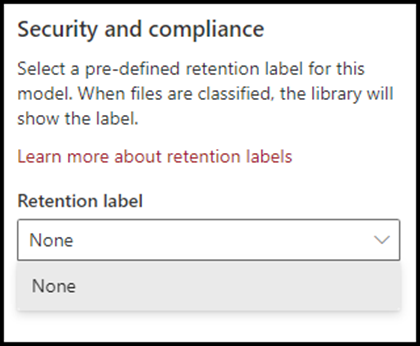

# Apply a retention label to a document understanding model

 

> [!VIDEO https://www.microsoft.com/videoplayer/embed/RE4CSoL]

 

You can easily apply a [retention label](https://docs.microsoft.com/microsoft-365/compliance/retention?view=o365-worldwide#retention-labels) to a document understanding model in Project Cortex.

Retention labels let you apply retention settings to the documents that your document understanding model identify.  For example, you want your model to not only identify any *Insurance notice* documents that are uploaded to your document library, but to also apply a *Business* retention tag to them so that these documents cannot be deleted from the document library for the specified time period (the next five months, for example).

You can apply a pre-existing retention label to your document understanding model through your model settings on your model's home page. 

> [!Important]
> For retention labels to be available to apply to your content understanding model, they need to be [created and published in the Microsoft 365 Compliance Center](https://docs.microsoft.com/microsoft-365/compliance/create-apply-retention-labels?view=o365-worldwide#how-to-create-and-publish-retention-labels).

### To add a retention label to a document understanding model

1. On the model home page, select **Model settings**. 
2. In **Model settings**, in the **Security and compliance** section, select the **Retention label** menu to see a list of retention labels that are available for your to apply to the model. 
   
3. Select the retention label you want to apply to the model, and then select **Save**. 

After applying the retention label to your model, you are able to:
- Apply the updated model to a new document library.
- Apply the updated model to a document library to which the model is already applied.
 
### Apply the retention label to a document library to which the model is already applied

If your document understanding model has already been applied to a document library, you can do the following to sync your retention label update to apply it to the document library: 

1. On your model home page, in the **Libraries with this model** section, select the document library to which you want to apply the retention label update.   
2. Select **Sync**.  
   

After applying the update, you can confirm that it has been applied by selecting your document library link and checking your document library view. In your document library view, select the information icon to check the model properties.  In the **Active models** list, select your updated model, and in the **Retention label** section you will see the name of the applied retention label.

Select the link to your document library. On the view page, a new **Retention label** column will display in your library view page.  As your model classifies files it identifies as belonging to it's content type and lists them in the library view, the Retention label column will also display the name of the retention label that has been applied to it through the model.

For example, all *Insurance notice* documents that your model identifies will also have the *Business* retention label applied to them, preventing them from being deleted from the document library for five months. If an attempt is made to delete the file from the document library, an error will display saying it is not allowed because of the applied retention label.

## See Also
[Create a classifier](create-a-classifier.md) 
[Create an extractor](create-an-extractor.md) 
[Document Understanding overview](document-understanding-overview.md) 
[Create a form processing model](create-a-form-processing-model.md)  

