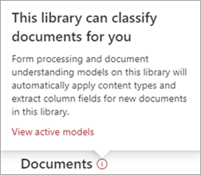

# Apply a retention label to a model in SharePoint Syntex

 

> [!VIDEO https://www.microsoft.com/videoplayer/embed/RE4GydO]  

 

You can easily apply a [retention label](../compliance/retention.md) to a model in Microsoft SharePoint Syntex. You can do this for both document understanding and form processing models.

Retention labels let you apply retention settings to the documents that your models identify.  For example, you want your model to not only identify any *Insurance notice* documents that are uploaded to your document library, but to also apply a *Business* retention tag to them so that these documents cannot be deleted from the document library for the specified time period (the next five months, for example).

You can apply a pre-existing retention label to your model through your model settings on your model's home page. 

> [!Important]
> For retention labels to be available to apply to your document understanding models, they need to be [created and published in the Microsoft 365 Compliance Center](../compliance/create-apply-retention-labels.md#how-to-create-and-publish-retention-labels).

## To add a retention label to a document understanding model

1. From the model home page, select **Model settings**. 
2. In **Model settings**, in the **Security and compliance** section, select the **Retention label** menu to see a list of retention labels that are available for your to apply to the model. 
   
3. Select the retention label you want to apply to the model, and then select **Save**. 

After applying the retention label to your model, you are able to apply it to a:
- New document library
- Document library to which the model is already applied
 
## Apply the retention label to a document library to which the model is already applied

If your document understanding model has already been applied to a document library, you can do the following to sync your retention label update to apply it to the document library: 

1. On your model home page, in the **Libraries with this model** section, select the document library to which you want to apply the retention label update.   
2. Select **Sync**.  
   

After applying the update and syncing it to your model, you can confirm that it has been applied by doing the following:

1. In the content center, in the **Libraries with this model** section, click on the library to which your updated model was applied.  
2. In your document library view, select the information icon to check the model properties.   
3. In the **Active models** list, select your updated model. 
4. In the **Retention label** section you will see the name of the applied retention label. 

On your model's view page in your document library, a new **Retention label** column will display.  As your model classifies files it identifies as belonging to it's content type and lists them in the library view, the Retention label column will also display the name of the retention label that has been applied to it through the model.

For example, all *Insurance notice* documents that your model identifies will also have the *Business* retention label applied to them, preventing them from being deleted from the document library for five months. If an attempt is made to delete the file from the document library, an error will display saying it is not allowed because of the applied retention label.

## To add a retention label to a form processing model

> [!Important]
> For retention labels to be available to apply to your form processing model, they need to be [created and published in the Microsoft 365 Compliance Center](../compliance/create-apply-retention-labels.md#how-to-create-and-publish-retention-labels).

You can either apply a retention label to a form processing model when you are creating a model, or apply it to an existing model.

### To add a retention label when you create a form processing model

1. When you are [creating a new form processing model](./create-a-form-processing-model.md), select <b>Advanced settings.</b>
2. In <b>Advanced settings</b>, in the <b>Retention label</b> section, select the menu and then select the retention label you want to apply to the model.</b>

 
      

3.  After you've completed your remaining model settings, select <b>Create</b> to build your model.

### To add a retention label to an existing form processing model

You can add a retention label to an existing form processing model in different ways:
- Through the Automate menu in the document library
- Through the Active model settings in the document library 

#### To add a retention label to an existing form processing model through the Automate menu

You can add a retention label to an existing form processing model that you own through the Automate menu in the document library in which the model is applied.

1. In your document library to which the form processing model is applied, select the <b>Automate</b> menu, select <b>AI Builder</b>, then select <b>View form processing model details</b>.

    

2. In the model details, in the <b>Retention Label</b> section, select the retention label you want to apply.  Then select <b>Save</b>.

       

#### To add a retention label to an existing form processing model in the active model settings

You can add a retention label to an existing form processing model that you own through the Active model settings in the document library in which the model is applied.

1. In the SharePoint document library in which the model is applied, select the <b>View active models</b> icon, and then select <b>View active models</b>.</b>

     

2. In <b>Active models</b>, select the form processing model to which you want to apply the retention label.

       

3. In the model details, in the <b>Retention Label</b> section, select the retention label you want to apply.  Then select <b>Save</b>.

> [!NOTE]
> You must be the model owner for the model settings pane to be editable. 

## See Also
[Create a classifier](create-a-classifier.md)

[Create an extractor](create-an-extractor.md)

[Document Understanding overview](document-understanding-overview.md)
