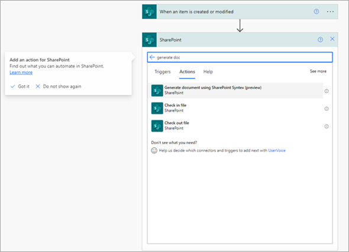

# Automate document generation with SharePoint Syntex and Power Automate (preview)

Using content assembly in SharePoint Syntex together with Power Automate, you can automate the generation of documents using modern templates. 

This preview version is a Power Automate action in a SharePoint connector named “Generate document using SharePoint Syntex (preview)” and has limited capabilities. 

## Scope of the preview 

The current scope of the preview lets you:  

- Choose a SharePoint list as a starting point for document generation. That is, you want a document to be generated using the values in the SharePoint list once an item in the list has been added, modified, or deleted. 

- Choose a modern template and associate its fields with columns from the chosen SharePoint list. 

The preview is created and tested to work for the following three triggers in SharePoint Connector:

- When an item is created
- When an item is created or modified
- When an item is deleted

## Steps to automate document generation 

Follow these steps to automatically generate documents using a modern template and Power Automate. 

1. Sign in to Power Automate.

2. In the left panel, select **Connectors**, and then select **SharePoint** under popular connectors.

3. In the subsequent screen, select the trigger that should start the automated document generation process. 

    We recommend starting with any one of the following three triggers:

    - When an item is created
    - When an item is created or modified
    - When an ttem is deleted

4. Next, set up the trigger by associating the SharePoint site with the name of the SharePoint list. Select **New step**. 

   

5. Select the SharePoint connector again and search for and select the action “Generate document using SharePoint Syntex (preview).” 

    

6. Enter the site information and select the document library that contains the modern template. 

7. Once the template is selected, you will start seeing the template fields. Associate the fields with the columns in the list. 

    > [!NOTE]
    >Honoring the data mapping in the template is not supported in this preview. For example, if you have associated a field in your template with an MMD column during automated generation, you will be able to associate this field with a column in a list. 

8. Once done, save the flow. 

9. You are all set! 

> [!NOTE]
> We recommend using templates that do not need users to add values manually for document generation. If the template needs manual input for a field, you can specify that value against the field rather than mapping it to a SharePoint list column.  

 
