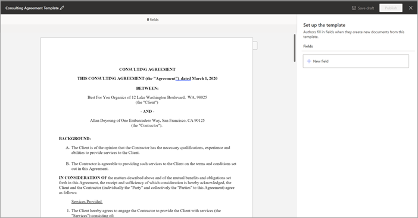
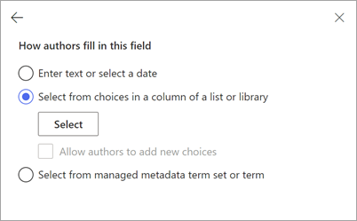
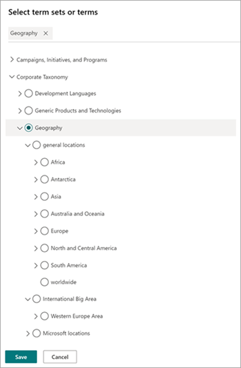
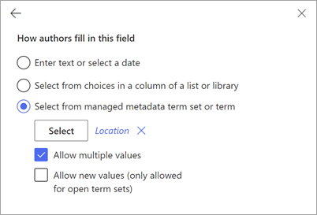
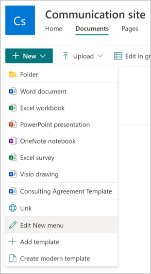

## Create a modern template in Microsoft SharePoint Syntex

Follow these steps to create a modern template.

1. From a SharePoint document library, select **New** > **Create modern template**.

   

2. Choose an existing Word document that you want to use as a basis for creating a modern template, and then select **Open**.

   

   > [!NOTE]
   > Currently, you can upload only Word documents (.docx extension) to create templates. Upload Word documents from your local storage or desktop.

3. After you upload the document, the document is displayed in the template studio where you can convert the document to a template.

   

4. At the upper-left corner of the template studio, select the name for the template. The default name is the name of the document used to create the template. If you want to rename the template, select the default name or the pencil icon next to the name, type the new name, and then select **Enter**.

   

5. Create placeholders for all dynamic text in the document that users might want to change from one document to another. For example, you might want to create a placeholder for input such as company name, client name, address, phone number, or date.

    To create a placeholder, select the text (such as the date). The **All placeholders** panel will open, where you'll give the placeholder a relevant name and choose the type of input you want to associate with the placeholder.
 
   

   Currently, there are three ways for users to fill in a placeholder:

   - [Enter text or select a date](#associate-a-placeholder-by-entering-text-or-selecting-a-date)
   - [Select from choices in a column of a list or library](#associate-a-placeholder-by-selecting-from-choices-in-a-column-of-a-list-or-library)
   - [Select from managed metadata term set or term](#associate-a-placeholder-by-selecting-from-managed-metadata-term-set-or-term)

   > [!NOTE]
   > You can create placeholders for text, and also placeholders for text within cells in a table. However, images, smart art, complete tables, and bulleted lists are currently not supported.   

## Associate a placeholder by entering text or selecting a date

On the **All placeholders** panel:

1. In the **Name** field, enter a relevant name for the placeholder.

   

2. In the **How authors fill in this placeholder** section, select **Enter text or select a date**.

3. In the **Type of info** field, select the data type you want to associate with the placeholder. Currently, there are six options available: **Single line of text**, **Multiple lines of text**, **Number**, **Date and time**, **Email**, and **Hyperlink**.

4. Select **Add**.

   > [!NOTE]
   > You can configure multiple date formatters such as MM/DD/YYYY, DD/MM/YYYY, YYYY/MM/DD, and Month DD, including setting time in both 12-hour and 24-hour format. 

## Associate a placeholder by selecting from choices in a column of a list or library

On the **All placeholders** panel:

1. In the **Name** field, enter a relevant name for the placeholder.

   

2. In the **How authors fill in this placeholder** section, choose **Select from choices in a column of a list or library**, and then choose **Select**.

3. On the **Select a list for adding a source column** page, select the list you want to use, and then select **Next**.

   

4. On the **Select a source column from the existing list** page, select the column name you want to associate with the placeholder, and then select **Save**.

   

    If you want to see the original page of lists again, select **Go to (list name)** link at the bottom of the list.

5. When you're done, you'll see that the list field has been associated with the placeholder.

   

6. If you want users to be able to add inputs manually, in addition to choosing from a list, select **Allow authors to add new choices**. In this case, the default for the manual input data type is *Single line of text*. Also the values input by the authors will only be used to generate the document. They won't be added to the SharePoint list.

## Associate a placeholder by selecting from managed metadata term set or term

On the **All placeholders** panel:

1. In the **Name** field, enter a relevant name for the placeholder.

   

2. In the **How authors fill in this placeholder** section, choose **Select from managed metadata term set or term**, and then choose **Select**.

3. On the **Select term sets or terms** page, search for or select the term set or term to associate with the placeholder, and then select **Save**.

   

4. When you’re done, you’ll see that the selected term set or term has been associated with the placeholder. 

   

5. If you want users to be able to add multiple values corresponding to the term set or term, select **Allow multiple values**. Also, if the term set is configured as an open term set, you can select **Allow new values**. If you enable this option, users who generate documents from the modern template can add new terms to the term set and add those terms as placeholder values.

   > [!TIP]
   > When you enable the **Allow new values** option (only allowed for open term sets), users are more likely to add redundant terms in the term store. Redundant terms can make it difficult for admins to manage a term set.

You can create as many placeholders as you think are necessary. When you're done, you can choose to save the template as a draft or publish the template.

   - **Save draft** – Saves the template as a draft and you can access it later. You can view, edit, or publish saved drafts from the **Modern templates** section by selecting **New** > **Edit New menu** from the document library.
 
   - **Publish** – Publishes the template to be used by other users in the organization to create documents. You can view, edit, or unpublish *published* templates from the **Modern templates** section by selecting **New** > **Edit New menu** from the document library. 

## Edit a modern template

If you need to edit an existing template or to delete or unpublish a template, follow these steps.

1. From a SharePoint document library, select **New** > **Edit New menu**.

   

2. On the **Edit New menu** panel, in the **Modern templates** section, select the published or draft template you want to edit.

   

3. To edit a published template or a draft template:

   - For **Published templates**, select **Edit** to open the template studio where you can edit the published template. You can also choose to delete or unpublish the template.

      

   - For **Draft templates**, select **Edit** to open the template studio where you can edit the draft template. You can also choose to delete or publish the template.

      

> [!div class="nextstepaction"]
> [Next step > Create a document from a modern template](content-assembly-create-document.md)