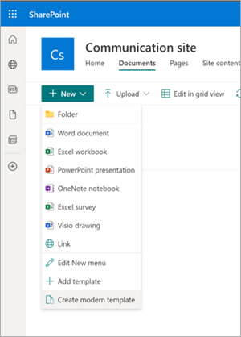
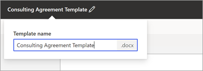
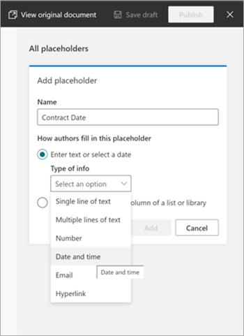
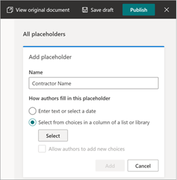
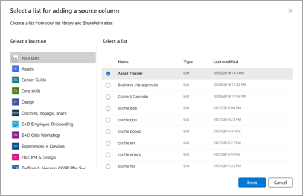
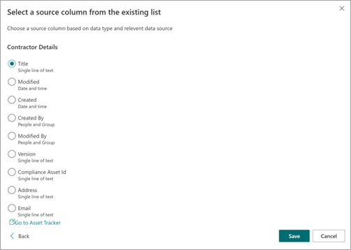
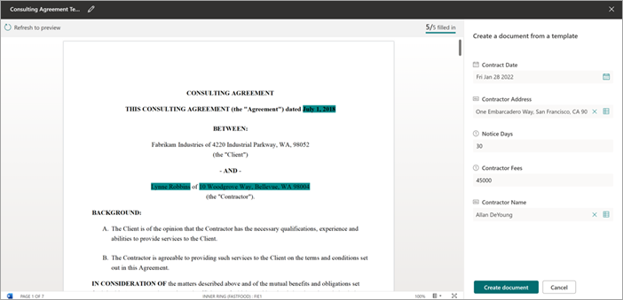

# Create documents using content assembly in Microsoft SharePoint Syntex

You can now use SharePoint Syntex to help you automatically generate standard repetitive business documents, such as contracts, statements of work, service agreements, letters of consent, nondisclosure agreements, sales pitches, and correspondence. You can do all this quicker, more consistent, and less prone to errors by using content assembly in SharePoint Syntex.

With content assembly, you can use an existing document to create a *modern template*, and then use that template to automatically generate new content using SharePoint lists as a data source.

> [!NOTE]
> You must be a SharePoint Syntex licensed user to access and use content assembly capabilities.

## Create a modern template

Follow these steps to create a modern template.

1. From a Sharepoint document library, select **New** > **Create modern template**. 
 
   

2. Upload the existing Word document that you want to use as a basis for creating a modern template. 
 
   

   > [!NOTE]
   > Currently, you can upload only Word documents (“.docx” extension) to create templates. Upload Word documents from your local storage or desktop.

3. After you upload the document, the document is displayed in the template viewer where you can convert this document to a template.
 
   

   > [!NOTE]
   > Currently, the document is displayed without formatting. This is a technical limitation that will be resolved in a future release.

4. At the top-right corner of the page, select the name of the document to rename the template.
 
   

5. Create placeholders for all dynamic text in the document that users might want to change from one document to another. For example, you might want to create a placeholder for company name, client name, address, phone number, date, and so on.

    To create a placeholder, select the text (such as the address), and then select the **+** button above the selected text.
 
   

6. The **All placeholders** panel will open, where you will give the placeholder a relevant name and choose the type of input you want to associate with the placeholder. Currently, there are two types of input:

    - [Manual input](#associate-a-placeholder-with-manual-input)
    - [SharePoint list](#associate-a-placeholder-with-a-sharePoint-list)

### Associate a placeholder with manual input 

On the **All placeholders** panel:

1. In the **Placeholder name** field, enter a relevant name for the placeholder.

   

2. In the **Choose the input type for the placeholder value** section, select **Manual input only**.

3. In the **Choose the data type** field, select the data type you want to associate with the placeholder. Currently, there are six data types available: single line of text, multiple lines of text, date & time, email, hyperlink, and number.

4. Select **Add**.

### Associate a placeholder with a SharePoint list

On the **All placeholders** panel:

1. In the **Placeholder name** field, enter a relevant name for the placeholder.

   

2. In the **Choose the input type for the placeholder value** section, select **Choose from a column of a list**, and then choose **Select**.

3. On the **Select a list for adding a source column** page, select the list you want to use, and then select **Next**.

   

4. On the **Select a source column from the existing list** page, select the column name you want to associate with the placeholder, and then select **Save**. 

   

    If you want to see the original page of lists again, select **Go to the list for reference**.

5. When you are done, you will see that the list field has been associated with the placeholder.

   

6. If you want users to be able to add manual input in addition to choose from a list, select **Allow manual input as well**. In this case, the default for the manual input data type is *Single line of text*.
 
You can create as many placeholders as you think are necessary. When you are done, you can choose to save the template as a draft or publish the template.

   - **Save as draft** – Saves the template as a draft and you can access it at a later time.
   - **Publish** – Publishes the template to be used by other employees in the organization to create documents with.

## Edit an existing modern template

If you need to edit an existing template or to delete or unpublish a template, follow these steps.

1. From a Sharepoint document library, select **New** > **Edit New menu**. 
 
   

2. On the **Edit New menu** panel, in the **Modern templates** section, select the published or draft template you want to edit.
 
   

3. Select **Edit** to open the template viewer where you can edit the template.

## Create a document from a modern template

You can use a modern template to quickly create similar documents without having to start from scratch. To create a document using a modern template, follow these steps:

1. From a Sharepoint document library, select **New**, and then select the modern template you want to use.
 
   

2. The template opens in the template viewer.

3. On the **Fill in the placeholder values** panel, enter the information, and then select **Create**.

   

   To help reduce time and effort involved in filling values for placeholders, SharePoint Syntex provides:

      - Suggestions to help you easily pick values when selecting values from a list.
      - Autofill placeholder values if able to uniquely identify a record for placeholders associated with the same list.

> [!NOTE]
> - Only Word documents (.docx extension) are supported for templatization.
 - The template and the document are associated with one document library. To use the template in another document library, you will need to create the template again in that document library.
 - You can create placeholders only for text. Currently, images, smart art, tables, and bullet lists are not supported.
 - Once a document is created from a template, it is not associated with the template.

 