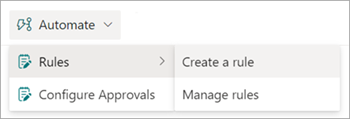

# Create a rule to move or copy a file from one document library to another in Microsoft Syntex

From a document library, you can use Microsoft Syntex to create rules to automate tasks such as sending someone a notification when metadata changes in a file or when a new file is created in the library.

You'll choose a condition that triggers the rule and the action that the rule will take. 
For example, you can create a rule to move files tagged with a specific customer to a specific library or folder. This helps you structure your content architecture with the power of AI-driven processing.

## Move a file

To move a file from one document libary to another, follow these steps.

1. In the document library of the file you want move, select **Automate** > **Rules** > **Create a rule**.

   

2. On the **Create a rule** page, select a condition that triggers the rule and the action that the rule will take. In this case, select **A new file is added**.

   

    Your selection here creates a rule statement that you'll complete in the next step.

3. To complete the rule statement, under **When a new file is added**:

    1. Select **choose action**, and then select **Move file to**.

   

    2. Select **choose a site**, and then select the site that contains the document library you want the file moved to.

   

    3. Select **choose a library**, and the select the document library you want the file moved to.

   

4. Select **Create**.

## Copy a file to another document library

To copy a file from one document libary to another, follow these steps.

1. In the document library of the file you want move, select **Automate** > **Rules** > **Create a rule**.

   

2. On the **Create a rule** page, select a condition that triggers the rule and the action that the rule will take. In this case, select **A new file is added**.

   

    Your selection here creates a rule statement that you'll complete in the next step.

3. To complete the rule statement, under **When a new file is added**:

    1. Select **choose action**, and then select **Move file to**.

   

    2. Select **choose a site**, and then select the site that contains the document library you want the file moved to.

   

    3. Select **choose a library**, and the select the document library you want the file moved to.

   

4. Select **Create**.

## View the activity feed of a document library

<!---
1. In the document library, select **Automate** > **Rules** > **Create a rule**.

   

2. On the **Create a rule** page, select a condition that triggers the rule and the action that the rule will take.

   

3. 

## To manage rules

1. In the document library, select **Automate** > **Rules** > **Manage rules**.

   

2. On the **Manage rules** page, turn on or off a rule or create a new rule to automate actions on the document library.

   

--->