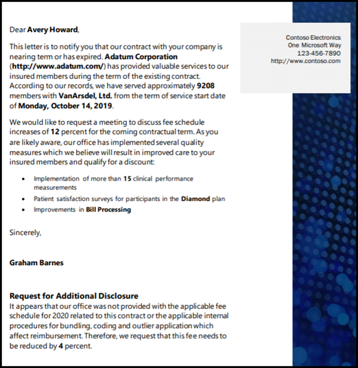
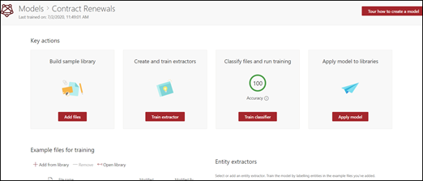
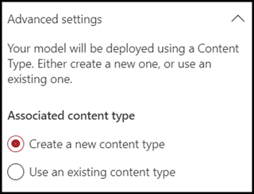
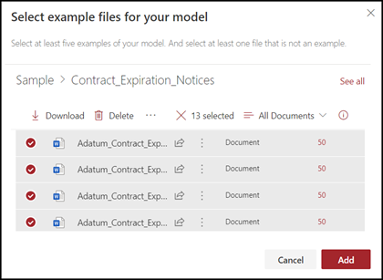
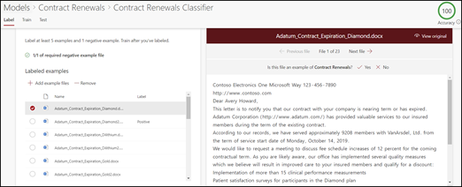
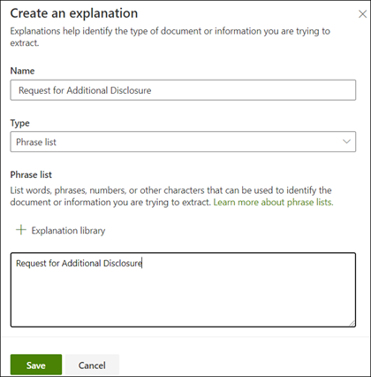

# Create a classifier in Microsoft SharePoint Syntex

 

> [!VIDEO https://www.microsoft.com/videoplayer/embed/RE4CL0R]  

 

A classifier is a type of model that you can use to automate identification and classification of a document type. For example, you may want to identify all *Contract Renewal* documents that are added to your document library, such as is shown in the following illustration.

Creating a classifier enables you to create a new [SharePoint content type](/sharepoint/governance/content-type-and-workflow-planning#content-type-overview) that will be associated to the model.

When creating the classifier, you need to create *explanations* to define the model. This enables you to note common data that you would expect to consistently find this document type. 

Use examples of the document type ("example files") to "train" your model to identify files that have the same content type.

To create a classifier, you need to:
1. Name your model.
2. Add your example files.
3. Label your example files.
4. Create an explanation.
5. Test your model.

> [!NOTE]
> While your model uses a classifier to identify and classify document types, you can also choose to pull specific pieces of information from each file identified by the model. Do this by creating an **extractor** to add to your model. See [Create an extractor](create-an-extractor.md).

## Name your model

The first step to create your model is to give it a name:

1. From the content center, select **New**, and then **Create a model**.
2. In the **New document understanding model** pane, in the **Name** field type the name of the model. For example, if you want to identify contract renewal documents, you could name the model *Contract Renewal*.
3. Choose **Create**. This creates a home page for the model. 

    

When you create a model, you are also creating a new site content type. A content type represents a category of documents that have common characteristics and share a collection of columns or metadata properties for that particular content. SharePoint content types are managed through the [Content types gallery](https://support.microsoft.com/office/create-or-customize-a-site-content-type-27eb6551-9867-4201-a819-620c5658a60f). For this example, when you create the model, you are creating a new *Contract Renewal* content type.

Select **Advanced settings** if you want to map this model to an existing enterprise content type in the SharePoint Content types gallery to use its schema. Enterprise content types are stored in the Content Type Hub in the SharePoint admin center and are syndicated to all sites in the tenant. Note that while you can use an existing content type to leverage its schema to help with identification and classification, you still need to train your model to extract information from files it identifies. 

## Add your example files

On the model home page, add your examples files you will need to help train the model to identify your document type.  
 

> [!VIDEO https://www.microsoft.com/videoplayer/embed/RE4D0iX] 

 

> [!NOTE]
> You should use the same files for both classifier and [extractor training](create-an-extractor.md). You always have the option to add more later, but typically you add a full set of example files. Label some to train your model, and test the remaining unlabeled ones to evaluate model fitness. 

For your training set, you want to use both positive and negative examples:
- Positive example: Documents that represent the document type. These contain strings and information that would always be in this type of document.
- Negative example: Any other document that does not represent the document you want to classify. 

Be sure to use at least five positive examples and at least one negative example to train your model.  You want to create additional ones to test your model after the training process.

To add example files:

1. On the model home page, in the **Add example files** tile, click **Add files**.
2. On the **Select example files for your model** page, select your example files from the Training files library in the content center. If you had not already uploaded them there, choose to upload them now by clicking **Upload** to copy them to the Training files library.
3. After selecting your example files to use to train the model, click **Add**.

     

## Label your example files

After adding your example files, you need to label them as either positive or negative examples.

1. From the model home page, on the **Classify files and run training** tile, click **Train classifier**.
   This displays the label page that shows a listing of your example files, with the first file visible in the viewer.
2. In the viewer on the top of the first example file, you should see text asking if the file is an example of the model you just created. If it is a positive example, select **Yes**. If it is a negative example, select **No**.
3. From the **Labeled examples** list on the left, select additional files that you want to use as examples, and label them. 

     

> [!NOTE]
> Label at least five positive examples. You must also label at least one negative example. 

## Create an explanation

The next step is for you to create an explanation on the Train page. An explanation helps the model understand how to recognize the document. For example, the Contract Renewal documents always contain a *Request for additional disclosure* text string.

> [!Note]
> When used with extractors, an explanation identifies the string that you want to extract from the document. 

To create an explanation:

1. From the model home page, select the **Train** tab to go to the Train page.
2. On the Train page, in the **Trained files** section you should see a list of the sample files that you previously labeled. Select one of the positive files from the list, and it displays in the viewer.
3. In the Explanation section, select **New** and then **Blank**.
4. On the **Create an explanation** page: 
    a. Type the **Name** (for example, "Disclosure Block"). 
    b. Select the **Type**. For the sample, select **Phrase list**, since you add a text string. 
    c. In the **Type here** box, type the string. For the sample, add "Request for additional disclosure". You can select **Case sensitive** if the string needs to be case sensitive. 
    d. Click **Save**.

     
    
5. The Content Center now checks to see if the explanation you created is complete enough to identify the remaining labeled example files correctly, as positive and negative examples. In the Trained Files section, check the **Evaluation** column after the training has completed to see the results. The files show a value of **Match**, if the explanations you created was enough to match what you labeled as positive or negative.

     

If you receive a **Mismatch** on the labeled files, you may need to create an additional explanation to provide the model more information to identify the document type. If this happens, click on the file to get more information about why the mismatch occurred.

## Test your model

If you received a match on your labeled sample files, you can now  test your model on your remaining unlabeled example files that the model has not seen before.  This is optional, but a useful step to evaluate the “fitness” or readiness of the model before using it, by testing it on files the model hasn’t seen before.

1. From the model home page, select the **Test** tab.  This runs the model on your unlabeled sample files.
2. In the **Test files** list, your example files display and shows if the model predicted them to be positive or negative. Use this information to help determine the effectiveness of your classifier in identifying your documents.

     

## See Also
[Create an extractor](create-an-extractor.md)

[Document Understanding overview](document-understanding-overview.md)

[Explanation types](explanation-types-overview.md)

[Apply a model](apply-a-model.md) 

[SharePoint Syntex Accessibility Mode](accessibility-mode.md)