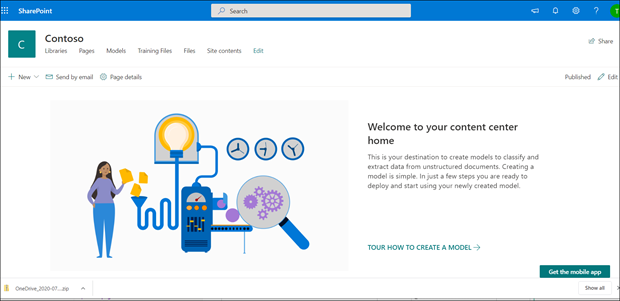
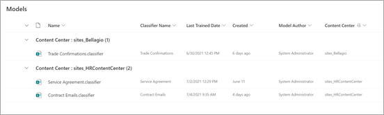

# Create a content center in Microsoft SharePoint Syntex

 

> [!VIDEO https://www.microsoft.com/videoplayer/embed/RE4CPSF]

 

To create and manage document understanding models, you first need a content center. The content center is the model creation interface and also contains information about which document libraries published models have been applied to.

   

You create a default content center during [setup](set-up-content-understanding.md). But a SharePoint admin can also choose to create additional centers as needed. While a single content center may be fine for environments for which you want a roll-up of all model activity, you may want to have additional centers for multiple departments within your organization, which might have different needs and permission requirements for their models.

> [!NOTE]
> In a [Microsoft 365 Multi-Geo environment](../enterprise/microsoft-365-multi-geo.md), if you have a single default content center in your central location, you can only provide a roll-up of model activity from within that location. You currently cannot get a roll-up of model activity across farm-boundaries in Multi-Geo environment. 

## Create a content center

A SharePoint admin can create a content center site like they would [create any other SharePoint site](/sharepoint/create-site-collection) through the admin center site provisioning panel.

To create a new content center:

1. On the Microsoft 365 admin center, go to the SharePoint admin center.

2. On the SharePoint admin center, under **Sites**, select **Active Sites**.

3. On the **Active Sites** page, click **Create**, and then select **Other options**.

4. On the **Choose a template** menu, select **Content Center**.

5. For the new site, provide a **Site Name**, **Primary administrator**, and a **Language**. 

   > [!NOTE] 
   > You can select a content center site to render in any of the available languages, but note that currently models can only be created for English files. Also note that like other site templates, the default site language isn't editable after the site is created.

6. Select **Finished**.
 
After you create a content center site, you will see it listed on the **Active sites** page in the SharePoint admin center. 

### Give access to additional users
 
After you create the site, you can give additional users access to the site through the standard [SharePoint site permissions model.](/sharepoint/modern-experience-sharing-permissions).

### Roll up of models in the default content center

In SharePoint Syntex, the first content center created during setup is the *default content center*. If subsequent content centers are created, their models are shown in the default content center view.

The **Models** library in the default content center view groups the created models by content center for a summary view of all document understanding models and form processing models that have been created.

> [!NOTE]
> You can't change the designated default content center. It's always the first content center created during setup. 

## See Also
[Create a classifier](create-a-classifier.md)

[Create an extractor](create-an-extractor.md)

[Create a content center](create-a-content-center.md)

[Document understanding overview](document-understanding-overview.md)

[Create a form processing model](create-a-form-processing-model.md)

[Apply a model](apply-a-model.md)