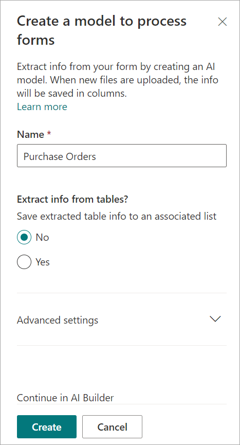
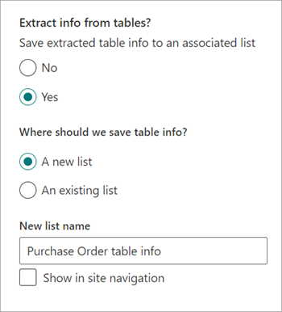
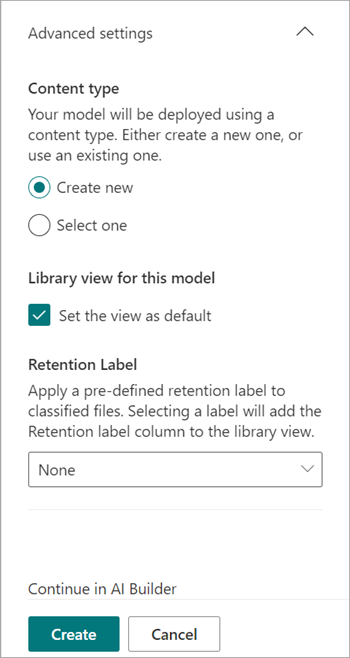

# Create a form processing model in Microsoft SharePoint Syntex

 

> [!VIDEO https://www.microsoft.com/videoplayer/embed/RE4GnhN]  

 

Using [AI Builder](/ai-builder/overview)—a feature in Microsoft PowerApps—SharePoint Syntex users can create a [form processing model](form-processing-overview.md) directly from a SharePoint document library. 

Creating a form processing model involves the following steps:

 - Step 1: Create the from processing model to create the content type
 - Step 2: Add and analyze example files
 - Step 3: Select your form fields
 - Step 4: Train and test your model
 - Step 5: Publish your model
 - Step 6: Use your model

## Requirements

You can only create a form processing model in SharePoint document libraries for which it's enabled. If form processing is enabled, you're able to see the **Automate** > **AI Builder** > **Create a model to process forms** menu in your document library. If you need processing enabled on your document library, you must contact your SharePoint administrator.

 

## Step 1: Create a form processing model

The first step in creating a form processing model is to name the model, define the new content type, and create a new document library view for it.

1. From the document library, select the **Automate** menu, select **AI Builder**, and then select **Create a model to process forms**.

    

2. In the **Create a model to process forms** panel, in the  **Name** field, type a name for your model (for example, *Purchase Orders*).

     

3. You can now automatically extract and save information from a *collection* of structured files that share a similar layout—such as invoices or tax documents—that are in a SharePoint document library. This lets you compose several models into a single model and extract specific table item data.

   The collection name is saved to a dedicated column in the document library where the model is applied, allowing you to distinguish different file layouts processed by the same model. The extracted table data is saved to a specified list and associated with the uploaded file for easy viewing or for additional business process automation.

   If you want to extract table information to an associated list:

   1. In the **Extract info from tables?** section, select **Yes**.

       

   2. In the **Where should we save table info?** section:
 
      - If you select **A new list** (the default setting), a suggested name is automatically provided in the **New list name** box. You can modify the name if you want to. If you want to show the list in the site navigation, select the **Show in site navigation** checkbox.

      - If you select **An existing list**, in the **Selected list** box, choose the list you want to use.

4. When you create a form processing model, you create a new SharePoint content type. A SharePoint content type represents a category of documents that have common characteristics and share a collection of columns or metadata properties for that particular content. SharePoint content types are managed through the SharePoint admin center.

   If you want to map this model to an existing content type in the SharePoint content types gallery, select **Advanced settings**.

     

   1. In the **Content type** section, choose whether to create a new content type or to use an existing one. 

   2. To use an existing content type, select **Select one**, and choose a content type from the list.

   3. Your model creates a new view in your document library for your extracted data. If you don't want it to be the default view, in the **Library view for this model** section, clear the **Set the view as default** checkbox.

   4. To apply a retention label to your files, in the **Retention label** section, select the retention label you want to use.

4. Select **Create**.

## Step 2: Add and analyze documents

After you create your new form processing model, your browser opens a new PowerApps AI Builder forms processing model page. On this page, you can add and analyze your example documents. 

> [!NOTE]
> When looking for example files to use, see the [form processing model input document requirements and optimization tips](/ai-builder/form-processing-model-requirements). 

   
 
1. Select **Add documents** to begin adding example documents analyzed to determine the named value pairs that can be extracted. You can then choose either **Upload from local storage**, **SharePoint**, or **Azure Blob storage**. You need to use at least five files for training.

2. After adding files, select **Analyze** to check for any information common is all files. This step might take several minutes to complete.
 
    

3. After the files have been analyzed, in the **Select the form fields you want to save** page select the file to view the detected fields.

    

## Step 3: Select your form fields

After analyzing the documents for fields, you can now see the fields that were found and identify the ones that you want to save. Saved fields display as columns in your model's document library view and show the values extracted from each document.

1. The next page displays one of your sample files and will highlight all common fields that were automatically detected by the system.

    

2. Select the fields that you want to save and select the checkbox to confirm your selection. For example, in the Purchase Order model, choose to select the *Date*, *PO*, and *Total* fields. You can also choose to rename a field if you want to.

    

3. If a field was not detected by analysis, you can still choose to add it. Highlight the information you want to extract, and in the name box type in the name you want. Then select the check box. Note that you need to confirm undetected fields in your remaining sample files.

4. Select **Confirm fields** after you've selected the fields that you want to save.
 
    
 
5. On the **Select the form fields you want to save** page, it shows the number of fields you've selected. Select **Done**.

## Step 4: Train and test your model

After selecting the fields you want to save, the **Model Summary** page lets you train and test your model.

1. On the **Model Summary** page, the saved fields will show in the **Selected fields** section. Select **Train** to begin training on your example files. This step might take a few minutes to complete.

      

2. When you see the notification that training has completed, select **Go to details page**. 

3. On the **Model details** page, you can choose to test how your model works by selecting **Quick test**. This lets you drag and drop files to the page and see if the fields are detected.

    

2. When you see the notification that training has completed, select **Go to details page**. 

3. On the **Model details** page, choose to test how your model works by selecting **Quick test**. This lets you drag and drop files to the page and see if the fields are detected.

## Step 5: Publish your model

1. If you're satisfied with the results of your model, select **Publish** to make it available for use.

2. After the model is published, select **Use model**. This creates a Power Automate flow that can run in your SharePoint document library and extracts the fields that have been identified in the model, then select **Create Flow**.
  
3. When completed, you'll see the message: *Your flow has been successfully created*.
 
## Step 6: Use your model

After publishing your model and creating its Power Automate flow, you can use your model in your SharePoint document library.

1. After publishing your model, select **Go to SharePoint** to go to your document library.

2. In the document library model view, notice that the fields you selected now display as columns.

    

3. Notice that the information link next to **Documents** notes that a forms processing model is applied to this document library.

      

4. Upload files to your document library. Any files that the model identifies as its content type lists the files in your view and displays the extracted data in the columns.

     

## See Also
  
[Power Automate documentation](/power-automate/)

[Training: Improve business performance with AI Builder](/learn/paths/improve-business-performance-ai-builder/?source=learn)