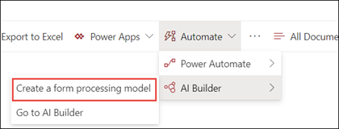
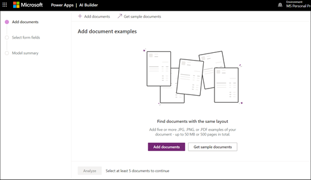
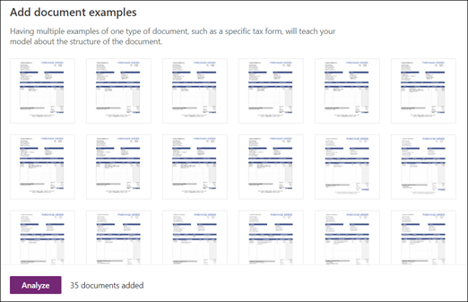
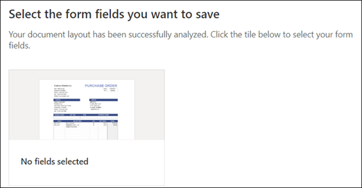
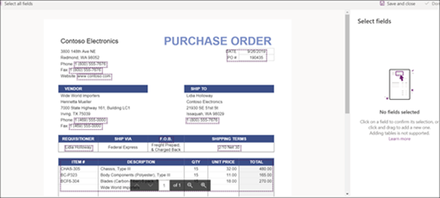
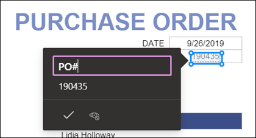
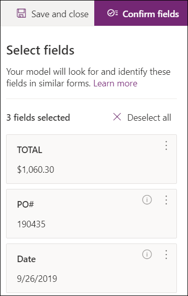
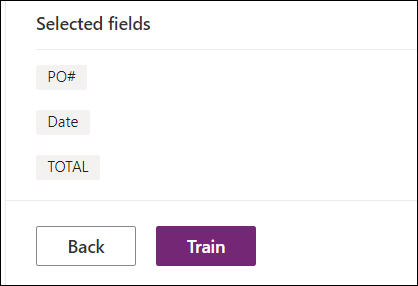

# Create a form processing model in Microsoft SharePoint Syntex

 

> [!VIDEO https://www.microsoft.com/videoplayer/embed/RE4GnhN]  

 

Using [AI Builder](/ai-builder/overview) - a feature in Microsoft PowerApps - SharePoint Syntex users can create a [form processing model](form-processing-overview.md) directly from a SharePoint document library. 

Creating a form processing model involves the following:
 - Step 1: Create the from processing model to create the content type
 - Step 2: Add and analyze example files
 - Step 3: Select your form fields
 - Step 4: Train and test your model
 - Step 5: Publish your model
 - Step 6: Use your model

## Requirements

You can only create a form processing model in SharePoint document libraries for which it is enabled. If form processing is enabled, you are able to see the **AI Builder** **"Create a form processing model'** under the **Automate** menu in your document library.  If you need processing enabled on your document library, you must contact your SharePoint administrator.

  

## Step 1: Create a form processing model

The first step in creating a form processing model is to name it and create the define the new content type and create a new document library view for it.

1. From the document library, select the **Automate** menu, select **AI Builder**, and then select **Create a Form Processing model**.

     

2. In the **New form processing model** pane, in the  **Name** field, type a name for your model (for example, *Purchase Orders*).

      

3. When you create a form processing model, you create a new SharePoint content type. A SharePoint content type represents a category of documents that have common characteristics and share a collection of columns or metadata properties for that particular content. SharePoint Content Types are managed through the [Content types gallery]().

    Select **Advanced settings** if you want to map this model to an existing content type in the SharePoint Content types gallery to use its schema. 

4. Your model creates a new view in your document library for your extracted data. If you do not want it to the default view, deselect **Set the view as default**.

5. Select **Create**.

## Step 2: Add and analyze documents

After you create your new form processing model, your browser opens a new PowerApps AI Builder forms processing model page. On this page you can add and analyze your example documents.  

> [!NOTE]
> When looking for example files to use, see the [form processing model input document requirements and optimization tips](/ai-builder/form-processing-model-requirements). 

     
 
1. Select **Add documents** to begin adding example documents analyzed to determine the named value pairs that can be extracted. You can then choose either **Upload from local storage**, **SharePoint**, or **Azure Blob storage**. You need to use at least five files for training.

2. After adding files, select **Analyze** to check for any information common is all files. This may take several minutes to complete.  
 
      

3. After the files have been analyzed, in the **Select the form fields you want to save** page select the file to view the detected fields. 

      

## Step 3: Select your form fields

After analyzing the documents for fields, you can now see the fields that were found, and identify the ones that you want to save. Saved fields display as columns in your model's document library view and show the values extracted from each document.

1. The next page displays one of your sample files and will highlight all common fields that were automatically detected by the system.  

      

2. Select the fields that you want to save and select the checkbox to confirm your selection. For example, in the Purchase Order model, choose to select the *Date*, *PO*, and *Total* fields.  Note that you can also choose to rename a field if you choose.  

      

3. If a field was not detected by analysis, you can still choose to add it. Highlight the information you want to extract, and in the name box type in the name you want. Then select the check box. Note that you need to confirm undetected fields in your remaining sample files.

4. Click **Confirm fields** after you have selected the fields that you want to save.  
 
      
 
5. On the **Select the form fields you want to save** page, it shows the number of fields you have selected. Select **Done**.

## Step 4: Train and test your model

After selecting the fields you want to save, the **Model Summary** page lets you train and test your model.

1. On the **Model Summary** page, the saved fields will show in the **Selected fields** section. Select **Train** to begin training on your example files. Note that this may take a few minutes to complete. 

       

2. When you see the notification that training has completed, select **Go to details page**. 

3. On the **Model details** page, you can choose to test how your model works by selecting **Quick test**. This lets you drag and drop files to the page and see if the fields are detected.

      

2. When you see the notification that training has completed, select **Go to details page**. 

3. On the **Model details** page, choose to test how your model works by selecting **Quick test**. This lets you drag and drop files to the page and see if the fields are detected.

## Step 5: Publish your model

1. If you are satisfied with the results of your model, select **Publish** to make it available for use.

2. After the model is published, select **Use model**. This creates a PowerAutomate flow that can run in your SharePoint document library and extracts the fields that have been identified in the model, then select **Create Flow**.
  
3. When completed, you will see the message **Your flow has been successfully created**.
 
## Step 6: Use your model

After publishing your model and creating it's PowerAutomate flow, you can use your model in your SharePoint document library.

1. After publishing your model, select **Go to SharePoint** to go to your document library.

2. In the document library model view, notice that the fields you selected now display as columns. 

      

3. Notice that the information link next to **Documents** notes that a forms processing model is applied to this document library.

       

4. Upload files to your document library. Any files that the model identifies as it's content type lists the files in your view and displays the extracted data in the columns. 

       

## See Also
  
[Power Automate documentation](/power-automate/)

[Training: Improve business performance with AI Builder](/learn/paths/improve-business-performance-ai-builder/?source=learn)