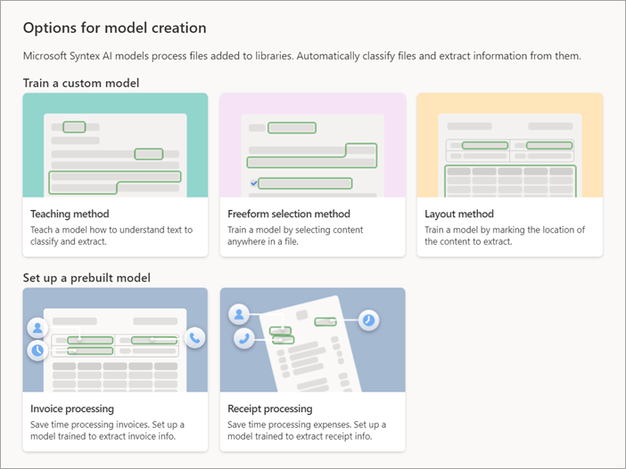

# Create a model in Microsoft SharePoint Syntex

**Applies to:**  &ensp; &#10003; All custom models &ensp; | &ensp; &#10003; All prebuilt models

Whether you want to create a custom model or use a prebuilt model, you can do so from any of these places in SharePoint Syntex:

- From the **Models** library
- From the [content center](create-a-content-center.md) home page
- From any document library in a site where SharePoint Syntex has been activated

For this article, we start in the **Models** library. For information about the different model types, see [Overview of model types in SharePoint Syntex](model-types-overview.md).

## Create a model

Follow these steps to create a model in SharePoint Syntex.

1. From the **Models** library, select **Create a model**.

     

2. On the **Options for model creation** page, there are two sections:

    - [**Train a custom model**](#train-a-custom-model)
    - [**Set up a prebuilt model**](#set-up-a-prebuilt-model)

     

    > [!NOTE]
    > All model options might not be available. These options are configured by your Microsoft 365 admin.

## Train a custom model

1. In the **Train a custom model** section, view the types of custom models you can create. 

     

    - [**Teaching method**](#teaching method)

    - [**Freeform selection method**](#freeform-selection-method)

    - [**Layout method**](#layout-method)

2. When you select a custom model, the next page will show you more information about the model. If you want to continue to create the model, select **Next**.

### Teaching method

Use this method to create an [unstructured document processing model](document-understanding-overview.md).

1. Select **Teaching method**.

2. On the **Teaching method: Details** page, you'll find more information about the model. If you want to proceed with creating the model, select **Next**.

3. On the right panel of the **Create a model with the teaching method** page, enter the following information.

    - **Model name** – Enter the name of the model, for example *Service agreements*.

    - **Description** – Enter information about how this model will be used.

         
    
4. Under **Advanced settings**:

    - In the **Content type** section, choose whether to create a new content type or to use an existing one.

    - In the **Compliance** section, under **Retention labels**, select the retention label you want to add. Under **Sensitivity labels**, select the sensitivity label you want to add. If a compliance label has been already applied to the library where the file is stored, it will be shown.

5. When you are ready to create the model, select **Create**.

6. You are now ready to [train the model](create-a-classifier).

### Freeform selection method

Use this method to create a [freeform document processing model](freeform-document-processing-overview.md).

1. Select **Freeform selection method**.

2. On the **Freeform selection method: Details** page, you'll find more information about the model. If you want to proceed with creating the model, select **Next**.

3. On the right panel of the **Create a model with the freeform selection method** page, enter the following information.

    - **Model name** – Enter the name of the model, for example *Service agreements*.

    - **Description** – Enter information about how this model will be used.

         
    
4. Under **Advanced settings**:

    - In the **Content type** section, choose whether to create a new content type or to use an existing one.

    - In the **Compliance** section, under **Retention labels**, select the retention label you want to add. If a compliance label has been already applied to the library where the file is stored, it will be shown.

    > [!NOTE]
    > Sensitivity labels are not available for **Extract by text pattern and layout** models at this time.

5. When you are ready to create the model, select **Create**.

6. You are now ready to [train the model](train-freeform-document-processing-model.md).

    > [!NOTE]
    > When published, this model type is available for reuse by others who do not own the model. Currently, this model can be edited and shared for editing only by the model owner.

### Layout method

Use this method to create a [structured document processing model](form-processing-overview.md).

1. Select **Layout method**.

2. On the **Layout method: Details** page, you'll find more information about the model. If you want to proceed with creating the model, select **Next**.

3. On the right panel of the **Create a model with the layout method** page, enter the following information.

    - **Model name** – Enter the name of the model, for example *Service agreements*.

    - **Description** – Enter information about how this model will be used.

         
    
4. Under **Advanced settings**:

    - In the **Content type** section, choose whether to create a new content type or to use an existing one.

    - In the **Compliance** section, under **Retention labels**, select the retention label you want to add. If a compliance label has been already applied to the library where the file is stored, it will be shown.

    > [!NOTE]
    > Sensitivity labels are not available for **Extract by layout** models at this time.

5. When you are ready to create the model, select **Create**.

6. You are now ready to [train the model](create-a-form-processing-model.md).

    > [!NOTE]
    > When published, this model type is available for reuse by others who do not own the model. Currently, this model can be edited and shared for editing only by the model owner.

## Set up a prebuilt model

1. In the **Set up a prebuilt model** section, view the types of prebuilt models you can use. Select the type of prebuilt model you want to learn more about or to start using. 

     

    - [**Invoice processing**](#invoice-processing)

    - [**Receipt processing**](#receipt-processing)

2. When you select a prebuilt model, the next page will show you more information about the model. If you want to continue to create the model, select **Next**.

### Invoice processing

1. Select **Invoice processing**.

2. On the **Invoice processing: Details** page, you'll find more information about the model. If you want to proceed with using the model, select **Next**.

3. On the right panel of the **Create an invoice processing model** page, enter the following information.

    - **Model name** – Enter the name of the model, for example *Office expenses*.

    - **Description** – Enter information about how this model will be used.

         
    
4. Under **Advanced settings**:

    - In the **Content type** section, choose whether to create a new content type or to use an existing one.

    - In the **Compliance** section, under **Retention labels**, select the retention label you want to add. If a retention label has been already applied to the library where the file is stored, it will be selected. 

    > [!NOTE]
    > Sensitivity labels are not available for prebuilt models at this time.

5. When you are ready to create the model, select **Create**.

6. You are now ready to [complete setting up the model](prebuilt-model-invoice.md).

### Receipt processing

1. Select **Receipt processing**.

2. On the **Receipt processing: Details** page, you'll find more information about the model. If you want to proceed with using the model, select **Next**.

2. On the right panel of the **Create a receipt processing model** page, enter the following information.

    - **Model name** – Enter the name of the model, for example *Office expenses*.

    - **Description** – Enter information about how this model will be used.

         
    
3. Under **Advanced settings**:

    - In the **Content type** section, choose whether to create a new content type or to use an existing one.

    - In the **Compliance** section, under **Retention labels**, select the retention label you want to add. If a retention label has been already applied to the library where the file is stored, it will be selected. 

    > [!NOTE]
    > Sensitivity labels are not available for prebuilt models at this time.

4. When you are ready to create the model, select **Create**.

5. You are now ready to [complete setting up the model](prebuilt-model-receipt.md).
