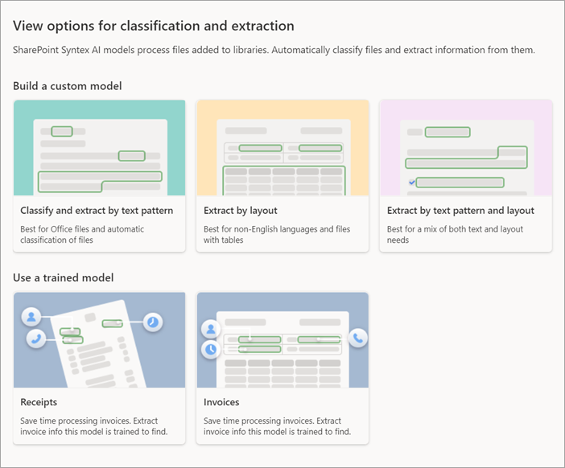
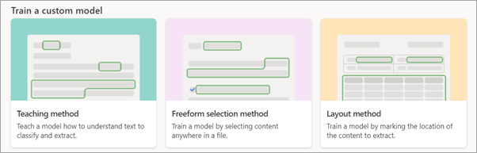
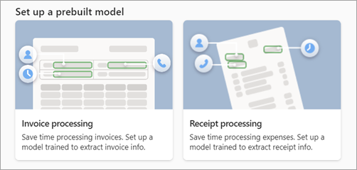

# Create a model in Microsoft SharePoint Syntex

**Applies to:**  &ensp; &#10003; All custom models &ensp; | &ensp; &#10003; All prebuilt models

Whether you want to create a custom model or use a prebuilt model, you can do so from any of these places in SharePoint Syntex:

- From the **Models** library
- From the [content center](create-a-content-center.md) home page
- From any document library in a site where SharePoint Syntex has been activated

For this article, we start in the **Models** library. For information about the different model types, see [Overview of model types in SharePoint Syntex](model-types-overview.md).

## Create a model

Follow these steps to create a model in SharePoint Syntex.

1. From the **Models** library, select **Create a model**.

     

2. On the **View options for classification and extraction** page, there are two sections:

    - [**Build a custom model**](#build-a-custom-model)
    - [**Use a prebuilt model**](#use-a-prebuilt-model)

     

    > [!NOTE]
    > All model options might not be available. These options are configured by your Microsoft 365 admin.

## Build a custom model

1. In the **Build a custom model** section, view the types of custom models you can create. 

     

    - [**Classify and extract by text pattern**](#classify-and-extract-by-text-pattern)

    - [**Extract by layout**](#extract-by-layout)

    - [**Extract by text pattern and layout**](#extract-by-text-pattern-and-layout)

2. When you select a custom model, the next page will show you more information about the model. If you want to continue to create the model, select **Next**.

### Classify and extract by text pattern

1. On the **Classify and extract by text pattern** page, you'll find more information about the model. If you want to proceed with creating the model, select **Next**.

2. On the right panel of the **Create model to classify and extract by text pattern** page, enter the following information.

    - **Model name** – Enter the name of the model, for example *Service agreements*.

    - **Description** – Enter information about how this model will be used.

         
    
3. Under **Advanced settings**:

    - In the **Content type** section, choose whether to create a new content type or to use an existing one.

    - In the **Compliance** section, under **Retention labels**, select the retention label you want to add. Under **Sensitivity labels**, select the sensitivity label you want to add. If a compliance label has been already applied to the library where the file is stored, it will be shown.

4. When you are ready to create the model, select **Create**.

5. You are now ready to begin training the model:

    - [Upload six example files](create-a-classifier#add-your-example-files).
    - [Train the model to classify](create-a-classifier.md).
    - [Add explanations of text patterns](explanation-types-overview.md).
    - [Train extractors](create-an-extractor.md) (optional).
    - [Test model](create-a-classifier#test-your-model) (optional).

### Extract by layout

1. On the **Extract by layout** page, you'll find more information about the model. If you want to proceed with creating the model, select **Next**.

2. On the right panel of the **Create model to extract by layout** page, enter the following information.

    - **Model name** – Enter the name of the model, for example *Service agreements*.

    - **Description** – Enter information about how this model will be used.

         
    
3. Under **Advanced settings**:

    - In the **Content type** section, choose whether to create a new content type or to use an existing one.

    - In the **Compliance** section, under **Retention labels**, select the retention label you want to add. If a compliance label has been already applied to the library where the file is stored, it will be shown.

    > [!NOTE]
    > Sensitivity labels are not available for **Extract by layout** models at this time.

4. When you are ready to create the model, select **Create**.

5. You are now ready to begin training the model:

    - [Name extractors](create-an-extractor.md)
    - [Add collections of documents](create-a-form-processing-model.md#step-2-add-and-analyze-documents)
    - [Tag documents](create-a-form-processing-model.md#step-3-tag-fields-and-tables)
    - [Check results and publish](create-a-form-processing-model.md#step-4-train-and-publish-your-model)
    - [Apply model to library](apply-a-model.md)

    > [!NOTE]
    > When published, this model type is available for reuse by others who do not own the model. Currently, this model can be edited and shared for editing only by the model owner.

### Extract by text pattern and layout

1. On the **Extract by text pattern and layout** page, you'll find more information about the model. If you want to proceed with creating the model, select **Next**.

2. On the right panel of the **Create model to extract by text pattern and layout** page, enter the following information.

    - **Model name** – Enter the name of the model, for example *Service agreements*.

    - **Description** – Enter information about how this model will be used.

         
    
3. Under **Advanced settings**:

    - In the **Content type** section, choose whether to create a new content type or to use an existing one.

    - In the **Compliance** section, under **Retention labels**, select the retention label you want to add. If a compliance label has been already applied to the library where the file is stored, it will be shown.

    > [!NOTE]
    > Sensitivity labels are not available for **Extract by text pattern and layout** models at this time.

4. When you are ready to create the model, select **Create**.

5. You are now ready to begin training the model:
    
    - [Name extractors](create-an-extractor.md)
    - [Add collections of documents](create-a-form-processing-model.md#step-2-add-and-analyze-documents)
    - [Tag documents](create-a-form-processing-model.md#step-3-tag-fields-and-tables)
    - [Check results and publish](create-a-form-processing-model.md#step-4-train-and-publish-your-model)
    - [Apply model to library](apply-a-model.md) 

    > [!NOTE]
    > When published, this model type is available for reuse by others who do not own the model. Currently, this model can be edited and shared for editing only by the model owner.

## Use a prebuilt model

1. In the **Use a prebuilt model** section, view the types of prebuilt models you can use. Select the type of prebuilt model you want to learn more about or to start using. 

     

    - [**Receipts**](#receipts)

    - [**Invoices**](#invoices)

2. When you select a prebuilt model, the next page will show you more information about the model. If you want to continue to create the model, select **Next**.

### Receipts

1. On the **Receipts** page, you'll find more information about the model. If you want to proceed with using the model, select **Next**.

2. On the right panel of the **Create a model to process receipts** page, enter the following information.

    - **Model name** – Enter the name of the model, for example *Office expenses*.

    - **Description** – Enter information about how this model will be used.

         
    
3. Under **Advanced settings**:

    - In the **Content type** section, choose whether to create a new content type or to use an existing one.

    - In the **Compliance** section, under **Retention labels**, select the retention label you want to add. If a retention label has been already applied to the library where the file is stored, it will be selected. 

    > [!NOTE]
    > Sensitivity labels are not available for prebuilt models at this time.

4. When you are ready to create the model, select **Create**.

5. To complete the model:

    - [Upload an example file](prebuilt-model-receipt.md#upload-an-example-file-to-analyze).
    - [Select extractors](prebuilt-model-receipt.md#select-extractors-for-your-model).
    - [Apply model to library](prebuilt-model-receipt.md#apply-the-model).

### Invoices

1. On the **Invoices** page, you'll find more information about the model. If you want to proceed with using the model, select **Next**.

2. On the right panel of the **Create a model to process invoices** page, enter the following information.

    - **Model name** – Enter the name of the model, for example *Office expenses*.

    - **Description** – Enter information about how this model will be used.

         
    
3. Under **Advanced settings**:

    - In the **Content type** section, choose whether to create a new content type or to use an existing one.

    - In the **Compliance** section, under **Retention labels**, select the retention label you want to add. If a retention label has been already applied to the library where the file is stored, it will be selected. 

    > [!NOTE]
    > Sensitivity labels are not available for prebuilt models at this time.

4. When you are ready to create the model, select **Create**.

5. To complete the model:

    - [Upload an example file](prebuilt-model-invoice.md#upload-an-example-file-to-analyze).
    - [Select extractors](prebuilt-model-invoice.md#select-extractors-for-your-model).
    - [Apply model to library](prebuilt-model-invoice.md#apply-the-model).

