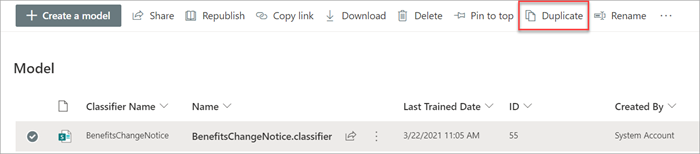

# Duplicate a model in Microsoft SharePoint Syntex

Duplicating a document understanding model can save you time and effort if you need to create a new model, and know that an existing model is very similar to what you need.

For example, you know that an existing model (for example, “Contracts”) classifies the same files you need to work with. Your new model will extract some of the existing data, but will need to be updated to extract some additional ones. Instead of creating and training a new model from scratch, you can use the duplicate model feature to make a copy of the Contracts model, which will also copy all associated training items such as example files, extractors, and classifiers.

When you duplicate the model, after you rename it (for example, to “Contract Renewals”), you can then make your needed updates to it. For example, you can choose to remove some of the existing extracted fields that you don’t need, and train the model to extract a new one (for example, “Renewal date”).

## Duplicate a model

Follow these steps to duplicate a document understanding model.

1. From the content center, select **Models** to see your models list.

2. On the **Models** page, select the model you want to duplicate.

3. On the ribbon, select **Duplicate**. 

      

4. On the **Duplicate model** panel:

   a. Under **Name**, enter the new name of the model that you want to duplicate. 

      

   b. Under **Description**, add a description of your new model.

   c. Under **Advanced settings**, select whether you want to associate an existing [content type](/sharepoint/governance/content-type-and-workflow-planning#content-type-overview).

5. Select **Duplicate**.

 

      

Creating a classifier enables you to create a new [SharePoint content type](/sharepoint/governance/content-type-and-workflow-planning#content-type-overview) that will be associated to the model.

> [!NOTE]
> While your model uses a classifier to identify and classify document types, you can also choose to pull specific pieces of information from each file identified by the model. Do this by creating an **extractor** to add to your model. See [Create an extractor](create-an-extractor.md).

## Name your model

The first step to create your model is to give it a name:

1. From the content center, select **New**, and then **Create a model**.
2. In the **New document understanding model** pane, in the **Name** field type the name of the model. For example, if you want to identify contract renewal documents, you could name the model *Contract Renewal*.
3. Choose **Create**. This creates a home page for the model. 

    

When you create a model, you are also creating a new site content type. A content type represents a category of documents that have common characteristics and share a collection of columns or metadata properties for that particular content. SharePoint content types are managed through the [Content types gallery](https://support.microsoft.com/office/create-or-customize-a-site-content-type-27eb6551-9867-4201-a819-620c5658a60f). For this example, when you create the model, you are creating a new *Contract Renewal* content type.

Select **Advanced settings** if you want to map this model to an existing enterprise content type in the SharePoint Content types gallery to use its schema. Enterprise content types are stored in the Content Type Hub in the SharePoint admin center and are syndicated to all sites in the tenant. Note that while you can use an existing content type to leverage its schema to help with identification and classification, you still need to train your model to extract information from files it identifies. 

## Add your example files

On the model home page, add your examples files you will need to help train the model to identify your document type.  

> [!NOTE]
> You should use the same files for both classifier and [extractor training](create-an-extractor.md). You always have the option to add more later, but typically you add a full set of example files. Label some to train your model, and test the remaining unlabeled ones to evaluate model fitness. 
 

## See Also
[Create a classifier](create-a-classifier.md)

[Rename a model](rename-a-model.md)

[Create an extractor](create-an-extractor.md)

[Document Understanding overview](document-understanding-overview.md)

[Explanation types](explanation-types-overview.md)

[Apply a model](apply-a-model.md) 

[SharePoint Syntex Accessibility Mode](accessibility-mode.md)