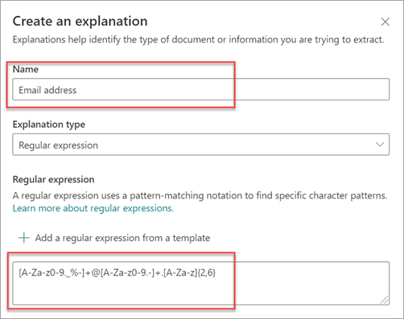

# Explanation types in Microsoft SharePoint Syntex

Explanations are used to help to define the information you want to label and extract in your document understanding models in Microsoft SharePoint Syntex. When you create an explanation, you need to select an explanation type. This article helps you understand the different explanation types and how they're used.

 
   
These explanation types are available:

- [**Phrase list**](#phrase-list): List of words, phrases, numbers, or other characters you can use in the document or information that you're extracting. For example, the text string *referring doctor* is in all Medical Referral documents you're identifying. Or the *phone number* of the referring doctor from all Medical Referral documents that you're identifying.

- [**Regular expression**](#regular-expression): Uses a pattern-matching notation to find specific character patterns. For example, you can use a regular expression to find all instances of an *email address* pattern in a set of documents.

- [**Proximity**](#proximity): Describes how close explanations are to each other. For example, a *street number* phrase list goes right before the *street name* phrase list, with no tokens in between (you'll learn about tokens later in this article). Using the proximity type requires you to have at least two explanations in your model or the option will be disabled. 

## Phrase list

A phrase list explanation type is typically used to identify and classify a document through your model. As described in the *referring doctor* label example, it's a string of words, phrases, numbers, or characters that is consistently in the documents that you're identifying.

While not a requirement, you can achieve better success with your explanation if the phrase you're capturing is located in a consistent location in your document. For example, the *referring doctor* label might be consistently located in the first paragraph of the document. You can also use the **[Configure where phrases occur in the document](https://docs.microsoft.com/microsoft-365/contentunderstanding/explanation-types-overview#configure-where-phrases-occur-in-the-document)** advanced setting to select specific areas where the phrase is located, especially if there's a chance that the phrase might occur in multiple locations in your document.

If case sensitivity is a requirement in identifying your label, using the phrase list type allows you to specify it in your explanation by selecting the **Only exact capitalization** checkbox.

 

A phrase type is especially useful when you create an explanation that identifies and extracts information in different formats, such as dates, phone numbers, and credit card numbers. For example, a date can be displayed in many different formats (1/1/2020, 1-1-2020, 01/01/20, 01/01/2020, or Jan 1,2020). Defining a phrase list makes your explanation more efficient by capturing any possible variations in the data that you're trying to identify and extract. 

For the *phone number* example, you extract the phone number for each referring doctor from all Medical Referral documents that the model identifies. When you create the explanation, type the different formats a phone number might display in your document so that you're able to capture possible variations. 

For this example, in **Advanced Settings** select the **Any digit from 0-9** checkbox to recognize each "0" value used in your phrase list to be any digit from 0 through 9.

Similarly, if you create a phrase list that includes text characters, select the **Any letter from a-z** checkbox to recognize each "a" character used in the phrase list to be any character from "a" to "z".

For example, if you create a **Date** phrase list and you want to make sure that a date format such as *Jan 1, 2020* is recognized, you need to:

- Add *aaa 0, 0000* and *aaa 00, 0000* to your phrase list.
- Make sure that **Any letter from a-z** is also selected.

If you have capitalization requirements in your phrase list, you can select the **Only exact capitalization** checkbox. For the date example, if you require the first letter of the month to be capitalized, you need to:

- Add *Aaa 0, 0000* and *Aaa 00, 0000* to your phrase list.
- Make sure that **Only exact capitalization** is also selected.

> [!NOTE]
> Instead of manually creating a phrase list explanation, use the [explanation library](https://docs.microsoft.com/microsoft-365/contentunderstanding/explanation-types-overview#use-explanation-templates) to use phrase list templates for a common phrase list, such as *date*, *phone number*, or *credit card number*.

## Regular expression

A regular expression explanation type allows you to create patterns that help find and identify certain text strings in documents. You can use regular expressions to quickly parse large amounts of text to:

- Find specific character patterns.
- Validate text to ensure that it matches a predefined pattern (such as an email address).
- Extract, edit, replace, or delete text substrings.

A regular expression type is especially useful when you create an explanation that identifies and extracts information in similar formats, such as email addresses, bank account numbers, or URLs. For example, an email address, such as megan@contoso.com, is displayed in a certain pattern ("megan" is the first part, and "com" is the last part). 

The regular expression for an email address is: **[A-Za-z0-9._%-]+@[A-Za-z0-9.-]+.[A-Za-z]{2,6}**.

This expression consists of five parts, in this order:

1. Any amount of the following characters:

   a. Letters from a to z

   b. Numbers from 0-9

   c. Period, underscore, percent, or dash

2. The @ symbol

3. Any amount of the same characters as the first part of the email address

4. A period

5. Two to six letters

To add a regular expression explanation type:

1. From the **Create an explanation** panel, under **Explanation type**, select **Regular expression**.

   

2. You can either type an expression in the **Regular expression** text box or select **Add a regular expression from a template**.

   When you add a regular expression by using a template, it automatically adds the name and the regular expression to the text box. For example, if you choose the **Email address** template, the **Create an explanation** panel will be populated.

   

### Limitations

The following table shows inline character options that currently are not available for use in regular expression patterns. 

|Option  |State  |Current functionality  |
|---------|---------|---------|
|Case sensitivity | Currently not supported. | All matches performed are case-insensitive.  |
|Line anchors     | Currently not supported. | Unable to specify a specific position in a string where a match must occur.   |

## Proximity 

The proximity explanation type helps your model identify data by defining how close another piece of data is to it. For example, in your model say you have defined two explanations that label both the customer *street address number* and *phone number*. 

Notice that customer phone numbers always appear before the street address number. 

Alex Wilburn 
555-555-5555 
One Microsoft Way 
Redmond, WA 98034 

Use the proximity explanation to define how far away the phone number explanation is to better identify the street address number in your documents.

#### What are tokens?

To use the proximity explanation type, you need to understand what a token is. The number of tokens is how the proximity explanation measures distance from one explanation to another. A token is a continuous span (not including spaces or punctuation) of letters and numbers. 

The following table shows examples for how to determine the number of tokens in a phrase.

|Phrase|Number of tokens|Explanation|
|--|--|--|
|`Dog`|1|A single word with no punctuation or spaces.|
|`RMT33W`|1|A record locator number. It might include numbers and letters, but doesn't have punctuation.|
|`425-555-5555`|5|A phone number. Each punctuation mark is a single token, so `425-555-5555` is 5 tokens: `425` `-` `555` `-` `5555` |
|`https://luis.ai`|7|`https` `:` `/` `/` `luis` `.` `ai` |

#### Configure the proximity explanation type

For the example, configure the proximity setting to define the range of the number of tokens in the *phone number* explanation from the *street address number* explanation. Notice that the minimum range is "0", because there are no tokens between the phone number and street address number.

But some phone numbers in the sample documents are appended with *(mobile)*.

Nestor Wilke 
111-111-1111 (mobile) 
One Microsoft Way 
Redmond, WA 98034 

There are three tokens in *(mobile)*:

|Phrase|Token count|
|--|--|
|(|1|
|mobile|2|
|)|3|

Configure the proximity setting to have a range of 0 through 3.

## Configure where phrases occur in the document

When you create an explanation, by default the entire document is searched for the phrase you're trying to extract. However, you can use the **Where these phrases occur** advanced setting to help in isolating a specific location in the document that a phrase occurs. This setting is useful in situations where similar instances of a phrase might appear somewhere else in the document, and you want to make sure that the correct one is selected.

Referring to our Medical Referral document example, the *referring doctor* is always mentioned in the first paragraph of the document. With the **Where these phrases occur** setting, in this example you can configure your explanation to search for this label only in the beginning section of the document, or any other location in which it might occur.

You can choose the following options for this setting:

- Anywhere in the file: The entire document is searched for the phrase.

- Beginning of the file:  The document is searched from the beginning to the phrase location.

   

    In the viewer, you can manually adjust the select box to include the location where the phase occurs. The **End position** value will update to show the number of tokens your selected area includes. You can update the **End position** value as well to adjust the selected area.

   

- End of the file: The document is searched from the end to the phrase location.

   

    In the viewer, you can manually adjust the select box to include the location where the phase occurs. The **Starting position** value will update to show the number of tokens your selected area includes. You can update the Starting position value as well to adjust the selected area.

   

- Custom range: The document is searched within a specified range for the phrase location.

   

    In the viewer, you can manually adjust the select box to include the location where the phase occurs. For this setting, you need to select a **Start** and an **End** position. These values represent the number of tokens from the beginning of the document. While you can manually enter in these values, it's easier to manually adjust the select box in the viewer. 
   
## Use explanation templates

While you can manually add various phrase list values for your explanation, it can be easier to use the templates provided to you in the explanation library.

For example, instead of manually adding all the variations for *date*, you can use the phrase list template for *date* because it already includes many phrase lists values:

 
The explanation library includes commonly used *phrase list* explanations, including:

- Date: Calendar dates, all formats. Includes text and numbers (for example, "Dec 9, 2020").
- Date (numeric): Calendar dates, all formats. Includes numbers (for example, 1-11-2020).
- Time: 12 and 24 hour formats.
- Number: Positive and negative numbers up to two decimals. 
- Percentage: A list of patterns representing a percentage. For example, 1%, 11%, 100%, or 11.11%.
- Phone number: Common US and International formats. For example, 000 000 0000, 000-000-0000, (000)000-0000, or (000) 000-0000.
- Zip code: US Zip code formats. For example, 11111, 11111-1111.
- First word of sentence: Common patterns for words up to nine characters. 
- End of sentence: Common punctuation for end of a sentence.
- Credit card: Common credit card number formats. For example, 1111-1111-1111-1111. 
- Social security number: US Social Security Number format. For example, 111-11-1111. 
- Checkbox: A phrase list representing variations on a filled in checkbox. For example, _X_, __X_.
- Currency: Major international symbols. For example, $. 
- Email CC: A phrase list with the term 'CC:', often found near the names or email addresses of other people or groups the message was sent to.
- Email date: A phrase list with the term 'Sent on:', often found near the date the email was sent.
- Email greeting: Common opening lines for emails.
- Email recipient: A phrase list with the term 'To:', often found near the names or email addresses of people or groups the message was sent to. 
- Email sender: A phrase list with the term 'From:', often found near the sender's name or email address. 
- Email subject: A phrase list with the term 'Subject:', often found near the email's subject.

The explanation library also includes commonly used *regular expression* explanations, including:

- 6 to 17 digit numbers: Matches any number from 6 to 17 digits long. US bank account numbers fit this pattern.
- Email address: Matches a common type of email address like meganb@contoso.com.
- US taxpayer ID number: Matches a three-digit number starting with 9 followed by a 6 digit number starting with 7 or 8. 
- Web address (URL): Matches the format of a web address, starting with http:// or https://.

In addition, the explanation library includes three automatic template types that work with the data you've labeled in your example files:

- After label: The words or characters that occur after the labels in the example files.
- Before label: The words or characters that occur before the labels in the example files.
- Labels: Up to the first 10 labels from the example files.

To give you an example of how automatic templates work, in the following example file, we'll use the Before label explanation template to help give the model more information to get a more accurate match.

When you select the Before label explanation template, it will look for the first set of words that appear before the label in your example files. In the example, the words that are identified in the first example file is "As of".

You can select **Add** to create an explanation from the template.  As you add more example files, additional words will be identified and added to the phrase list.

 
#### To use a template from the explanation library

1. From the **Explanations** section of your model's **Train** page, select **New**, then select **From a template**.

   

2.  On the **Explanation templates** page, select the explanation you want to use, then select **Add**.

    

3. The information for the template you selected displays on the **Create an explanation** page. If needed, edit the explanation name and add or remove items from the phrase list.  

    

4. When finished, select **Save**.