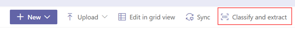

# Overview of structured document processing in Microsoft SharePoint Syntex

Use the structured document processing model to automatically identify field and table values. It works best for structured or semi-structured documents, such as forms and invoices.

SharePoint Syntex uses Microsoft Power Apps [AI Builder](/ai-builder/form-processing-model-overview) document processing (formerly known as form processing) to create structured document processing models within SharePoint document libraries.

 

You can use AI Builder document processing to create structured document processing models that use machine learning technology to identify and extract key-value pairs and table data from structured or semi-structured documents, such as forms and invoices.

Organizations often receive invoices in large quantities from various sources, such as mail, fax, and email. Processing these documents and manually entering them into a database can take a considerable amount of time. By using AI to extract the text, key-value pairs, and tables from your documents, SharePoint Syntex automates this process. 

> [!NOTE]
> For more ideas about how to use these models in your organization, see [Get started driving adoption](adoption-getstarted.md) and [Scenarios and use cases](adoption-scenarios.md).

For example, you can create an structured document processing model that identifies all purchase order documents that are uploaded to the document library. From each purchase order, you can then extract and display specific data that is important to you, such as *PO Number*, *Date*, or *Total Cost*.

  

You use example files to train your model and define the information to be extracted from your form. The layout of your document is learned by training your model. You only need five form documents to get started. AI Builder will analyze your example files for key-value pairs, and you can also manually identify ones that might not have been detected.  AI builder lets you test the accuracy of your model on your example files.

After you train and publish your model, your model creates a [Power Automate flow](/power-automate/getting-started). The flow runs when a file is uploaded to the SharePoint document library and will extract data that has been identified in the model. The extracted data will display in columns in your model's document library view.

You can only create a structured document processing model in SharePoint document libraries for which it's enabled. If it has been enabled, you're able to see the **Automate** > **AI Builder** > **Create a model to process forms** menu in your document library. If you need it enabled on your document library, contact your Microsoft 365 admin.

## Requirements

For information about requirements to consider when choosing this model, see [Requirements and limitations for models in SharePoint Syntex](requirements-and-limitations.md#extract-by-layout).

## See also
  
[Power Automate documentation](/power-automate/)

[Create a structured document processing model](create-a-form-processing-model.md)

[Unstructured document processing overview](document-understanding-overview.md)

[Training: Improve business performance with AI Builder](/training/paths/improve-business-performance-ai-builder/?source=learn)
