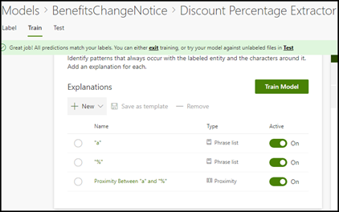

# Learn about document understanding models through the sample model

Microsoft SharePoint Syntex provides you a with sample model that you can use to examine, giving you a better understanding of how to create your own models. It also allows you to examine model components, such as its classifier, extractors, and explanations. You can also use the sample files to train the model.

## Import the sample model

To access the sample model, first you need to import the model to your content center.

1. From the content center, select **Models** to see your models list. 
2. On the **Models** page, select **Import sample model**. 

      

3. Look for the sample model titled *BenefitsChangeNotice.classifier* that appears in your models list. 

      

4. Select the *BenefitsChangeNotice.classifier*, to open the model's home page. 
  
     

5. From the model home page, examine the model more closely to see how it was created.
 
- View the sample files used to train the model.
- Examine the model's entity extractors more closely to see how the sample model configured the explanations.

     

## See Also
[Create a classifier](create-a-classifier.md) 
[Create an extractor](create-an-extractor.md) 
[Document Understanding overview](document-understanding-overview.md) 
[Create a form processing model](create-a-form-processing-model.md)  
