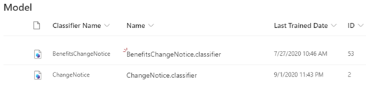
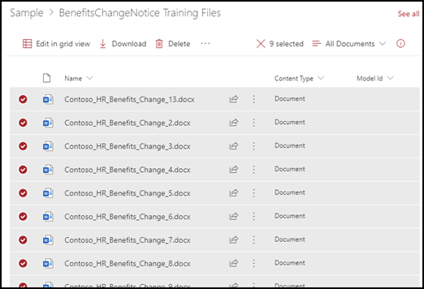

# Learn about document understanding models through the sample model

Microsoft SharePoint Syntex provides you a sample model that you can examine to help give you a better understanding of how to create your own models. It allows you to not only examine model components such as its classifier, extractors, and explanations, but also the example files that are used to train the model.

## Import the sample model

To be able to access the sample model, you first need to import it to your content center.

### To import the sample model

1. On the content center, select **Models** to see your models list. 
2. In **Models** page, select **Import sample model**. 

      

3. The sample model, titled *BenefitsChangeNotice.classifier*, will appear in your models list. 

      

4. Select the *BenefitsChangeNotice.classifier* to open the model home page. 

5. On the model home page, in the **Example files for training** section, select **Add sample files**.  

6. On the **Select sample files for your model**, page, open the  the **BenefitsChangeNotice Training Files** folder, and select the example files you want to train your model.  Then select **Add**.  

       

## See Also
[Create a classifier](create-a-classifier.md) 
[Create an extractor](create-an-extractor.md) 
[Document Understanding overview](document-understanding-overview.md) 
[Create a form processing model](create-a-form-processing-model.md)  

