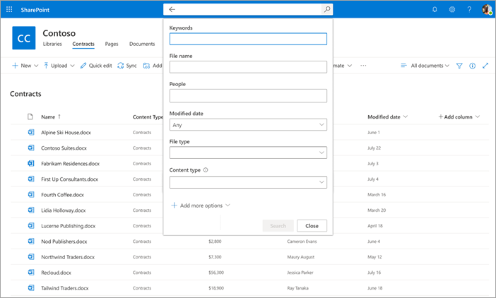

# Search for metadata in document libraries in Microsoft SharePoint Syntex

The advanced metadata search feature in SharePoint Syntex lets you easily perform specific metadata-based queries on SharePoint document libraries. You can make faster, more precise queries based on specific metadata column values, rather than just searching for keywords or writing search queries in Keyword Query Language (KQL).

Advanced metadata search lets you use the metadata associated with a document to help locate the file in a SharePoint document library. This is particularly useful when you have a specific piece of information you want to search for, such as when a document was last modified, a specific person associated with a file, or a specific file type.

> [!NOTE]
> This feature is available only for users who are licensed for SharePoint Syntex. 

## To use advanced metadata search

1. From a SharePoint document library, in the **Search this library** box, click or tap the metadata search icon ().

    

2. In the metadata search pane, type the text or select the parameter you want to find in one or more of the search fields.

    

   Five metadata search fields are currently available. More fields will be added in the future.

   |Field    |Use this field to  |
   |---------|---------|
   |Keywords |Search for a string match in metadata or in the full text of a document. |
   |Name     |Search in the **Name** column in the library.          |
   |People   |Search for a match on people in any column in the library.   |
   |Modified |Search by selected date range in the **Modified** column in the library.         |
   |Type     |Search by selected file type.        |

3. Select **Search**. Your matched documents are shown on the results page. 
