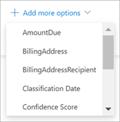

# Search for metadata in document libraries in Microsoft Syntex

The advanced metadata search feature in Microsoft Syntex lets you perform specific metadata-based queries on SharePoint document libraries. You can make faster, more precise queries based on specific metadata column values, rather than just searching for keywords.

Advanced metadata search lets you use the metadata associated with a document to help locate the file in a SharePoint document library. This feature is particularly useful when you have a specific piece of information you want to search for, such as when a document was last modified, a specific person associated with a file, or a specific file type.

> [!NOTE]
> This feature is available only for users who are licensed for Syntex. 

## To use advanced metadata search

1. From a SharePoint document library, in the **Search this library** box, select the metadata search icon ().

    

2. In the metadata search pane, type the text or select the parameter you want to find in one or more of the search fields.

    

   The following metadata search fields are currently available. More fields will be added in the future.

   |Field    |Use this field to  |
   |---------|---------|
   |Keywords |Search for a string match in metadata or in the full text of a document. |
   |File name     |Search in the **Name** column in the library.          |
   |People   |Search for a match on people in any column in the library.   |
   |Modified date |Search by selected date range in the **Modified** column in the library.         |
   |File type     |Search by selected file type (for example, Word document or PDF).        |
   |Content type  |Search by selected content type. This option will only appear if there's a non-default content type applied to the library. Default content types are *document* and *folder*.        |

3. You can also search for custom site columns that are in the current library view. This is especially useful if you have a model running on the library because the metadata extractors automatically populate information into site columns.  

    To add a custom site column to your search, select **Add more options**, and then select the name of the site column.

    

4. Select **Search**. The documents that match your metadata search are shown on the results page. 
