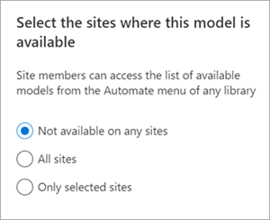
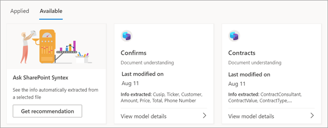
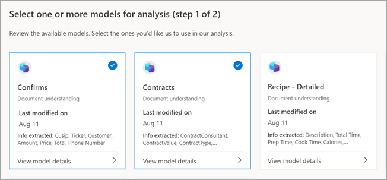

# Publish and discover models in Microsoft SharePoint Syntex

You can make your trained document understanding models available for others to view and use directly from the SharePoint document library. 

You can also find and evaluate trained models in other content centers that were created by others in your organization. Select the model that is most useful for classifying your files or extracting specific information from them. 

> [!NOTE]
> This feature is not yet available for form processing models.

## Make your model discoverable to others

To make your trained model available for others to use:

1. On the **Models** page for your model, select **Model settings**.

2. On the **Model settings** panel, in the **Sites where this model is available** section, select **Edit**.

3. At this point, the **Select the sites where this model is available** panel will be different depending on whether or not you are an administrator. 

    If you are a SharePoint administrator, you will see this view.

    

    - **Not available on any sites** – The model won't be available for others to use.
    - **All sites** – The model will be available in the content type gallery for others to use.
    - **Only selected sites** – You can choose which site or sites in which the model will be available. Click in the text box to search for and choose the sites to which you want the model applied. You'll only see sites for which you have access.

    If you are *not* a SharePoint administrator, you will see this view.

    

    You can only add or remove availability to the specific sites to which you already have access.

4. Select the sites where you want the model to be available for other users to apply, and then select **Save**.

## Discover other trained models

To find trained models that might be suitable for your content:

1. In the document library for your model, select **Automate** > **View document understanding models**.

2. On the **Review models and apply new ones** page, you can review the applied models and the models that are available to be applied to your document library.

    

   - On the **Applied** tab, see the models that have been applied to your library. Select **View model details** to see information about the model, such as description, extractors, and other settings.
   
   - On the **Available** tab, see the trained models that are available to be applied to your library.

### Apply a trained model to your library

You can evaluate trained models against your content to help you find the most appropriate one. To select a model that you want to apply to your library:

1. On the **Review models and apply new ones** page, select the **Available** tab to review the models in the list.

    

2. Choose the model that you think will get you the best results, select **View model details**, and then select **Apply to library**.

### Get a recommendation for a trained model

If you're unsure which model is the best fit for your files, you can ask for a recommendation. Your recommendation could include up to 10 models.

1. On the **Review models and apply new ones** page, select the **Available** tab.

2. On the first tile, select **Get recommendation**.

    

3. On the **Select one or more models for analysis** page, select the models that you think might be the best fit, and then select **Next**.

    

4. On the **Select a file to analyze** page, select a file of the same or similar type that will be stored in your library. Then choose **Select**.

    

5. On the **Review results and select a model** page, under **Our recommendation**, you'll see the recommended file. You don't have to apply the recommended model. You can choose to apply another model if you think it's a better fit.

    

6. For the model you think will get you the best results, select **View model details**, and then select **Apply to library**.

7. If there are no recommended models based on the selected file, you can go back and select another file or select different models.

### Remove an applied model

To remove an applied model from your document library:

1. On the **Review models and apply new ones** page, on the **Applied** tab, see the models that have been applied to your library.

2. On the model you want to remove, select **View model details**, and then select **Remove from library**.

## See also

[Apply a document understanding model](apply-a-model.md)

[Document understanding overview](document-understanding-overview.md)
