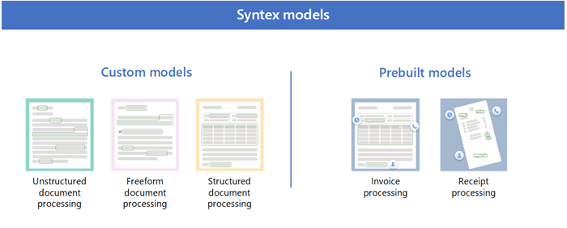

# Overview of model types in Microsoft SharePoint Syntex

Content understanding in SharePoint Syntex starts with AI models. Models let you identify and classify documents that are uploaded to SharePoint document libraries, and then to extract the information you need from each file.

SharePoint Syntex uses [custom models](#custom-models) and [prebuilt models](#prebuilt-models). 

<!---
 

> [!VIDEO https://www.microsoft.com/videoplayer/embed/RE4GJXS] 

 
--->

## Custom models

The type of custom model you choose will depend on the types of files you use, the format and structure of the files, and where you want to apply the model.

Custom models include:

- [Unstructured document processing](#unstructured-document-processing)
- [Freeform document processing](#freeform-document-processing)
- [Structured document processing](#structured-document-processing)

To view the side-by-side differences in custom models, see [Compare custom models](./difference-between-document-understanding-and-form-processing-model.md).

### Unstructured document processing

Use the unstructured document processing model to automatically classify documents and extract information from them. It works best with unstructured documents, such as letters or contracts. These documents must have text that can be identified based on phrases or patterns. The identified text designates both the type of file it is (its classification) and what you'd like to extract (its extractors).

For example, an unstructured document could be a contract renewal letter that can be written in different ways. However, information exists consistently in the body of each contract renewal document, such as the text string "Service start date of" followed by an actual date.

Unstructured document processing models are created and managed in a type of SharePoint site called a [content center](create-a-content-center.md). When applied to a SharePoint document library, the model is associated with a content type has columns to store the information being extracted. The content type you create is stored in the SharePoint content type gallery. You can also choose to use existing content types to use their schema.

For more information, see [Overview of unstructured document processing](document-understanding-overview.md).

### Freeform document processing

Use the freeform document processing model to automatically extract information from unstructured and freeform documents such as letters and contracts.

Freeform document processing models use Microsoft Power Apps [AI Builder](/ai-builder/form-processing-model-overview) document processing (formerly known as form processing) to create models within SharePoint document libraries. You can use AI Builder document processing to create AI models that use machine learning technology to identify and extract key-value pairs and table data from documents. You can then use Power Automate flows to automatically process the files.

Because your organization receives letters and documents in large quantities from various sources, such as mail, fax, and email. Processing these documents and manually entering them into a database can take a considerable amount of time. By using AI to extract the text and other information from these documents, this model automates this process.

For more information, see [Overview of freeform document processing](freeform-document-processing-overview.md).

### Structured document processing

Use the structured document processing model to automatically identify field and table values. It works best for structured or semi-structured documents, such as forms and invoices.

Structured document processing models use Microsoft Power Apps [AI Builder](/ai-builder/form-processing-model-overview) document processing (formerly known as form processing) to create models within SharePoint document libraries. You can use AI Builder document processing to create AI models that use machine learning technology to identify and extract key-value pairs and table data from documents. You can then use Power Automate flows to automatically process the files.

These models are trained to understand the layout of your form from example documents, and learn to look for the data you need to extract from similar locations. Forms usually have a more structured layout where entities are in the same location (for example, a social security number in a tax form).

For more information, see [Overview of structured document processing](form-processing-overview.md).

## Prebuilt models

If you don't need to build a custom model, you can use a [prebuilt model](prebuilt-overview.md) that has already been trained for specific structured documents.

Prebuilt models include:

- [Invoice processing](#invoice-processing)
- [Receipt processing](#receipt-processing)

Prebuilt models are pretrained to recognize documents and the structured information in the documents. Instead of having to create a new custom model from scratch, you can iterate on an existing pretrained model to add specific fields that fit the needs of your organization.

### Invoice processing

The invoice processing model analyzes and extracts key information from sales invoices. The API analyzes invoices in various formats and extracts key invoice information such as customer name, billing address, due date, and amount due.

For more information about prebuilt invoice processing models, see [Use a prebuilt model to extract information from invoices](prebuilt-model-invoice.md).

### Receipt processing

The prebuilt receipt processing model analyzes and extracts key information from sales receipts. The API analyzes printed and handwritten receipts and extracts key receipt information such as merchant name, merchant phone number, transaction date, tax, and transaction total.

For more information about prebuilt receipt processing models, see [Use a prebuilt model to extract information from receipts](prebuilt-model-receipt.md).

## See also

[Compare custom models in SharePoint Syntex](./difference-between-document-understanding-and-form-processing-model.md)

[Training: Improve business performance with AI Builder](/learn/paths/improve-business-performance-ai-builder/?source=learn)
