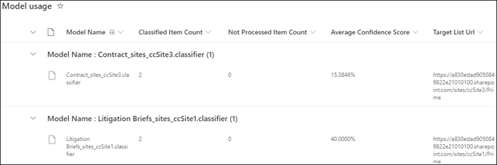

# Document understanding model usage analytics

 

> [!VIDEO https://www.microsoft.com/videoplayer/embed/RE4GnhX]  

 

Your Microsoft SharePoint Syntex content center provides you model usage analytics to provide more information about how your models that have been published from the content center are being used. This includes a roll-up of the following information:

- Where your models are being applied
- How many files are being processed over time
- Model usage 

   

### Roll up of model usage data in the default content center

In SharePoint Syntex, the default content center is created during setup. Additional content centers can also be created as needed. For example, departments might create their own content centers to create and manage their models. 

In regards to model usage analytics, note that:

- Your default content center will show model usage analytics for all content centers and models in your org, including ones created in additional content centers. This gives content managers and other stakeholders a centralized portal to manage and oversee the content centers and models across the company.  
- Other content centers will only show model usage analytics for the models that were created in them. This gives content managers insights into usage data for only the models they are concerned with.

## Total model percentage

     

The **Total model percentage** pie chart displays each published model as a percentage of the total files processed by all published models on the content center.

Each model also shows the **Completeness Rate**, the percentage of uploaded files that were successfully analyzed by the model. A low completeness rate may mean that there are issues with either the model or the files that are being analyzed.

## Files processed over time

     

The **Files processed over time** bar chart shows you not only the number of files processed over time for each model, but also shows you the document libraries to which the model was applied.

     

## Model usage

The Model Usage list will show usage analytics for the models created through the content center.  

> [!NOTE]
> If you are in the default content center and have additional content centers in your organization, the model usage list will be grouped by content center.

Each model in the model usage list will show the usage data:

- Classified item count:
- Not processed item count:
- Average confidence score:
- Target list URL:

   

## See Also
[Create a classifier](create-a-classifier.md)

[Create an extractor](create-an-extractor.md)

[Document Understanding overview](document-understanding-overview.md)

[Create a form processing model](create-a-form-processing-model.md)  
