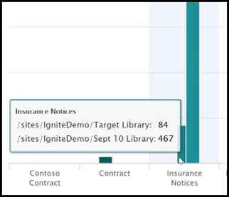

# Document understanding model usage analytics

Your Microsoft SharePoint Syntex content center provides you model usage analytics to provide more information about how your models that have been published from the content center are being used. This includes a roll-up of the following information:

- Where your models are being applied
- How many files are being processes over time

   

## Total model percentage

     

The **Total model percentage** pie chart displays each published model as a percentage of the total files processed by all published models on the content center.

Each model also shows the **Completeness Rate**, the percentage of uploaded files that were successfully analyzed by the model. A low completeness rate may mean that there are issues with either the model or the files that are being analyzed.

## Files processed over time

     

The **Files processed over time** bar chart shows you not only the number of files processed over time for each model, but also shows you the document libraries to which the model was applied.

     

## See Also
[Create a classifier](create-a-classifier.md) 
[Create an extractor](create-an-extractor.md) 
[Document Understanding overview](document-understanding-overview.md) 
[Create a form processing model](create-a-form-processing-model.md)  
