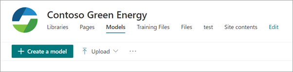
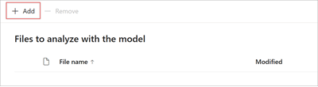
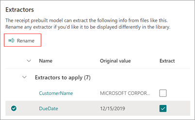

# Use a prebuilt model to extract information from invoices in Microsoft SharePoint Syntex

The prebuilt *invoices model* analyzes and extracts key information from sales invoices. The API recognizes invoices in various formats and [extracts key invoice information](/azure/applied-ai-services/form-recognizer/concept-invoice#field-extraction), such as customer name, billing address, due date, and amount due.

To use an invoices model, follow these steps:

- Step 1: [Create an invoices model](#create-an-invoices-model)
- Step 2: [Upload an example file to analyze](#upload-an-example-file-to-analyze)
- Step 3: [Select extractors for your model](#select-extractors-for-your-model)
- Step 4: [Apply the model](#apply-the-model)

## Create an invoices model

Follow the instructions in [Create a model in SharePoint Syntex](create-syntex-model.md) to create a prebuilt invoices model. Then continue with the following steps to complete your model.

<!---
## Create an invoices model

Follow these steps to create a trained invoices model.

1. From the **Models** page, select **Create a model**.

     

2. On the **View options for classification and extraction** page, in the **Use a trained model** section, select **Invoices**.

     

3. To continue, follow these [instructions to continue to create an invoices model](create-syntex-model.md#invoices).

    > [!NOTE]
    > Sensitivity labels are not available for trained models at this time.
--->

## Upload an example file to analyze

1. On the **Models** page, in the **Add a file to analyze** section, select **Add file**.

     

2. On the **Files to analyze the model** page, select **Add** to find the file you want to use.

     

3. On the **Add a file from the training files library** page, select the file, and then select **Add**.

     

4. On the **Files to analyze the model** page, select **Next**.

## Select extractors for your model

On the extractor details page, you'll see the document area on the right and the **Extractors** panel on the left. The **Extractors** panel shows the list of extractors that have been identified in the document.

    

The entity fields that are highlighted in green in the document area are the items that were detected by the model when it analyzed the file. When you select an entity to extract, the highlighted field will change to blue. If you later decide not to include the entity, the highlighted field will change to gray. The highlights make it easier to see the current state of the extractors you've selected.

> [!TIP]
> You can use the scroll wheel on your mouse or the controls at the bottom of the document area to zoom in or out as needed to read the entity fields.

### Select an extractor entity

You can select an extractor either from the document area or from the **Extractors** panel, depending on your preference.
 
- To select an extractor from the document area, select the entity field.

     

- To select an extractor from the **Extractors** panel, select the checkbox to the right of the entity name.

     

When you select an extractor, a **Select extractor?** box is displayed in the document area. The box shows the extractor name, the original value, and the option to select it as an extractor. For certain data types such as numbers or dates, it will also show an extracted value.

    

The original value is what is actually in the document. The extracted value is what will be written into the column in SharePoint. When the model is applied to a library, you can use column formatting to specify how you want it to look in the document.

Continue to select additional extractors you want to you use. You can also add other files to analyze for this model configuration.

### Rename an extractor

You can rename an extractor either from the model home page or from the **Extractors** panel. You might consider renaming selected extractors because these names will be used as the column names when the model is applied to the library.

To rename an extractor from the model home page:

1. In the **Extractors** section, select the extractor you want to rename, and then select **Rename**.

     

2. On the **Rename entity extractor** panel, enter the new name of the extractor, and then select **Rename**.

To rename an extractor from the **Extractors** panel:

1. Select the extractor you want to rename, and then select **Rename**.

     

2. In the **Rename extractor** box, enter the new name of the extractor, and then select **Rename**.

## Apply the model

- To save changes and return to the model home page, on the **Extractors** panel, select **Save and exit**.

- If you're ready to apply the model to a library, in the document area, select **Next**. On the **Add to library** panel, choose the library to which you want to add the model, and then select **Add**.

## Change the view in a document library

For information about how to set the default view and how to change the view of a document library, see [Choose the view in a document library](choose-library-view.md).

<!---
[!INCLUDE [Change the view in a document library](../includes/change-library-view.md)]
--->
