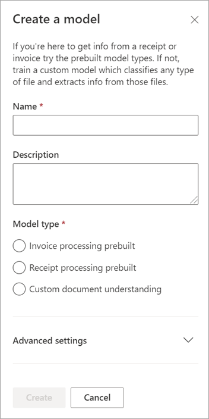

# Use a prebuilt model to classify documents in Microsoft SharePoint Syntex

Prebuilt models are pretrained to recognize documents and the structured information in the documents. You can immediately apply prebuilt models to libraries as they are. They don't need additional training or labeling.

You can also customize a prebuilt model, review it to see how it works on your documents, and customize the names to match your documents or naming conventions. 

Currently, there are two prebuilt models available: sales invoices and sales receipts. Additional prebuilt models will be available in future releases.

> [!NOTE]
> Sensitivity labels are not supported in these prebuilt models.

## Use a prebuilt model

Follow these steps to use a prebuilt model to classify documents.

1. From the **Models** page, select **Create a model**.

2. On the **Create a model** panel, in the **Name** field, type the name of the model.

     

3. In the **Model type** section, select one of the prebuilt models. 

4. Select **Create**.

5. On the **Files to analyze the model** page, select a file (invoice or receipt) to analyze and select detected distractors.

6. More TBD.

