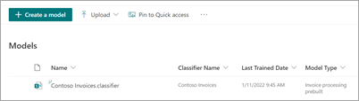

# Use a prebuilt model to classify documents in Microsoft SharePoint Syntex

Prebuilt models are pretrained to recognize documents and the structured information in the documents. You can immediately apply prebuilt models to libraries as they are. They don't need additional training or labeling.

You can also customize a prebuilt model, review it to see how it works on your documents, and customize the names to match your documents or naming conventions. 

Currently, there are two prebuilt models available: invoice and receipt. Additional prebuilt models will be available in future releases.

> [!NOTE]
> You can use retention labels in these prebuilt models. However, sensitivity labels are not supported at this time.

## Create a prebuilt model

Follow these steps to create a prebuilt model to classify documents in SharePoint Syntex.

1. From the **Models** page, select **Create a model**.

     

2. On the **Create a model** panel, in the **Name** field, type the name of the model.

     

3. In the **Model type** section, select one of the prebuilt models:
   - **Invoice processing prebuilt**
   - **Receipt processing prebuilt**

   If you want to create a traditional, untrained document understanding model instead of a prebuilt model, select **Custom document understanding**.

4. Select **Create**.

## Analyze the prebuilt model

1. On the **Models** page, in the **Add a file to analyze** section, select **Add file**.

     

2. On the **Files to analyze the model** page, select **Add** to find the file you want to use.

     

3. On the **Add a file from the training files library** page, select the file, and then select **Add**.

     

6. On the **Files to analyze the model** page, select **Next**.

## Select extractors for your model

On the extractor details page, you will see the document area on the right and the **Extractors** panel on the left. The **Extractors** panel shows the list of extractors that have been identified in the document.

    

The entity fields that are highlighted in green in the document area are the items that were detected by the model when it analyzed the file. When you select an entity to extract, the highlighted field will change to blue. If you later decide not to include the entity, the highlighted field will change to gray. The highlights make it easier to see the current state of the extractors you have selected.

> [!TIP]
> You can use the scroll wheel on your mouse or the controls at the bottom of the document area to zoom in or out as needed to read the entity fields.

### Select an extractor entity

You can select an extractor either from the document area or from the **Extractors** panel, depending on your preference.
 
- To select an extractor from the document area, select the entity field.

     

- To select an extractor from the **Extractors** panel, select the check box to the right of the entity name.

     

When you select an extractor, a **Select extractor?** box is displayed in the document area. The box shows the extractor name, the original value, and the option to select it as an extractor. For certain data types such as numbers or dates, it will also show an extracted value.

    

The original value is what is actually in the document. The extracted value is what will be written into the column in SharePoint. When the model is applied to a library, you can use column formatting to specify how you want it to look in the document.

Continue to select additional extractors you want to you use. 

## Apply the extractors to the model

When you have selected the extractors you want to use, you can apply them either from the document area or from the **Extractors** panel.

- To apply the extractors from the document area, select **Apply**.

- To apply the extractors from the **Extractors** panel, select **Save and exit**.

     

## Rename an extractor

You can rename an extractor either from the model home page or from the **Extractors** panel.

To rename a extractor from model home page:

1. In the **Extractors** section, select the extractor you want to rename, and then select **Rename**.

     

2. On the **Rename entity extractor** panel, enter the new name of the extractor, and then select **Rename**.

To rename a extractor the **Extractors** panel:

1. Select the extractor you want to rename, and then select **Rename**.

     

2. In the **Rename extractor** box, enter the new name of the extractor, and then select **Rename**.