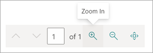

# Use a prebuilt model to classify documents in Microsoft SharePoint Syntex

Prebuilt models are pretrained to recognize documents and the structured information in the documents. You can immediately apply prebuilt models to libraries as they are. They don't need additional training or labeling.

You can also customize a prebuilt model, review it to see how it works on your documents, and customize the names to match your documents or naming conventions. 

Currently, there are two prebuilt models available: invoice and receipt. Additional prebuilt models will be available in future releases.

> [!NOTE]
> You can use retention labels in these prebuilt models. However, sensitivity labels are not supported at this time.

## Create a prebuilt model

Follow these steps to create a prebuilt model to classify documents in SharePoint Syntex.

1. From the **Models** page, select **Create a model**.

     

2. On the **Create a model** panel, in the **Name** field, type the name of the model.

     

3. In the **Model type** section, select one of the prebuilt models:
   - **Invoice processing prebuilt**
   - **Receipt processing prebuilt**

   If you want to create a traditional, untrained document understanding model instead of a prebuilt model, select **Custom document understanding**.

4. Select **Create**.

## Analyze the prebuilt model

1. On the **Models** page, in the **Add a file to analyze** section, select **Add file**.

     

2. On the **Files to analyze the model** page, select **Add** to find the file you want to use.

     

3. On the **Add a file from the training files library** page, select the file, and then select **Add**.

     

6. On the **Files to analyze the model** page, select **Next**.

## Select extractors for your model

On the extractor details page, you will see the sample file and the list of extractors that are identified in the file.

    

The fields that are highlighted in green are the items that were detected by the model by the model when it analyzed the file. When you select an entity to extract, the highlighted field will change to blue. If you later decide not to include the entity, the highlighted field will change to gray. The highlights in the document make it easy to see what the state of the field is.

When you select a name in the

Select a extractor field name

You can use either the document area of the **Extractors panel** to select and apply a field name.

When you select a field name either in the document or on the **Extractors** panel, a **Select distractor?** box is displayed over the document. The box shows the extractor name, the original value, and the option to select it as an extractor. For certain data types such as numbers or dates, it will also show an extracted value.

    

The original value is what is actually in the document. The extracted value is what will be actually written into the column. When the model is applied to a library, you can using column formatting in SharePoint to specify how it gets written into the document.

> [!TIP]
> You can use the scroll wheel on your mouse or the controls at the bottom of the document to zoom in or out as needed to read the fields.

When you select a field in the table

 

