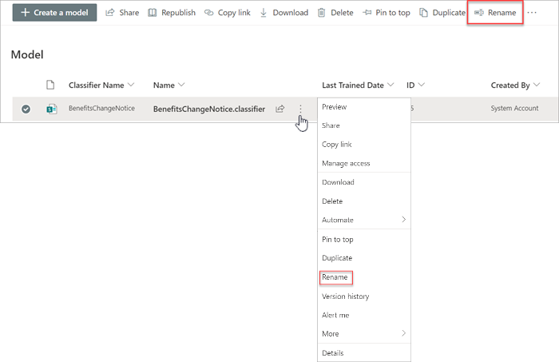
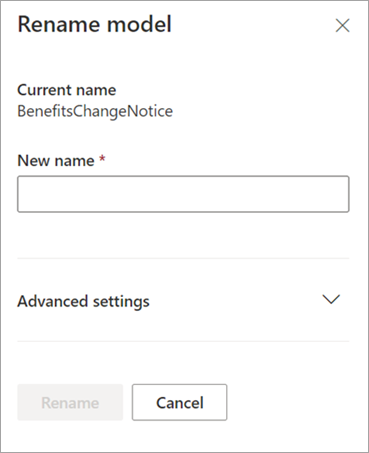

# Rename a model in Microsoft SharePoint Syntex

At some point, you might want to rename a document understanding model. A common example is when you create an initial draft of a model, you might not have given a lot of thought as to the final name (for example, you might have named it “AlexWilburModel1”). As you come closer to finalizing the model and putting it to use, you realize that a more proper name would be “Contract Renewals,” and you want to rename it.  

Another example is when your organization makes a decision to refer to a process or document type by a different name. For example, after you create your model and are ready to apply it, your organization might mandate that all “Contracts” will now formally be referred to as “Agreements.” If needed, you can choose to rename your model from “Contract Renewals” to “Agreement Renewals.”

> [!IMPORTANT]
> You can only rename a document understanding model if it has not been applied to a document library. 

Renaming a model also renames the [content type](/sharepoint/governance/content-type-and-workflow-planning#content-type-overview) that is associated with the model.

## Rename a model

Follow these steps to rename a document understanding model.

1. From the content center, select **Models** to see your models list.

2. On the **Models** page, select the model you want to rename.

3. By using either the ribbon or the **Show actions** button (next to the model name), select **Rename**.  

      

4. On the **Rename model** panel:

   a. Under **New name**, enter the new name of the model that you want to rename. 

      

   b. (Optional) Under **Advanced settings**, select whether you want to associate an existing [content type](/sharepoint/governance/content-type-and-workflow-planning#content-type-overview). If you choose **Use an existing content type**, the model will be renamed to match the selected content type.

5. Select **Rename**.

## See Also
[Create a classifier](create-a-classifier.md)

[Create an extractor](create-an-extractor.md)

[Rename an extractor](rename-an-extractor.md)

[Document Understanding overview](document-understanding-overview.md)

[Explanation types](explanation-types-overview.md)

[Apply a model](apply-a-model.md) 
