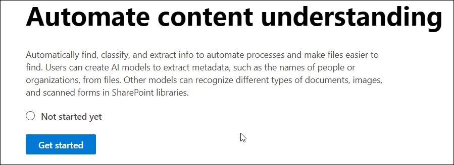
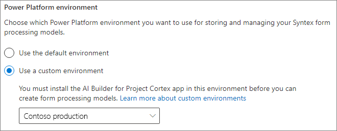
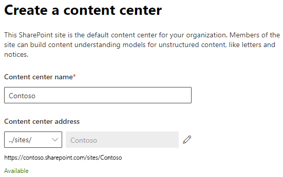
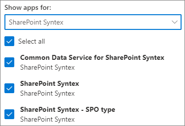

# Set up SharePoint Syntex

Admins can use the Microsoft 365 admin center to set up [Microsoft SharePoint Syntex](index.md). 

Consider the following before you start:

- In which SharePoint sites will you enable form processing? All of them, some, or select sites?
- What will you name your default content center?

You can change your settings after initial setup in the Microsoft 365 admin center.

Prior to setup, make sure to plan for the best way to set up and configure content understanding in your environment. For example, you need to make the following decisions:

- The SharePoint sites in which you want to enable form processing - all of them, some, or selected sites
- The name and admins for your content center

## Requirements 

> [!NOTE]
> You must have Global admin or SharePoint admin permissions to be able to access the Microsoft 365 admin center and set up SharePoint Syntex.

As an admin, you can also make changes to your selected settings anytime after setup, and throughout the content understanding management settings in the Microsoft 365 Admin Center.

If you plan to use a custom Power Platform environment, you must [install the *AI Builder for Project Cortex* app in this environment](/power-platform/admin/manage-apps#install-an-app-in-the-environment-view) and [allocate AI Builder credits](/power-platform/admin/capacity-add-on) to it before you can create form processing models.

### Licensing

To use SharePoint Syntex, your organization must have a subscription to SharePoint Syntex, and each user must have the following licenses assigned:

- SharePoint Syntex
- SharePoint Syntex - SPO type
- Common Data Service for SharePoint Syntex

If you cancel your SharePoint Syntex subscription at a future date (or your trial expires), users will no longer be able to create or run document understanding or form processing models, and the content center template will no longer be available. Additionally, term store reports, SKOS taxonomy import, and Content type push will no longer be available. No content will be deleted and site permissions will not be changed.

### AI Builder credits

If you have 300 or more SharePoint Syntex licenses for SharePoint Syntex in your organization, you will be allocated one million AI Builder credits. If you have fewer than 300 licenses, you must purchase AI Builder credits in order to use forms processing.

You can estimate the AI Builder capacity that’s right for you with the [AI Builder calculator](https://powerapps.microsoft.com/ai-builder-calculator).

If you plan to use a custom Power Platform environment, you must [allocate credits to that environment](/power-platform/admin/capacity-add-on).

Go to the [Power Platform admin center](https://admin.powerplatform.microsoft.com/resources/capacity) to check your credits and usage.

## To set up SharePoint Syntex

1. In the Microsoft 365 admin center, select **Setup**, and then view the **Files and content** section.

2. In the **Files and content** section, select **Automate content understanding**. 

3. On the **Automate content understanding** page, click **Get started** to walk through the setup process. Note that your current AI Builder credit availability is shown in the **At a glance** section. 

    > [!div class="mx-imgBorder"]
    >  

4. On the **Configure Form Processing** page, you can choose if you want to let users be able to create form processing models in specific SharePoint document libraries. A menu option will be available in the document library ribbon to **Create a form processing model** in SharePoint document libraries in which it is enabled.
 
     For **Which SharePoint libraries should show option to create a form processing model**, you can select: 
      - **Libraries in all SharePoint sites** to make it available to all SharePoint libraries in your organization. 
      - **Libraries in selected SharePoint sites**, and then select the sites in which you want to make it available or upload a list of up to 50 sites. 
      - **No SharePoint libraries** if you don't want to make it available to any sites (you can change this after setup).

   > [!div class="mx-imgBorder"]
   > 

   > [!Note]
   > Removing a site after it has been included does not affect existing models applied to the libraries in that site or the ability to apply document understanding models to a library. 
    
    If you have multiple Power Platform environments configured, you can choose which one you want to use with for form processing. (This option will not appear if you only have one environment.)

    

    For **Power Platform environment**, you can select:
    - **Use the default environment** to use your default Power Platform environment.
    - **Use a custom environment** to use a custom environment. Choose the environment that you want to use from the list. ([See the requirements for a custom environment](/microsoft-365/contentunderstanding/set-up-content-understanding#requirements)).

    Click **Next**.

5. On the **Create Content Center** page, you can create a SharePoint content center site on which your users can create and manage document understanding models.

    1. For **Site name**, type the name you want to give your content center site.
    
    1. The **Site address** will show the URL for your site, based on what you selected for the site name. If you want to change it, click **Edit**.

       > [!div class="mx-imgBorder"]
       >  

       Select **Next**.

6. On the **Review and finish** page, you can look at your selected setting and choose to make changes. If you are satisfied with your selections, select **Activate**.

7. On the confirmation page, click **Done**.

8. You'll be returned to your **Automate content understanding** page. From this page, you can select **Manage** to make any changes to your configuration settings. 

## Assign licenses

Once you have configured SharePoint Syntex, you must assign licenses for the users who will be using any SharePoint Syntex features.

To assign licenses:

1. In the Microsoft 365 admin center, under **Users**, click **Active users**.

2. Select the users that you want to license, and choose **Manage product licenses**.

3. Choose **Apps** from the drop-down menu.

4. Select **Show apps for  SharePoint Syntex**. Under **Apps**, make sure **Common Data Service for SharePoint Syntex**, **SharePoint Syntex**, and **SharePoint Syntex - SPO type** are all selected.

    > [!div class="mx-imgBorder"]
    > 

5. Click **Save changes**.

## See also

[Overview of the form processing model](/ai-builder/form-processing-model-overview)

[Step-by-Step: How to Build a Document Understanding Model (video)](https://www.youtube.com/watch?v=DymSHObD-bg)

[Create and manage environments in the Power Platform admin center](/power-platform/admin/create-environment)
