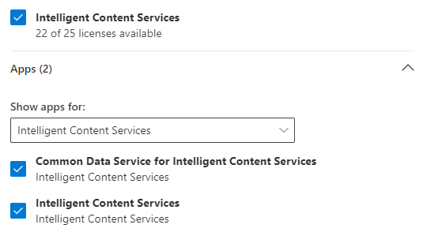

# Set up SharePoint Syntex

Admins can use the Microsoft 365 admin center to set up and Microsoft SharePoint Syntex. 

Consider the following before you start:

- Which SharePoint sites will you enable form processing? All of them, some, or select sites?
- What will you name of your content center, and who is the primary site admin?

You can change your settings after initial setup in the Microsoft 365 admin center.

## Requirements 

You must have global administrator or SharePoint administrator permissions to be able to access the Microsoft 365 admin center and set up SharePoint Syntex.

## To set up SharePoint Syntex

1. In the Microsoft 365 admin center, select **Setup**, and then view the **Organizational knowledge** section.
2. In the **Organizational knowledge** section, select **Automate content understanding**. 

     

3. On the **Automate SharePoint Syntex** page, click **Get started** to walk you through the setup process. 

     

4. On the **Configure Form Processing** page, you can choose if you want to let users be able to use AI Builder to create form processing models in specific SharePoint document libraries. A menu option will be available in the document library ribbon to **Create a form processing model** in SharePoint document libraries in which it is enabled.
 
     For **Which SharePoint libraries should show option to create a form processing model**, you can select: 
    - **All SharePoint libraries** to make it available to all SharePoint libraries in your tenant. 
    - **Only libraries in selected sites**, and then select the sites in which you want to make it available. 
    - **No SharePoint libraries** if you currently don't want to make it available to any sites (you can change this after setup).
 

   
 

   > [!Note]
   > Enabling this setting on a SharePoint document library does not affect existing models applied to the library or the ability to apply document understanding models to a library. 

    
5. On the **Create Content Center** page, you can create a SharePoint content center site on which your users can create and manage document understanding models.  
    a. For **Site name**, type the name you want to give your content center site. 
    b. The **Site address** will show the URL for your site, based on what you selected for the site name. 

    > [!Note] 
    > While you can select any supported language, note that SharePoint Syntex models can only be created for English. 

       

    Select **Next**.
6. On the **Finish and review** page, you can look at your selected setting and choose to make changes. If you are satisfied with your selections, select **Activate**.

7. The **SharePoint Syntex activated** page will display, confirming that the system has added your form processing preferences and creating the Content Center site. Select **Done**.

8. You'll be returned to your **Automate SharePoint Syntex** page. From this page, you can select **Manage** to make any changes to your configuration settings. 

## Assign licenses

For AI Builder to answer positively to users request to create form processing models, several things are required:
•	AI Builder credits to create and run models. 
These credits are automatically allocated by AI Builder to the default environment during set-up if the user’s tenant has credits entitled. Entitlement of credits happens if the tenant buys an ICS sku with 300+ seats: In that case 1M AI Builder credits are entitled to the tenant automatically. 
Note: Tenant admins can also buy AI Builder credits independently if they wish.
•	A user’s CDS license.
In the context of SharePoint, the license required is called “Common Data Service for Intelligent Content Service” and is assigned by the SharePoint admin when assigning Intelligent Content Service (ICS) license to users. 

Note: AI Builder relies on the credits ever allocated to the default environment to know when to stop allocating. That means if a tenant already manually allocated more than 1M AI Buildler credits in the default environment in the past (before a user ever uses AI Builder from a SharePoint), AI Builder won’t allocate any credit.

Remediation: Buy ICS license with 300 seats to get entitles with 1M AIB credits. 
If the credits were entitled but the automated credit allocation failed, connect as admin to the Power Platform Admin Center to manually assign AI Builder credits to the default environment. Learn more on Power Platform capacity management.

[Power Platform capacity](https://admin.powerplatform.microsoft.com/resources/capacity)

If the credits were entitled but the automated credit allocation failed, connect as admin to the Power Platform Admin Center to manually assign AI Builder credits to the default environment

[Power Platform admin center](https://admin.powerplatform.microsoft.com)

Once you have configured SharePoint Syntex, you must assign licenses for the users who will be using form processing and document understanding features.

To assign licenses

1. In the Microsoft 365 admin center, under **Users**, click **Active users**.

2. Select the users that you want to license, and click **Manage product licenses**.

3. Select **Assign more**.

4. Select **Intelligent Content Services**. Under **Apps**, make sure **Common Data Service for Intelligent Content Services** and **Intelligent Content Services** are both selected.

    

5. Click **Save changes**.

If you have 300 or more licenses for SharePoint Syntex in your organization, you will be allocated one million AI Builder credits.

## See also

[Overview of the form processing model](https://docs.microsoft.com/ai-builder/form-processing-model-overview)

[Common Data Service (CDS)](https://docs.microsoft.com/powerapps/maker/common-data-service/data-platform-intro)