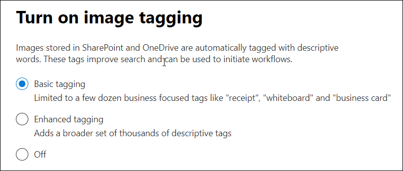

# Set up Content Understanding (Preview)

> [!Note] 
> The content in this article is for Project Cortex Private Preview. [Find out more about Project Cortex]().

Admins can use the Microsoft 365 admin center to set up and configure Content Understanding. 

> [!Important]
> It is important to plan the best way to set up and configure Content Understanding in your environment. For example, which sites should you allow forms processing and who is primary owner of the Content Center?  Much of this type of information is needed during the setup steps. Before going through the setup steps, make sure to [make all your planning considerations]().

## Requirements 
You must have Global Admin permissions to be able to access the Microsoft 365 admin center and set up Content Understanding.

## To set up Content Understanding

1. In the Microsoft 365 admin center, select **Setup**, and then view the **Organizational knowledge** section.
2. In the **Organizational knowledge** section, select **Automate content understanding**. 

     

3. On the **Automate content understanding** page, click **Get started** to walk you through the setup process. 

     

4. On the **Turn on image tagging** page, you can choose how images stored in SharePoint and OneDrive are automatically tagged with descriptive words. You can select: 
    - **Basic tagging** to use a limited set of business-focuses tags. 
    - **Enhanced tagging** to add a broader set of descriptive tags. 
    - **Off** to turn off image tagging. 
 
      

5. On the **Configure Form Processing** page, you can choose if you want to let users be able to use AI Builder to create Form Processing models in SharePoint document libraries.  For **Which SharePoint libraries should show option to create a form processing model**, you can select: 
    - **All SharePoint libraries** to make it available to all SharePoint libraries in your tenant. 
    - **Only libraries in selected sites**, and then select the sites in which you want to make it available. 
    - **No SharePoint libraries** if you currently don't want to make it available to any sites (you can change this after setup). 

         

    
6. On the **Create Content Center** page, you can create a SharePoint content center site on which your users can create and manage document understanding models.  
    a. For **Site name**, type the name you want to give your content center site. 
    b. The **Site address** will show the URL for your site, based on what you selected for the site name. 
    c. For **Primary administrator**, type the user who will own and manage this site. 
    d. For **Language**, select the language that you want the site to display in.   

    > [!Note] 
    > While you can select any supported language, note that content understanding models can only be created for English. 

       

    Select **Next**.
7. On the **Finish and review** page, you can look at your selected setting and choose to make changes. If you are satisfied with your selections, select **Apply settings**.

8. The **Content understanding settings applied** page will display, confirming that the system has added your form processing preferences and creating the Content Center site. Select **Done**.

9. You'll be returned to your **Automate content understanding** page. From this page, you can select **Manage** to make any changes to your configuration settings. 

## See also

  

