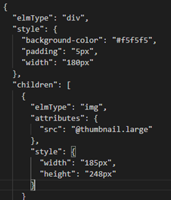
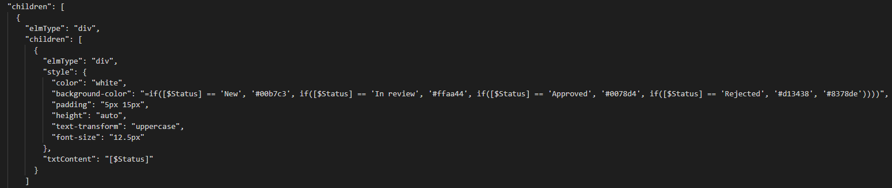
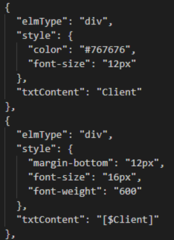
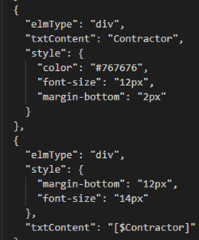
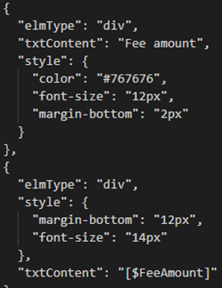
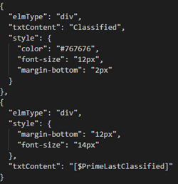
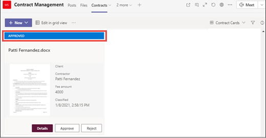
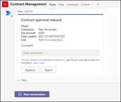
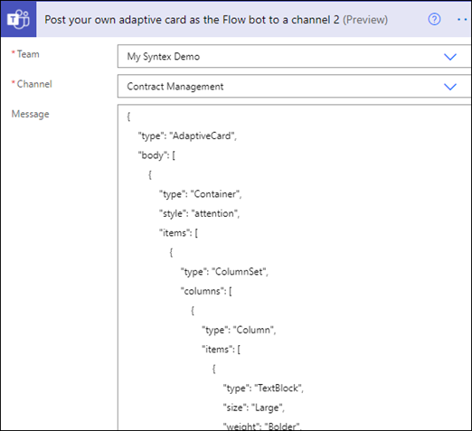

# Solution - Manage contracts in Microsoft 365

This article describes how to create a contracts management solution with components of Microsoft 365. Our hope is that it provides you with a framework to help you plan and create a solution that fits your unique business needs. Even if this solution does not suit your business needs as a whole, we hope that there are parts of it that you can adopt in your planning to create you custom contract management solution.

## The business problem

The first step in planning your contract management system is understanding the problem you are trying to solve. For our solution, we can define three key issues that need to be addressed:

- Need a way of identifying contracts: Many organizations work with a number of documents – invoices, contracts, statements of work, etc.  Some are digital assets sent in via email, and some are paper assets sent in via traditional mail. We need a way to identify all customer contracts from all other documents, and then classifying them as such.
- Need a site to manage contract approvals: The organization needs to set up a collaborative site in which all required stakeholders can easily review contracts. Stakeholders should be able to review the whole contract if needed, but mostly care about seeing several key fields from each contract (for example, customer name, PO number, and total cost). The goal is for stakeholders to easily approve or reject incoming contracts.

- Need a way to route reviewed contracts: Approved and rejected contracts need to be routed through a specific workflow. Approved contracts need to be routed to a third-party app for payment processing.  Rejected contracts need to be routed for additional review.

## Overview of the solution

This contract management solution guidance includes three Microsoft 365 components:

- Microsoft SharePoint Syntex: Create models to identify and classify your contract files and then extract the appropriate data from them.

- Microsoft Teams: Use the functionality of a Teams site and associated channels to allow your stakeholders to review and manage contracts.

- Power Automate: Use flows to process contracts through the approval process, and then to a 3rd party application for payment.

1.	Documents are uploaded to a SharePoint document library.
2.	When a document is uploaded to the library, a SharePoint Syntex document understanding model that has been applied to the document library runs. It checks each document and identifies any "contracts" and classifies them as such.
3.	The model also extracts all <i>Client</i>, <i>Contractor</i>, and <i>Fee amount</i> from all contracts.

The following is an example of a typical contract. 
        

4.	All contract are visible for approval/rejection in a custom tile view in the Contracts for approval channel of the Contracts Management Teams site. Team members are notified by Teams when new contracts are available for approval.  
5.	Team members go to the Contracts channel on the Teams site to approve or reject contracts.  Approved contracts are forwarded to a 3rd party financial app for payment.
6.	Rejected contracts are sent to appropriate users for review using Teams adaptive cards. They can be resubmitted back for approval after the review and any resulting update.

## Use SharePoint Syntex to identify contract files and extract data

One business issue is that we need a way to identify and classify all contract documents from the numerous files we receive. We also want to be able to be able to quickly view several key elements in each of the contract files we identify (for example, <i>Client</i>, <i>Contractor</i>, and <i>Fee amount</i>). We can do this by using [SharePoint Syntex](https://docs.microsoft.com/microsoft-365/contentunderstanding/) to create a document understanding model and applying it to a document library.

1. First, you need to find at least five example files that we can use to "train" the model to search for characteristics that are specific to the document type we are trying to identify (a contract). 
2. Using SharePoint Syntex, create a new document understanding model. Using your example files, you need to [create a classifier](https://docs.microsoft.com/microsoft-365/contentunderstanding/create-a-classifier). By training the classifier with your example files, you teach it to search for characteristics that are specific to what you would see in your company's contracts. For example, [create an "explanation"](https://docs.microsoft.com/microsoft-365/contentunderstanding/create-a-classifier#create-an-explanation) that searches for specific strings that are in your contracts, such as <i>Service Agreement</i>, <i>Terms of Agreement</i>, and <i>Compensation</i>. You can even train your explanation to look for these strings in specific sections of the document, or located next to other strings.  When you think you have trained your classifier with the information it needs, you can test your model on a sample set of example files to see how efficient it is. After testing, if needed you can choose to make changes to your explanations to make them more efficient. 
3. In your model, you can [create an extractor](https://docs.microsoft.com/microsoft-365/contentunderstanding/create-an-extractor) to pull out specific pieces of data from each contract. For example, for each contract, the information we are most concerned about is who the client is, the name of the contractor, and the total cost.
4. After you successfully create your model, [apply it to a SharePoint document library](https://docs.microsoft.com/microsoft-365/contentunderstanding/apply-a-model). As you upload documents to the document library, your document understanding model will run and will identify and classify all files that match the contracts content type you defined in your model. All files that are classified as contracts will display in a custom library view, and will also display the values from each contract that you defined in your extractor.

Screenshot

5. Additionally, if you have retention requirements for your contracts, you can use your model to also [apply a retention label](https://docs.microsoft.com/microsoft-365/contentunderstanding/apply-a-retention-label-to-a-model) that will prevent your contracts from being deleted for a specified period of time.

Question:  What can we make available to the reader in terms of downloads? Would having access to a couple of example files of the contracts we are using to train our model help? Are there components of a model that a user can "import" if they have a valid SharePoint Syntex license?   
 

## Create your contract management site in Microsoft Teams 

Another key business issue we have in setting up a contracts management solution is the need for a central location in which stakeholders review and manage contracts. For this, we can use Microsoft Teams to set up a Teams site and use the features in Teams to:

- Have a location in which stakeholders can easily see all contracts that require action. For example, in Teams we can create a Contract channel in the Contracts Management Teams site in which members can see a tile view of all contracts that need approval.

       

- Have a location in which members can members can interact with each other and post actions. For example, in Teams, the Posts channel can be used to have conversations, get updates, and see actions (such as a member rejecting a contract). When something has happened (such as a new contract submitted for approval), the Posts channel can be used not only to announce it, but also to keep a record of it. And if members subscribe to notifications, they will get notified whenever there is an update. 

       

- Be able to notify individual users for required actions. For example, if a contract is rejected and needs to be reviewed by a specific member, Teams can be configured to notify that member for the required action.

- Have a location in which approved contracts will display so that they can be submitted for payment. In Teams, we can create a <b>For Payment</b> channel that will list all contracts that will need to be submitted to payment (for example, by Dynamics CRM).
 

### Attach your SharePoint document library to the "Contracts" channel 

After you create you Contracts channel in your Contracts Management Team site, you need to [attach your SharePoint document library to it](https://support.microsoft.com/office/add-a-sharepoint-page-list-or-document-library-as-a-tab-in-teams-131edef1-455f-4c67-a8ce-efa2ebf25f0b). The SharePoint document library you want to attach is the one in which you applied your SharePoint Syntex document understanding model to in the previous section.

After you attach the SharePoint document library, you will be able to view any classified contracts through a default list view.

     

### Customize your Contracts channel tile view

While Teams allows you to view your contracts via a tile view, you may need to customize it to view the contract data you want to make visible in the "contract card". For example, for our Contracts channel, it is important for members to see the client, contractor, and fee amount on the contract card. All of these were extracted from each contract through your SharePoint Syntex model that was applied to your document library.

     

The custom tile view we used required us to make changes to the JSON used to format the current tile view. You can reference the JSON we used to create our card view by downloading the [contract card json file](). In the following sections, we will reference specific sections of the code for features you see in the contract cards.

     

### Card size and shape

In the contract card json file that you downloaded, look at the following section to see how we formatted the size and shape of the card.  
 

### Contract status

The following code lets us define the status of each title card. Note that each status value (New, In review, Approved, and Rejected) will display a different color code for each. In the contract card json file that you downloaded, look at the section that defines the status.

     

### Extracted fields

Each contract card will display three fields that were extracted for each contract (Client, Contractor, and Fee Amount). Additionally, we also want to display the time/date that the file was classified by the SharePoint Syntex model we used to identify it. 

In the contract card json file that you downloaded, the following sections define each of these.

#### Client

     

#### Contractor

     

#### Fee Amount

     

#### Classification date

 

## Create Power Automate Flows to process reviewed contracts

Now that you've created your Contract Management Team's site and have attached your SharePoint Document library, your next step is to create a Power Automate Flow to process your contracts that your SharePoint Syntex model identifies and classifies. You can do this by [creating a Power Automate flow in your SharePoint document library](https://support.microsoft.com/office/create-a-flow-for-a-list-or-library-in-sharepoint-or-onedrive-a9c3e03b-0654-46af-a254-20252e580d01).

In our contracts management solution, we want to create a Power Automate flow to do the following:

-  After a contract has been classified by your SharePoint Syntex model, change the contract status to <b>In Review</b>.
- The contract is then reviewed and is either approved or rejected.
- For approved contracts, the contract information is posted to a channel for payment processing.  

### Preparing your contract for review

When a contract is identified and classified by your SharePoint Syntex document understanding model, the PowerAutomate Flow will will first check out the file and change the status to "In Review".

 

After checking out the file, change the status value to "In Review".

 

The next step is to create adaptive card stating that the contract in waiting for review and posting it to the Contract Management Team site's.

 

 

Question: Do we include the code for this, or create a file the user can download to view?  I can create a zip file that includes all files needed in our example of this solution, and include a TOC that saws what file is which.

### Conditional

In your flow, next you need to create a condition in which your contract will either be approved or rejected.

 

#### If the contract is approved

When a contract has been approved, the following things occur:

- In the Contracts channel, in the contract card the status will change to <b>Approved</b>.
 
In your flow, the contract is checked out, status changed to "Approved" and checked back in again. 
 

- The contract will be written to the <b>For Payout</b> channel to so that the Total Fee can be submitted for payment by a third party software (for example, Dynamics CRM). 
 
In the flow, we created the following item to move approved contracts to the For Payout channel. Question: Package the code for this in the zipped file? 
 

- An adaptive card stating that the contract has been approved is created and posted to the Contract Management Team site's. 
 
In your flow, the following does this for you. Question: Package the code for this in the zipped file? 
 

#### If the contract is rejected

When a contract has been rejected, the following things occur:

- In the Contracts channel, in the contract card the status will change to <b>Rejected</b>.
 
In our flow, we check out the contract file, change the status to <b>Rejected</b>, and check the file back in again. 
 
- In our flow, we create an adaptive card stating that the contract has been rejected. Question: Package the code for this in the zipped file? 
  
- The card is posted in the Contract Management Team site's. 
 