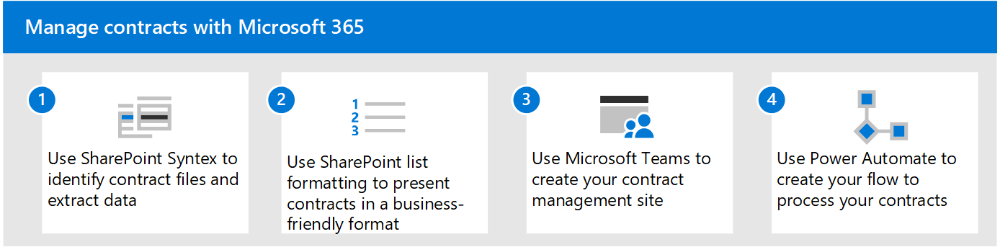
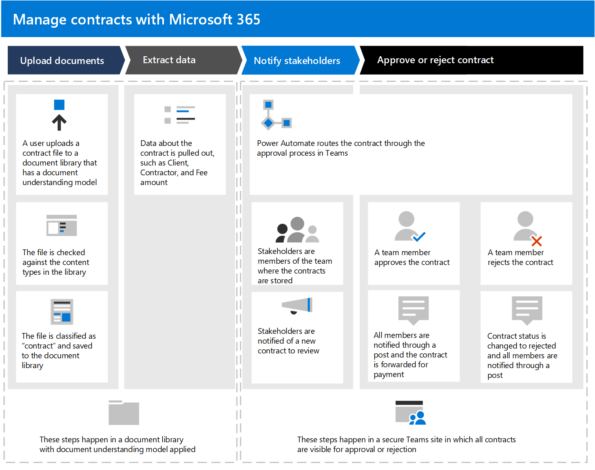
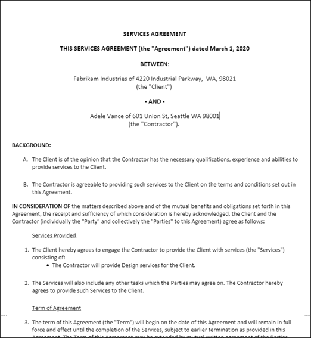

# Manage contracts using a Microsoft 365 solution

This article describes how to create a contracts management solution for your organization by using SharePoint Syntex and components of Microsoft 365. It provides you with a framework to help you plan and create a solution that fits your unique business needs. Even if this solution doesn't suit your business needs as a whole, parts of it can be adopted in your planning to create a custom contract management solution.

*This content set documents a Microsoft 365 solution developed by Thomas Molbach with the Modern Work Solution Strategy Team at Microsoft.*

## Identify the business problem

The first step in planning your contract management system is to understand the problem you're trying to solve. For this solution, four key issues need to be addressed:

- **Identify contracts**. Your organization works with many documents, such as invoices, contracts, statements of work, and so on.  Some are digital assets sent through email, and some are paper assets sent through traditional mail. You need a way to identify all customer contracts from all other documents, and then classifying them as such.

- **Track the history of contract approvals**. Your organization needs a reliable way to find whether contracts have been either approved or rejected, and whether payment has been processed. 

- **Site to manage contract approvals**. Your organization needs to set up a collaborative site in which all required stakeholders can easily review contracts. Stakeholders should be able to review the whole contract if needed, but mostly care about seeing several key fields from each contract (for example, customer name, PO number, and total cost). Stakeholders should be able to easily approve or reject incoming contracts.

- **Route reviewed contracts**. Approved and rejected contracts need to be routed through a specific workflow. Approved contracts need to be routed to a third-party application for payment processing. Rejected contracts need to be routed for additional review.

## Overview of the solution

  

This contract management solution guidance includes four components of Microsoft 365:

- **Microsoft SharePoint Syntex**: Create models to identify and classify your contract files and then extract the appropriate data from them.

- **Microsoft SharePoint lists**: Use the formatting available in modern SharePoint lists to present contracts in a business-friendly format.

- **Microsoft Teams**: Use the functionality of a Teams channel and associated tabs to allow your stakeholders to review and manage contracts.

- **Power Automate**: Use flows to guide contracts through the approval process, and then to a third-party application for payment.

### How it all works

  

1. Documents are uploaded to a SharePoint document library. A SharePoint Syntex document understanding model has been applied to the document library. It checks each file to see if any match a "contract" content type it's trained to look for. If it finds a match, it classifies the file as a "contract" and updates the content type for the document.

2. The model also pulls out specific data from each contract file that stakeholders are interested in seeing, such as the *Client*, *Contractor*, and *Fee amount*.

    The following page is an example of a contract that the model is trained to identify.

      

3. In Microsoft Teams, all stakeholders are members of a secure Teams channel in which all contracts in the document library are visible for approval or rejection. By using Teams functionality, all stakeholders are notified when new contracts need to be reviewed.
 
4. By using Power Automate, contracts are moved through the approval process in the Teams channel. When a member approves a contract, the contract status is changed to approve, all members are notified through a Teams post, and a line item is created to show that the contract is ready for payout. This process can be extended to write directly to a third-party financial application for payment.

5.	When a member rejects a contract, the status is changed to rejected, and all members are notified through a Teams post.

6. The end result of this solution is an automated business process for your organization. Employees can easily use the custom tile view in Teams to initiate and monitor the approval workflow of your documents. 

     

### Licensing requirements

This solution relies on the following functionality, all available as part of a Microsoft 365 Enterprise (E1, E3, E5, F3) or Business (Basic, Standard, or Premium) license:

-	Microsoft SharePoint Syntex
-	Microsoft Teams
-	Power Automate

## Create the solution

The next sections will go into detail about how to configure your contracts management solution. It's divided into three steps:

- [Step 1. Use SharePoint Syntex to identify contract files and extract data](solution-manage-contracts-step1.md)
- [Step 2. Use Microsoft Teams to create your contract management channel](solution-manage-contracts-step2.md)
- [Step 3. Use Power Automate to create your flow to process your contracts](solution-manage-contracts-step3.md)
