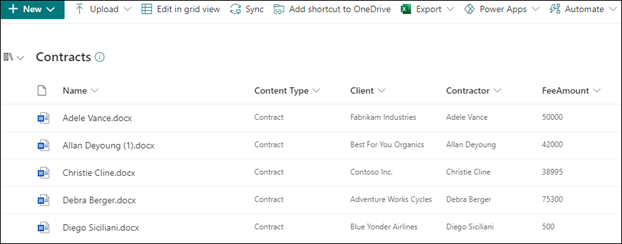

# Step 1. Use SharePoint Syntex to identify contract files and extract data

Your organization needs a way to identify and classify all contract documents from the numerous files you receive. You also want to be able to quickly view several key elements in each of the contract files identified (for example, *Client*, *Contractor*, and *Fee amount*). You can do this by using [SharePoint Syntex](index.md) to create a document understanding model and applying it to a document library.

[Document understanding](document-understanding-overview.md) uses artificial intelligence (AI) models to automate classification of files and extraction of information. Document understanding models are also optimal in extracting information from unstructured and semi-structured documents where the information you need is not contained in tables or forms, such as contracts.

1. First, you need to find at least five example files that you can use to "train" the model to search for characteristics that are specific to the content type you are trying to identify (a contract). 

2. Using SharePoint Syntex, create a new document understanding model. Using your example files, you need to [create a classifier](create-a-classifier.md). By training the classifier with your example files, you teach it to search for characteristics that are specific to what you would see in your company's contracts. For example, [create an "explanation"](create-a-classifier.md#create-an-explanation) that searches for specific strings that are in your contracts, such as *Service Agreement*, *Terms of Agreement*, and *Compensation*. You can even train your explanation to look for these strings in specific sections of the document, or located next to other strings. When you think you have trained your classifier with the information it needs, you can test your model on a sample set of example files to see how efficient it is. After testing, if needed you can choose to make changes to your explanations to make them more efficient. 

3. In your model, you can [create an extractor](create-an-extractor.md) to pull out specific pieces of data from each contract. For example, for each contract, the information you are most concerned about is who the client is, the name of the contractor, and the total cost.

4. After you successfully create your model, [apply it to a SharePoint document library](apply-a-model.md). As you upload documents to the document library, your document understanding model will run and will identify and classify all files that match the contracts content type you defined in your model. All files that are classified as contracts will display in a custom library view, and will also display the values from each contract that you defined in your extractor.

   

5. Additionally, if you have retention requirements for your contracts, you can use your model to also [apply a retention label](apply-a-retention-label-to-a-model.md) that will prevent your contracts from being deleted for a specified period of time.

## Next step

[Step 2. Use Microsoft Teams to create your contract management channel](solution-manage-contracts-step2.md)