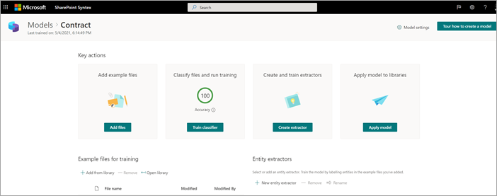
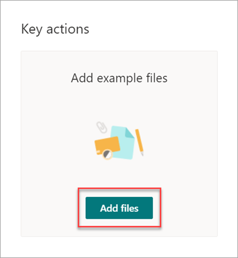
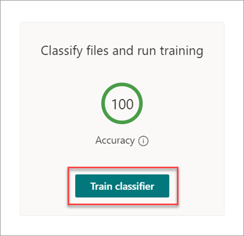
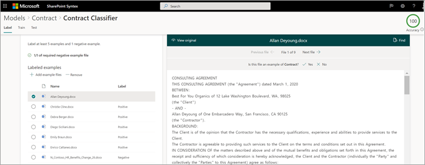
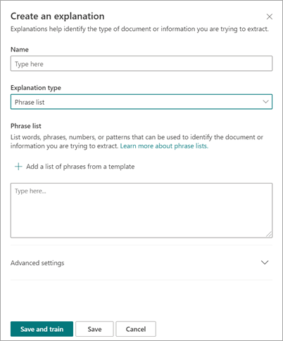
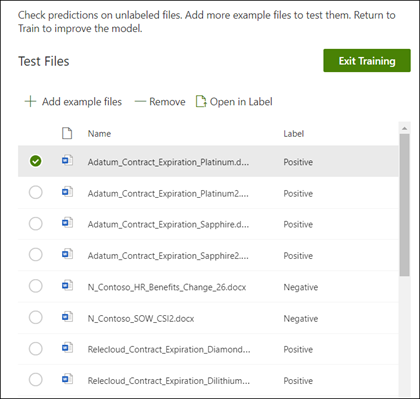
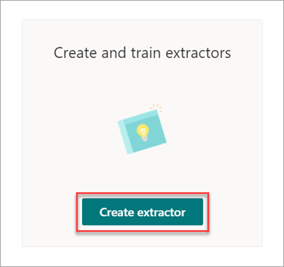
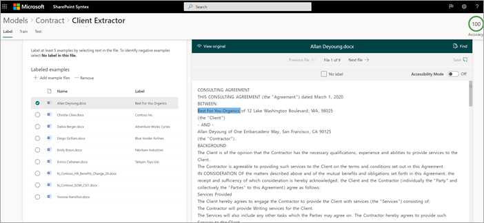
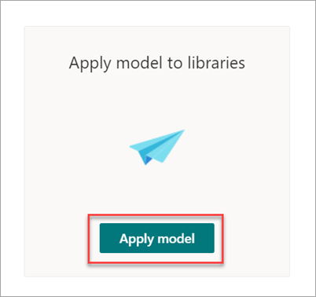
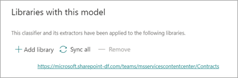

# Step 1. Use SharePoint Syntex to identify contract files and extract data

Your organization needs a way to identify and classify all contract documents from the many files you receive. You also want to be able to quickly view several key elements in each of the contract files identified (for example, *Client*, *Contractor*, and *Fee amount*). You can do this by using [SharePoint Syntex](index.md) to create a document understanding model and applying it to a document library.

## Overview of the process

[Document understanding](document-understanding-overview.md) uses artificial intelligence (AI) models to automate classification of files and extraction of information. Document understanding models are also optimal in extracting information from unstructured and semi-structured documents where the information you need isn't contained in tables or forms, such as contracts.

1. First, you need to find at least five example files that you can use to "train" the model to search for characteristics that are specific to the content type you're trying to identify (a contract). 

2. Using SharePoint Syntex, create a new document understanding model. Using your example files, you need to [create a classifier](create-a-classifier.md). By training the classifier with your example files, you teach it to search for characteristics that are specific to what you would see in your company's contracts. For example, [create an "explanation"](create-a-classifier.md#create-an-explanation) that searches for specific strings that are in your contracts, such as *Service Agreement*, *Terms of Agreement*, and *Compensation*. You can even train your explanation to look for these strings in specific sections of the document, or located next to other strings. When you think you have trained your classifier with the information it needs, you can test your model on a sample set of example files to see how efficient it is. After testing, if needed you can choose to make changes to your explanations to make them more efficient. 

3. In your model, you can [create an extractor](create-an-extractor.md) to pull out specific pieces of data from each contract. For example, for each contract, the information you're most concerned about is who the client is, the name of the contractor, and the total cost.

4. After you successfully create your model, [apply it to a SharePoint document library](apply-a-model.md). As you upload documents to the document library, your document understanding model will run and will identify and classify all files that match the contracts content type you defined in your model. All files that are classified as contracts will display in a custom library view. The files will also display the values from each contract that you defined in your extractor.

   

5. If you have retention requirements for your contracts, you can also use your model to [apply a retention label](apply-a-retention-label-to-a-model.md) that will prevent your contracts from being deleted for a specified period of time.

## Steps to create and train your model

> [!NOTE]
> For these steps, you can use the example files in the [Contracts Management Solution Assets repository](https://github.com/pnp/syntex-samples/tree/main/scenario%20assets/Contracts%20Management). The examples in this repository contain both the document understanding model files and the files used to train the model.

### Create a Contract model

The first step is to create your Contract model.

1. From the content center, select **New**, and then **Create a model**.

2. On the **New document understanding model** pane, in the **Name** field, type the name of the model. For this contract management solution, you can name the model *Contract*.

4. Choose **Create**. This creates a home page for the model. 

    

### Train your model to classify a type of file

#### Add example files for your model

You need to add at least five example files that are contract documents, and one example file that's not a contract document (for example, a statement of work). 

1. On the **Models > Contract** page, under **Key actions** > **Add example files**, select **Add files**.

   

2. On the **Select example files for your model** page, open the Contract folder, select files you want to use, and then select **Add**. If you don't have example files there, select **Upload** to add them.

#### Label the files as positive or negative examples

1. On the **Models > Contract** page, under **Key actions** > **Classify files and run training**, select **Train classifier**.

   

2. On the **Models > Contract > Contract classifier** page, in the viewer on the top of the first example file, you'll see text asking if the file is an example of the Contract model you created. If it is a positive example, select **Yes**. If it is a negative example, select **No**.

3. From the **Labeled examples** list on the left, select other files that you want to use as examples, and label them. 

     

#### Add at least one explanation to train the classifier 

1. On the **Models > Contract > Contract classifier** page, select the **Train** tab.

2. In the **Trained files** section, you'll see a list of the example files that you previously labeled. Select one of the positive files from the list to display it in the viewer.

3. In the **Explanations** section, select **New** and then **Blank**.

4. On the **Create an explanation** page:

    a. In the **Name** field, type the name of the explanation (such as "Agreement").

    b. In the **Explanation type** field, select **Phrase list**, because you add a text string.

    c. In the **Phrase list** box, type the string (such as "AGREEMENT"). You can select **Case sensitive** if the string needs to be case-sensitive.

    d. Select **Save and train**.

     

#### Test your model

You can test your Contract model on example files it hasn’t seen before. This is optional, but it can be a useful best practice.

1. On the **Models > Contract > Contract classifier** page, select the **Test** tab. This runs the model on your unlabeled example files.

2. In the **Test Files** list, your example files display and shows if the model predicted them to be positive or negative. Use this information to help determine the effectiveness of your classifier in identifying your documents.

     

3. When done, select **Exit Training**.

### Create and train an extractor

1. On the **Models > Contract** page, under **Key actions** > **Create and train extractors**, select **Create extractor**.

   

2. On the **New entity extractor** panel, in the **New name** field, type the name of your extractor. For example, name it *Client* if you want to extract the name of the client from each contract.

3. When you're done, select **Create**.

#### Label the entity you want to extract

When you create the extractor, the extractor page opens. Here you see a list of your sample files, with the first file on the list displayed in the viewer.

 

To label the entity:

1. From the viewer, select the data that you want to extract from the files. For example, if you want to extract the *Client*, you highlight the client value in the first file (in this example, *Best For You Organics*), and then select **Save**. You'll see the value display from the file in the **Labeled examples** list, under the **Label** column.

2. Select **Next file** to autosave and open the next file in the list in the viewer. Or select **Save**, and then select another file from the **Labeled examples** list.

3. In the viewer, repeat steps 1 and 2, then repeat until you saved the label in all the files.

After you've labeled the files, a notification banner displays informing you to move to training. You can choose to label more documents or advance to training.

#### Add an explanation

You can create an explanation that provides a hint about the entity format itself and variations it might have in the example files. For example, a date value can be in many different formats, such as:

- 10/14/2019
- October 14, 2019
- Monday, October 14, 2019

To help identify the *Contract Start Date*, you can create a pattern explanation.

1. In the **Explanations** section, select **New** and then **Blank**.

2. On the **Create an explanation** page:

    a. In the **Name** field, type the name of the explanation (such as *Date*).

    b. In the **Explanation type** field, select **Pattern list**.

    c. In the **Value** field, provide the date variation as they appear in the sample files. For example, if you have date formats that appear as 0/00/0000, you enter any variations that appear in your documents, such as:

    - 0/0/0000
    - 0/00/0000
    - 00/0/0000
    - 00/00/0000

4. Select **Save and train**.

#### Test your model again

You can test your Contract model on example files it hasn’t seen before. This is optional, but it can be a useful best practice.

1. On the **Models > Contract > Contract classifier** page, select the **Test** tab. This runs the model on your unlabeled example files.

2. In the **Test files** list, your example files display and shows if the model is able to extract the information you need. Use this information to help determine the effectiveness of your classifier in identifying your documents.

3. When done, select **Exit Training**.

### Apply your model to a document library

To apply your model to a SharePoint document library:

1. On the **Models > Contract** page, under **Key actions** > **Apply model to libraries**, select **Apply model**.

   

2. On the **Add Contract** panel, select the SharePoint site that contains the document library that you want to apply the model to. If the site does not show in the list, use the search box to find it. Select **Add**.

    > [!NOTE]
    > You must have *Manage List* permissions or *Edit* rights to the document library you are applying the model to.

3. After you select the site, select the document library to which you want to apply the model.

4. Because the model is associated to a content type, when you apply it to the library it will add the content type and its view with the labels you extracted showing as columns. This view is the library's default view by default, but you can optionally choose to have it not be the default view by selecting **Advanced settings** and clearing the **Set this new view as default** check box.

5. Select **Add** to apply the model to the library.

6. On the **Models > Contract** page, in the **Libraries with this model** section, you'll see the URL to the SharePoint site listed.

    

After you apply the model to the document library, you can begin uploading documents to the site and see the results.

## Next step

[Step 2. Use Microsoft Teams to create your contract management channel](solution-manage-contracts-step2.md)