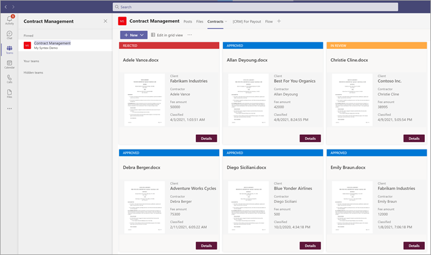
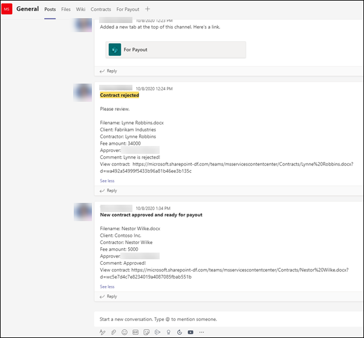
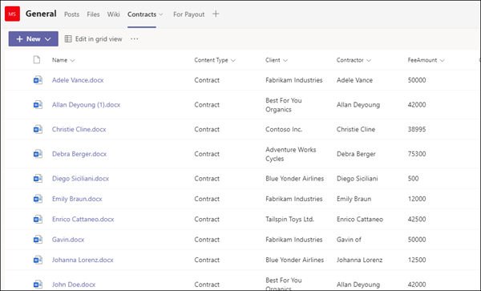
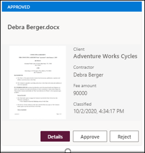
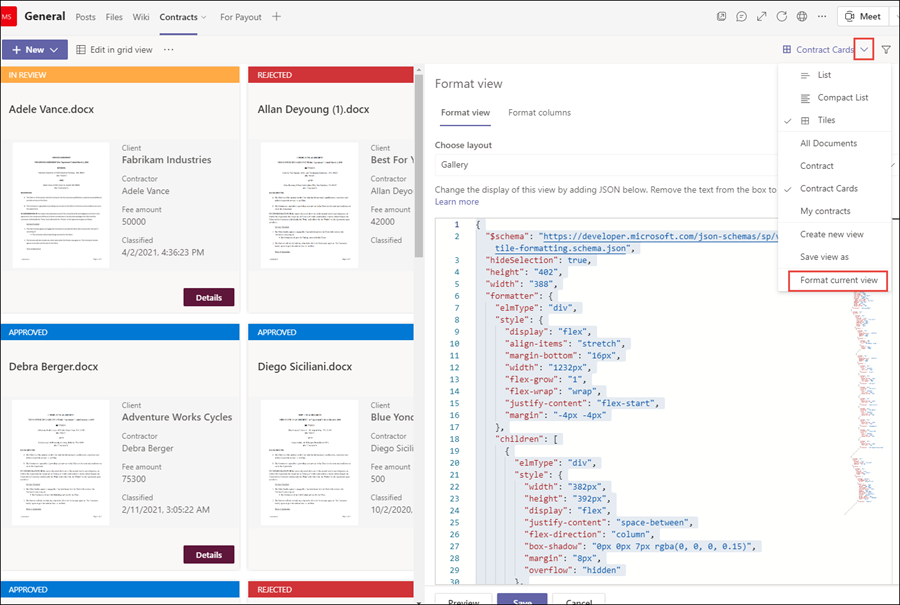

# Step 2. Use Microsoft Teams to create your contract management channel

When your organization sets up a contracts management solution, you need a central location in which stakeholders can review and manage contracts. For this, you can use [Microsoft Teams](https://docs.microsoft.com/microsoftteams/) to set up a Teams channel and use the features in Teams to:

- **Create a location for stakeholders to easily see all contracts that require action.** For example, in Teams you can create a **Contracts** tab in the Contract Management channel in which members can see a useful tile view of all contracts that need approval. You can also configure the view so that each "card" lists the important data you care about (such as *Client*, *Contractor*, and *Fee amount*).

     

- **Have a location for members to interact with each other and see important events.** For example, in Teams, the **Posts** tab can be used to have conversations, get updates, and see actions (such as a member rejecting a contract). When something has happened (such as a new contract submitted for approval), the **Posts** tab can be used not only to announce it, but also to keep a record of it. And if members subscribe to notifications, they will get notified whenever there is an update. 

     </br> 

- **Have a location for members to see approved contracts to know when they can be submitted for payment.** In Teams, you can create a <b>For Payment</b> channel that will list all contracts that will need to be submitted to payment. You can easily extend this solution to instead write this information directly to a third-party financial application (for example, Dynamics CRM).

## Attach your SharePoint document library to the Contracts tab 

After you create a **Contracts** tab in your Contracts Management channel, you need to [attach your SharePoint document library to it](https://support.microsoft.com/office/add-a-sharepoint-page-list-or-document-library-as-a-tab-in-teams-131edef1-455f-4c67-a8ce-efa2ebf25f0b). The SharePoint document library you want to attach is the one in which you applied your SharePoint Syntex document understanding model to in the previous section.

After you attach the SharePoint document library, you will be able to view any classified contracts through a default list view.

    

## Customize your Contracts tab tile view

> [!NOTE]
> This section references code examples that are contained in the [**ContractCard.json-TBD**](Placeholder-TBD) file that is included in the [**solutionfiles-TBD**](Placeholder-TBD) zip file.

While Teams lets you view your contracts in a tile view, you might want to customize it to view the contract data you want to make visible in the contract card. For example, for the **Contracts** tab, it is important for members to see the client, contractor, and fee amount on the contract card. All of these were extracted from each contract through your SharePoint Syntex model that was applied to your document library. You also want to be able to change the tile header bar to different colors for each status so that members can easily see this. For example, all approved contracts will have a blue header bar.

   

The custom tile view you use requires you to make changes to the JSON file used to format the current tile view. You can reference the JSON file used to create the card view by downloading the **ContractCard.json** file. In the following sections, you'll see specific sections of the code for features that are in the contract cards.

If you want to see or make changes to the JSON code for your view in your Teams channel, in the Teams channel, select the view drop-down menu, and then select **Format current view**.

    

## Card size and shape

In the **ContractCard.json** file that you downloaded in the reference zip file, look at the following section to see the code for how the size and shape of the card is formatted.

```JSON
                  {
                    "elmType": "div",
                    "style": {
                      "background-color": "#f5f5f5",
                      "padding": "5px",
                      "width": "180px"
                    },
                    "children": [
                      {
                        "elmType": "img",
                        "attributes": {
                          "src": "@thumbnail.large"
                        },
                        "style": {
                          "width": "185px",
                          "height": "248px"
                        }
                      }
```


## Contract status

The following code lets you define the status of each title card. Note that each status value (*New*, *In review*, *Approved*, and *Rejected*) will display a different color code for each. In the **ContractCard.json** file that you downloaded, look at the section that defines the status.

```JSON
          {
            "elmType": "div",
            "children": [
              {
                "elmType": "div",
                "style": {
                  "color": "white",
                  "background-color": "=if([$Status] == 'New', '#00b7c3', if([$Status] == 'In review', '#ffaa44', if([$Status] == 'Approved', '#0078d4', if([$Status] == 'Rejected', '#d13438', '#8378de'))))",
                  "padding": "5px 15px",
                  "height": "auto",
                  "text-transform": "uppercase",
                  "font-size": "12.5px"
                },
                "txtContent": "[$Status]"
              }
```


## Extracted fields

Each contract card will display three fields that were extracted for each contract (*Client*, *Contractor*, and *Fee Amount*). Additionally, you also want to display the time/date that the file was classified by the SharePoint Syntex model used to identify it. 

In the **ContractCard.json** file that you downloaded, the following sections define each of these.

### Client

This section defines how "Client" will display on the card, and uses the value for the specific contract.

```JSON
                      {
                        "elmType": "div",
                        "style": {
                          "color": "#767676",
                          "font-size": "12px"
                        },
                        "txtContent": "Client"
                      },
                      {
                        "elmType": "div",
                        "style": {
                          "margin-bottom": "12px",
                          "font-size": "16px",
                          "font-weight": "600"
                        },
                        "txtContent": "[$Client]"
                      },
```

### Contractor

This section defines how the "Contractor" will display on the card, and uses the value for the specific contract.

```JSON
                      {
                        "elmType": "div",
                        "style": {
                          "color": "#767676",
                          "font-size": "12px"
                        },
                        "txtContent": "Client"
                      },
                      {
                        "elmType": "div",
                        "style": {
                          "margin-bottom": "12px",
                          "font-size": "16px",
                          "font-weight": "600"
                        },
                        "txtContent": "[$Client]"
},
```


### Fee Amount

This section defines how the "Fee Amount" will display on the card, and uses the value for the specific contract.

```JSON
                      {
                        "elmType": "div",
                        "txtContent": "Fee amount",
                        "style": {
                          "color": "#767676",
                          "font-size": "12px",
                          "margin-bottom": "2px"
                        }
                      },
                      {
                        "elmType": "div",
                        "style": {
                          "margin-bottom": "12px",
                          "font-size": "14px"
                        },
                        "txtContent": "[$FeeAmount]"
                      },
```


### Classification date

This section defines how "Classification" will display on the card, and uses the value for the specific contract.

```JSON
                      {
                        "elmType": "div",
                        "txtContent": "Classified",
                        "style": {
                          "color": "#767676",
                          "font-size": "12px",
                          "margin-bottom": "2px"
                        }
                      },
                      {
                        "elmType": "div",
                        "style": {
                          "margin-bottom": "12px",
                          "font-size": "14px"
                        },
                        "txtContent": "[$PrimeLastClassified]"
                      }
```

## Next step

[Step 3. Use Power Automate to create your flow to process your contracts](solution-manage-contracts-step3.md)
