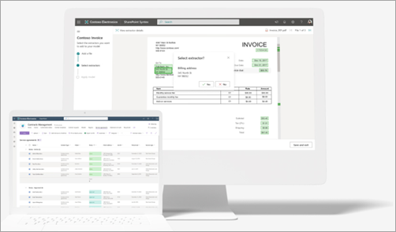

# Overview of Microsoft SharePoint Syntex

SharePoint Syntex is a content understanding, processing, and compliance service that uses intelligent document processing, content artificial intelligence (AI), and advanced machine learning to automatically and thoughtfully find, organize, and classify documents in your SharePoint libraries.

:::row:::
   :::column span="":::      
      With SharePoint Syntex, you can automate your content-based processes—capturing the information in your business documents and transforming that information into working knowledge for your organization.
   :::column-end:::
   :::column span="":::
      
   :::column-end:::
:::row-end:::

Rather than clicking and sorting through hundreds, or even thousands of files, SharePoint Syntex extracts, analyzes, and categorizes the data for you, streamlining the search and discovery process. Not only can you dive deeper into your content to truly understand it,  you can turn the information into meaningful insights that your organization can use to make informed business decisions.

-------------------------------

SharePoint Syntex is a content understanding, processing, and compliance service that uses intelligent document processing, content artificial intelligence (AI), and advanced machine learning to automatically and thoughtfully find, organize, and classify documents in your SharePoint libraries.

<!---
 

> [!VIDEO https://www.microsoft.com/videoplayer/embed/RE4GJXS] 

 
--->

With SharePoint Syntex, you can automate your content-based processes—capturing the information in your business documents and transforming that information into working knowledge for your organization.

Rather than clicking and sorting through hundreds, or even thousands of files, SharePoint Syntex extracts, analyzes, and categorizes the data for you, streamlining the search and discovery process. Not only can you dive deeper into your content to truly understand it,  you can turn the information into meaningful insights that your organization can use to make informed business decisions.

## Models

Understanding your content with SharePoint Syntex begins with models. Models let you identify and classify documents that are uploaded to your SharePoint document libraries, and then to extract the information you need from each file.

In SharePoint Syntex, you can build [custom models](model-types-overview.md) or you can use [prebuilt models](prebuilt-overview.md). The type of model you choose will depend on the types of files you use, the format and structure of the files, the information you want to extract, and where you want to apply the model.

### Custom models

You build custom models to understand the layout of your files from example documents. The models learn to look for the data you need to extract from similar documents. Custom models include:

- [Unstructured document processing](document-understanding-overview.md)
- [Structured document processing](form-processing-overview.md)
- [Freeform document processing](freeform-document-processing-overview.md)

| Unstructured document processing  | Structured document processing  | Freeform document processing  |
| ------------- | ------------- | ------------- |
|   |  |  |
| Use this custom model to automatically classify documents and extract information from them. Use the patterns of the text in example documents to train the model. Best for Office files and automatic classification of files.  [Learn more](document-understanding-overview.md) | Use this custom model to automatically identify field and table values from structured or semi-structured documents like forms. Best for most languages and files that include form layouts or tables.  [Learn more](form-processing-overview.md) | Use this custom model to automatically extract information from unstructured documents. Use the patterns of the text or the layout in example documents to train the model. Best for a mix of both text and layout needs.  [Learn more](extract-by-text-pattern-and-layout-overview.md) |

### Prebuilt models

If you don't need to build a custom model, you can use a [prebuilt model](prebuilt-overview.md). This type of model is pretrained to extract predefined entities from common business files. Prebuilt models include:

- [Invoice processing](prebuilt-model-invoice.md)
- [Receipt processing](prebuilt-model-receipt.md)

| Invoice processing | Receipt processing | 
| ------------- | ------------- |
|  |  |
| Use this prebuilt model to save time processing invoices. Automatically extract key information specific to invoices.  [Learn more](prebuilt-model-invoice.md) | Use this prebuilt model to save time processing receipts. Automatically extract key information specific to expenses.  [Learn more](prebuilt-model-receipt.md) | 

For more information about custom and prebuilt models, see [Overview of model types in SharePoint Syntex](model-types-overview.md).

## Content assembly

With SharePoint Syntex, you can create *modern templates* based on the business documents you use most, and then use those templates to automatically generate new documents using SharePoint lists or user entries as a data source.

This process lets you automatically generate standard repetitive business documents, such as contracts, statements of work, service agreements, letters of consent, and correspondence. You can do all this quicker, more consistentently, and with fewer errors in SharePoint Syntex.

For more information, see [Create documents using content assembly in SharePoint Syntex](content-assembly.md).

## Advanced metadata search

:::row:::
   :::column span="2":::
      The advanced metadata search feature in SharePoint Syntex lets you perform specific metadata-based queries on SharePoint document libraries. You can make faster, more precise queries based on specific metadata column values, rather than just searching for keywords.

   :::column-end:::
   :::column span="":::
      
   :::column-end:::
:::row-end:::

The advanced metadata search feature in SharePoint Syntex lets you perform specific metadata-based queries on SharePoint document libraries. You can make faster, more precise queries based on specific metadata column values, rather than just searching for keywords.

This feature is useful when you have a specific piece of information you want to search for, such as when a document was last modified, a specific person associated with a file, or a specific file type.

For more information, see [Search for metadata in document libraries in SharePoint Syntex](metadata-search.md).

## Content compliance

Understanding your content allows for better compliance control and increases management and governance options for all your data. When content is properly tagged and labeled, you have better control over your data and can follow regulations more easily. SharePoint Syntex helps you ensure compliance by using retention labels and sensitivity labels to manage your documents.

For more information, see [Apply a retention label to a model in SharePoint Syntex](apply-a-retention-label-to-a-model.md) and [Apply a sensitivity label to a model in Microsoft SharePoint Syntex](apply-a-sensitivity-label-to-a-model.md).

## Scenarios and use cases

SharePoint Syntex can help your organization automate business processes, improve search accuracy, and manage compliance risk.

To spark ideas about how you can use SharePoint Syntex in your organization, see [Scenarios and use cases for SharePoint Syntex](adoption-scenarios.md).
  
> [!div class="nextstepaction"]
> [Learn more about models in SharePoint Syntex](model-types-overview.md)
