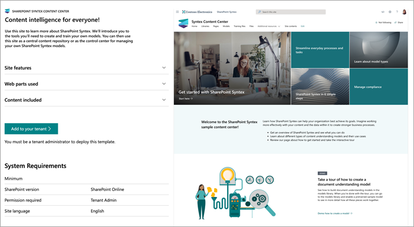
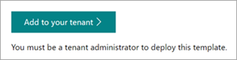

# Use the Content Center site template for Microsoft SharePoint Syntex

The SharePoint Syntex Content Center site is a ready-to-deploy SharePoint site template designed to help you better understand SharePoint Syntex capabilities.

You'll be introduced to the tools and information you’ll need to create and train your own models. You'll be able to use this site as a central content repository or as the control center for managing your own SharePoint Syntex models.
  
> [!NOTE]
> In this site, models can be trained and evaluated using your own content. However, to apply the models to libraries, a license for SharePoint Syntex is required.  

## Provision the Content Center site

The Content Center site can be provisioned from the [SharePoint look book service](https://lookbook.microsoft.com/).

> [!NOTE]
> You must be a global administrator or SharePoint administrator in Microsoft 365 to provision the site.

1. From the main page of the [SharePoint look book](https://lookbook.microsoft.com/), on the **View the designs** menu, select **SharePoint Syntex** > **Content Center site**.

2. On the **Content Center site** page, select **Add to your tenant**.

    

3. Enter your email address (for a notification of when your site is ready to use), the title you want to use for your site, and the site URL you want to use. 

4. Select **Provision**, and in a short time your site will be ready for you to use. You’ll get an email (sent to the email address you provided) indicating that your request to provision the Contracts Management site template is completed.

5. Select **Open site**, and you’ll see your Contracts Management site. From here, you can explore the site and edit the pages and content. 

For more information about provisioning from the SharePoint look book service, see [Provision a new learning pathways solution](https://docs.microsoft.com/en-us/office365/customlearning/custom_provision).

## Explore the Content Center site

The Content Center site includes pre-populated pages that walk you through the steps to begin using SharePoint Syntex in your organization. 

### Get started with SharePoint Syntex

Watch an overview video

### Learn about model types

### SharePoint Syntex in 6 simple steps

### Streamline everyday processes and tasks

### Manage compliance

### Take a tour of how to create a document understanding model

### View model activity

Example content for model activity is provided to illustrate how the data is visualized. 

### Additional resources

Additional resources are provided to help you learn more about SharePoint Syntex.

