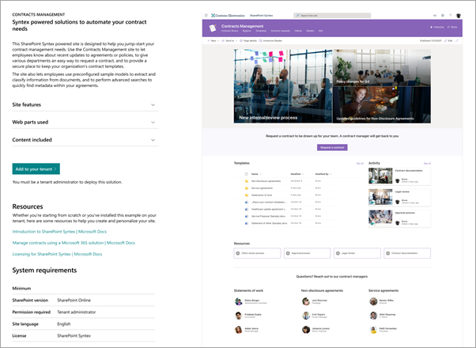

# Use the Contracts Management site template for Microsoft SharePoint Syntex

The Contracts Management site is a ready to deploy and customizable SharePoint site template that helps your organization maximize the value of SharePoint Syntex. The site is designed to let you create a professional site that meets the contract managing and processing goals of your organization.

The Contract Management site includes pre-populated pages, web parts, and site navigation. The site can be customized to incorporate your organization's own branding, employee information, policy and planning information, and document repository.

## Provision the Contracts Management site

The Contracts Management site can be provisioned from the [SharePoint look book service](https://lookbook.microsoft.com/).

> [!NOTE]
> You must be a global administrator or SharePoint administrator to provision the site.

1. From the main page of the [SharePoint look book](https://lookbook.microsoft.com/), on the **View the designs** menu, select **SharePoint Syntex** > **Contracts Management site**.

2. On the **Contracts Management site** page, select **Add to your tenant**.

    

3. Enter the information in the email and URL address sections, and then select **Provision**.

4. Select **Confirm**. The page will indicate that provisioning has started. When provisioning is complete, in the **Provisioning status** field, you'll see **Provisioning completed**.

## Customize the Contracts Management site

The Contracts Management site can be customized to meet your requirements, prior to sharing with other users. 

### Customize the look and feel of your site

Customize the following elements of your site to fit the need of your organization:

- Update the Contracts Management site [branding](https://support.microsoft.com/office/customize-your-sharepoint-site-320b43e5-b047-4fda-8381-f61e8ac7f59b) to align with your organization.
- Customize the [Hero web part](https://support.microsoft.com/office/use-the-hero-web-part-d57f449b-19a0-4b0d-8ce3-be5866430645) to include images of real sites in your organization where possible.
- Add other [web parts](https://support.microsoft.com/office/using-web-parts-on-sharepoint-pages-336e8e92-3e2d-4298-ae01-d404bbe751e0) to your site as needed.
- Customize the [page layouts](https://support.microsoft.com/office/add-sections-and-columns-on-a-sharepoint-modern-page-fc491eb4-f733-4825-8fe2-e1ed80bd0899) as needed.
- Add [new pages](https://support.microsoft.com/office/create-and-use-modern-pages-on-a-sharepoint-site-b3d46deb-27a6-4b1e-87b8-df851e503dec) to add additional support or informational resources.

### Customize the site navigation

You have control of the site navigation for the Contracts Management site. Use the following resources to help you make changes that align with your organization:

- Customize the [site navigation](https://support.microsoft.com/office/customize-the-navigation-on-your-sharepoint-site-3cd61ae7-a9ed-4e1e-bf6d-4655f0bf25ca).
- [Associate this site with a hub](https://support.microsoft.com/office/associate-a-sharepoint-site-with-a-hub-site-ae0009fd-af04-4d3d-917d-88edb43efc05).
- Use [audience targeting](https://support.microsoft.com/office/target-navigation-news-and-files-to-specific-audiences-33d84cb6-14ed-4e53-a426-74c38ea32293) to target specific navigational links to specific users. 
- [Delete unwanted pages](https://support.microsoft.com/office/delete-a-page-from-a-sharepoint-site-1d4197b8-31b6-460d-906b-3fb492a51db1) if you need to.

